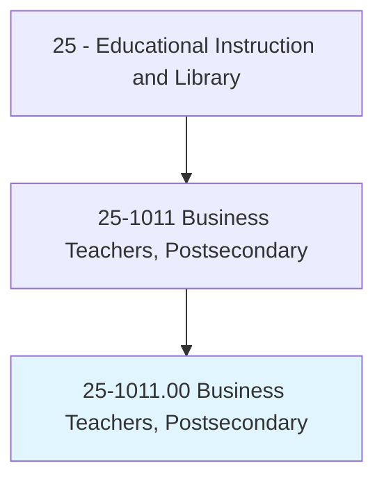
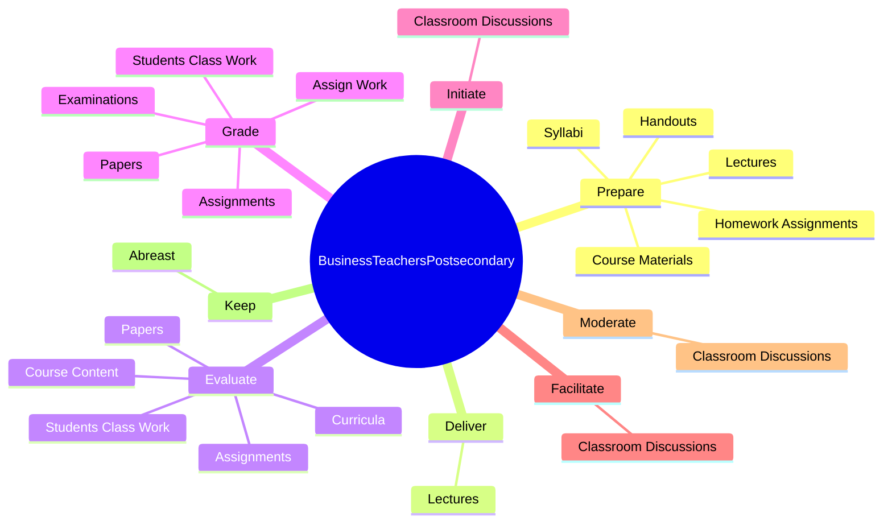

# Business Teachers, Postsecondary

> Teach courses in business administration and management, such as accounting, finance, human resources, labor and industrial relations, marketing, and operations research. Includes both teachers primarily engaged in teaching and those who do a combination of teaching and research.

## Overview

Business Teachers, Postsecondary is an occupation within the Educational Instruction and Library category. Teach courses in business administration and management, such as accounting, finance, human resources, labor and industrial relations, marketing, and operations research. 

## Classification Hierarchy

## Key Statistics

| Metric | Value |
|--------|-------|
| SOC Code | 25-1011.00 |
| Category | [Educational Instruction and Library](/occupations/Education) |
| Task Count | 79 |
| Source | O*NET |

## Core Tasks

### prepare.Lectures

Business Teachers, Postsecondary prepare lectures as part of their core responsibilities.

**Actions:**
- `prepare.Lectures.to.undergraduate.StudentsOnTopics`
- `prepare.Lectures.to.graduate.StudentsOnTopics`
- `prepare.Lectures.to.FinancialAccounting`
- `prepare.Lectures.to.PrinciplesOfMarketing`

### deliver.Lectures

Business Teachers, Postsecondary deliver lectures as part of their core responsibilities.

**Actions:**
- `deliver.Lectures.to.undergraduate.StudentsOnTopics`
- `deliver.Lectures.to.graduate.StudentsOnTopics`
- `deliver.Lectures.to.FinancialAccounting`
- `deliver.Lectures.to.PrinciplesOfMarketing`

### evaluate.StudentsClassWork

Business Teachers, Postsecondary evaluate students class work as part of their core responsibilities.

**Actions:**
- `evaluate.StudentsClassWork`
- `evaluate.Assignments`
- `evaluate.Papers`
- `evaluate.Curricula.of.Instruction`

## Skills & Competencies

### Technical Skills
- **Curriculum Development** - Advanced
- **Instructional Design** - Advanced
- **Assessment** - Advanced

### Soft Skills
- **Communication** - Essential
- **Problem Solving** - Essential
- **Critical Thinking** - Important
- **Teamwork** - Important
- **Adaptability** - Important

## Related Occupations

## Industries

This occupation is found across multiple industries. See [Industries](/industries) for sector-specific employment data.

## Career Progression

---

*Source: O*NET 25-1011.00 - ONETOccupation*
