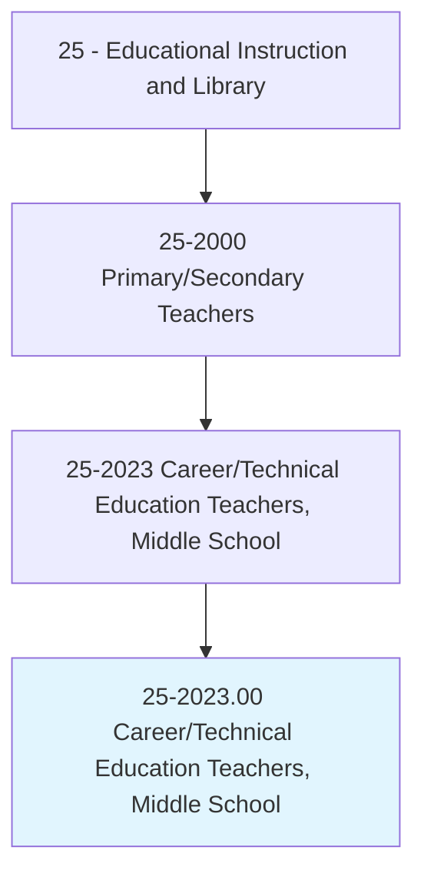
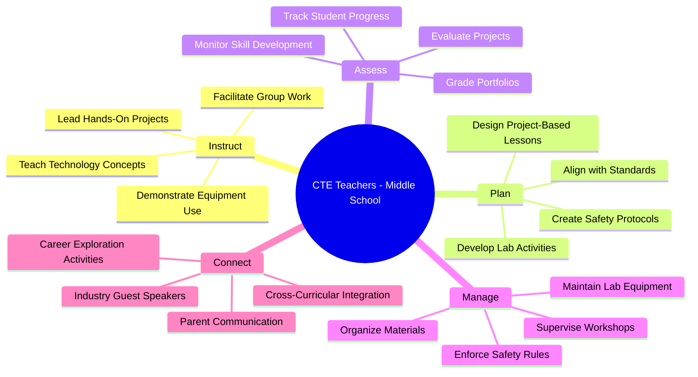
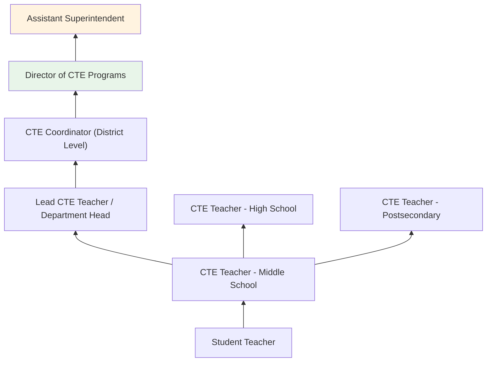
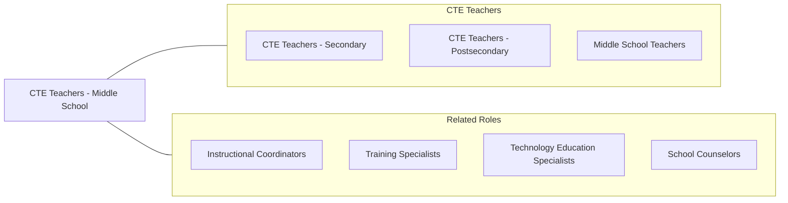

# Career/Technical Education Teachers, Middle School

> Teach occupational, career and technical, or vocational subjects in public or private schools at the middle, intermediate, or junior high school level, which falls between elementary and senior high school as defined by applicable laws and regulations.

## Overview

Career/Technical Education (CTE) Teachers at the middle school level introduce students aged 11-14 to practical, career-oriented subjects that bridge academic learning with real-world applications. They teach exploratory courses in technology education, family and consumer sciences, business fundamentals, agricultural literacy, health sciences, and manufacturing/engineering concepts. These educators ignite student interest in career pathways early, helping them understand the connections between classroom learning and future employment.

Middle school CTE teachers design hands-on, project-based curricula that engage adolescent learners through activities such as coding projects, woodworking, cooking, robotics, financial literacy exercises, and design challenges. They create safe laboratory and workshop environments where students develop foundational technical skills, critical thinking, teamwork, and problem-solving abilities. Their courses often serve as gateway experiences that influence students' later decisions about high school CTE pathways and career interests.

These educators collaborate with academic subject teachers to integrate CTE concepts across the curriculum, participate in career awareness programs, and often coordinate career exploration activities such as guest speakers, virtual field trips, and career interest inventories. They play a key role in the broader CTE pipeline by building foundational skills and enthusiasm before students enter more focused high school programs.

## Classification Hierarchy

## Key Statistics

| Metric | Value |
|--------|-------|
| SOC Code | 25-2023.00 |
| Job Zone | 4 (Considerable Preparation) |
| Category | [Educational Instruction and Library](/occupations/Education/index) |
| Median Salary | $58,000 - $68,000 |
| Employment | ~15,000 |
| Projected Growth | 3-5% (Average) |
| Source | O*NET |

## Core Tasks

### instruct.CareerTechnicalSubjects

CTE Teachers deliver hands-on exploratory instruction in career-related subjects.

**Actions:**
- `instruct.Students.in.TechnologyConcepts` - Teach coding, digital literacy, and engineering design
- `instruct.Students.in.PracticalSkills` - Guide woodworking, cooking, sewing, and shop projects
- `facilitate.ProjectBasedLearning.for.CareerExploration` - Lead design challenges connecting skills to career pathways

### manage.LaboratoryEnvironment

CTE Teachers maintain safe and functional workshop and lab spaces.

**Actions:**
- `manage.LabEquipment.for.StudentSafety` - Inspect, maintain, and organize tools and machinery
- `enforce.SafetyRules.in.Workshops` - Teach and enforce proper safety protocols for all equipment
- `organize.Materials.for.HandsOnActivities` - Prepare supplies and resources for project-based lessons

## Skills & Competencies

### Technical Skills
- **Technology Education** - Advanced (coding, robotics, digital fabrication)
- **Workshop Management** - Advanced (tool safety, equipment maintenance)
- **Project-Based Learning** - Advanced (design thinking, STEM integration)
- **Curriculum Design** - Advanced (CTE standards alignment)
- **Assessment** - Intermediate (portfolio, rubric, and performance assessment)
- **Industry Knowledge** - Intermediate (career pathways, labor market awareness)

### Soft Skills
- **Patience** - Critical (working with early adolescents)
- **Communication** - Essential (explaining procedures, engaging parents)
- **Safety Awareness** - Essential (supervising hands-on activities)
- **Creativity** - Essential (designing engaging projects)
- **Classroom Management** - Essential (maintaining order in active lab settings)
- **Enthusiasm** - Important (inspiring career interest in young students)

## Education & Certifications

| Requirement | Details |
|-------------|---------|
| Typical Education | Bachelor's degree in Education with CTE endorsement |
| Alternative Entry | Bachelor's in related technical field plus alternative teaching certification |
| State Licensure | Required; CTE-specific endorsement for middle grades |
| Work Experience | Industry experience valued, sometimes required depending on state |
| Common Certifications | State CTE teaching license; OSHA safety certifications; technology-specific credentials |

## Career Progression

## Setting Variations

### Public Middle Schools
Exploratory CTE courses as part of the required middle school rotation. Labs and workshops integrated into school facilities.

### STEM Magnet Schools
Specialized technology and engineering curriculum with advanced equipment. Competitive enrollment.

### Rural Schools
Agricultural literacy and technology education with smaller class sizes. Community-connected projects.

### Online/Hybrid Programs
Digital technology courses delivered remotely. Hands-on components through take-home kits or weekend workshops.

### Career Academies
Schools-within-schools with career-themed pathways beginning at the middle school level.

## Technology & Tools

| Category | Tools |
|----------|-------|
| Design & Fabrication | 3D printers, laser cutters, CNC machines, CAD software |
| Coding & Robotics | Scratch, Tinkercad, Arduino, VEX Robotics, LEGO Mindstorms |
| Learning Management | Google Classroom, Canvas, Schoology |
| Kitchen/Shop Equipment | Commercial kitchen equipment, power tools, sewing machines |
| Assessment | Rubric-based grading, digital portfolios, Google Workspace |
| Career Exploration | Naviance, Xello, career interest inventories |

## Related Occupations

## Industries

- [Educational Services - Middle Schools](/industries/Education/index) - Primary Employment
- [Government](/industries/Government) - Public School Districts
- [Other Services](/industries/OtherServices) - Youth Development Organizations

## Departments

This occupation typically works in:
- [Career and Technical Education Department](/departments/CTE)
- [STEM Department](/departments/STEM)
- [Technology Education](/departments/TechnologyEducation)
- [Exploratory Studies](/departments/ExploratoryStudies)

---

*Source: O*NET 25-2023.00 - ONETOccupation*
