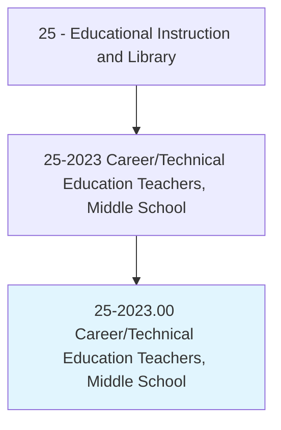
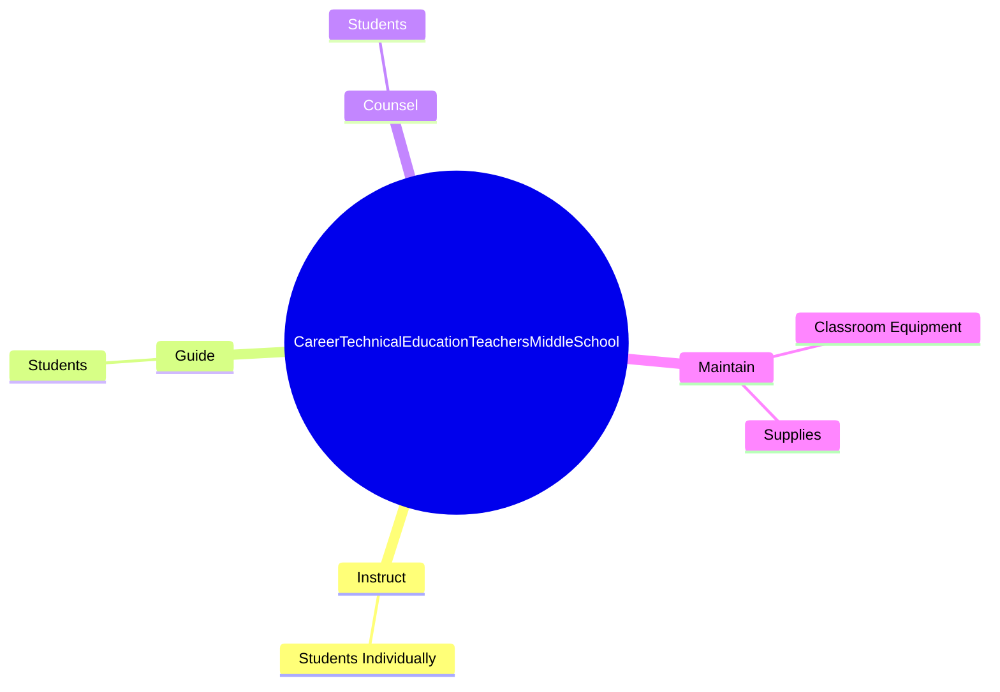

# Career/Technical Education Teachers, Middle School

> Teach occupational, vocational, career, or technical subjects to students at the middle, intermediate, or junior high school level.

## Overview

Career/Technical Education Teachers, Middle School is classified under Educational Instruction and Library (SOC 25). Teach occupational, vocational, career, or technical subjects to students at the middle, intermediate, or junior high school level.

## Classification Hierarchy

## Key Statistics

| Metric | Value |
|--------|-------|
| SOC Code | 25-2023.00 |
| Category | [Educational Instruction and Library](/occupations/Education) |
| Task Count | 5 |
| Source | O*NET |

## Core Tasks

### instruct.StudentsIndividually

Career/Technical Education Teachers, Middle School instruct students individually as part of their core responsibilities.

**Actions:**
- `instruct.StudentsIndividually.in.UsingVariousTeachingMethods`

### guide.Students

Career/Technical Education Teachers, Middle School guide students as part of their core responsibilities.

**Actions:**
- `guide.Students.with.Adjustments`

### counsel.Students

Career/Technical Education Teachers, Middle School counsel students as part of their core responsibilities.

**Actions:**
- `counsel.Students.with.Adjustments`

## Skills & Competencies

### Technical Skills
- **Curriculum Development** - Advanced
- **Instructional Design** - Advanced
- **Assessment** - Advanced

### Soft Skills
- **Communication** - Essential
- **Problem Solving** - Essential
- **Critical Thinking** - Important
- **Teamwork** - Important
- **Adaptability** - Important

## Related Occupations

## Industries

This occupation is found across multiple industries. See [Industries](/industries) for sector-specific employment data.

## Career Progression

---

*Source: O*NET 25-2023.00 - ONETOccupation*
