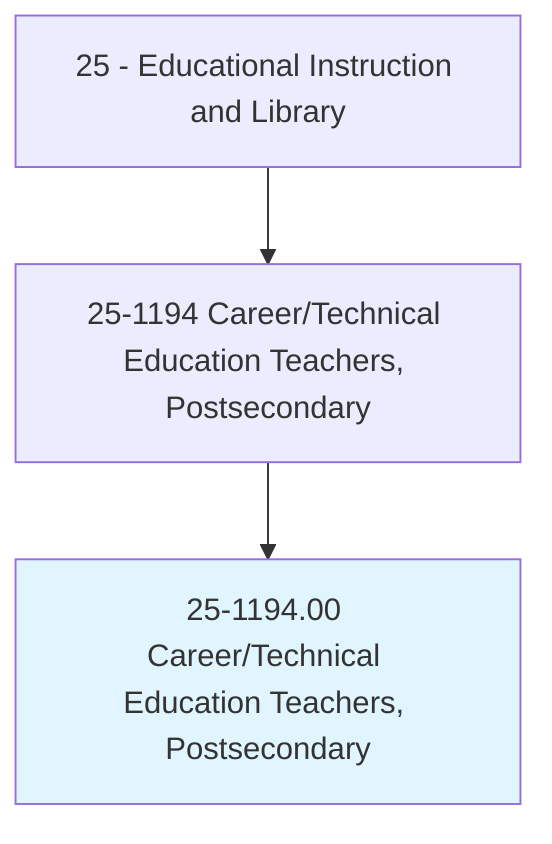

# Career/Technical Education Teachers, Postsecondary

> Teach vocational courses intended to provide occupational training below the baccalaureate level in subjects such as construction, mechanics/repair, manufacturing, transportation, or cosmetology, primarily to students who have graduated from or left high school. Teaching takes place in public or private schools whose primary business is academic or vocational education.

## Overview

Career/Technical Education Teachers, Postsecondary is an occupation within the Educational Instruction and Library category. Teach vocational courses intended to provide occupational training below the baccalaureate level in subjects such as construction, mechanics/repair, manufacturing, transportation, or cosmetology, primarily to students who have graduated from or left high school. 

## Classification Hierarchy

## Key Statistics

| Metric | Value |
|--------|-------|
| SOC Code | 25-1194.00 |
| Category | [Educational Instruction and Library](/occupations/Education) |
| Task Count | 97 |
| Source | O*NET |

## Core Tasks

```mermaid
mindmap
    root(("CareerTechnicalEducationTeachersPostsecondary"))
        Observe
            Students Work
        Evaluate
            Students Work
        Present
            Lectures
            Conduct Discussions
        Supervise
            Students Use
            Independent Projects
            Group Projects
            Field Placements
            Laboratory Work
        Monitor
            Students Use
        Administer
            Oral
            Written
            Performance Tests
        Provide
            Individualized Instruction Instruction
            Remedial Instruction
            Tutorial Instruction
        Prepare
            Reports Records
            Maintain Records
            Student Grades
            Attendance Rolls
            Training Activity Details
```

### observe.StudentsWork

Career/Technical Education Teachers, Postsecondary observe students work as part of their core responsibilities.

**Actions:**
- `observe.StudentsWork.to.determine.Progress`
- `observe.StudentsWork.to.provide.Feedback`
- `observe.StudentsWork.to.make.SuggestionsForImprovement`

### evaluate.StudentsWork

Career/Technical Education Teachers, Postsecondary evaluate students work as part of their core responsibilities.

**Actions:**
- `evaluate.StudentsWork.to.determine.Progress`
- `evaluate.StudentsWork.to.provide.Feedback`
- `evaluate.StudentsWork.to.make.SuggestionsForImprovement`

### present.Lectures

Career/Technical Education Teachers, Postsecondary present lectures as part of their core responsibilities.

**Actions:**
- `present.Lectures.to.increase.StudentsKnowledgeUsingVisualAids`
- `present.Lectures.to.CompetenceUsingVisualAids`
- `present.Lectures.to.Graphs`
- `present.Lectures.to.charts`

## Skills & Competencies

### Technical Skills
- **Curriculum Development** - Advanced
- **Instructional Design** - Advanced
- **Assessment** - Advanced

### Soft Skills
- **Communication** - Essential
- **Problem Solving** - Essential
- **Critical Thinking** - Important
- **Teamwork** - Important
- **Adaptability** - Important

## Related Occupations

## Industries

This occupation is found across multiple industries. See [Industries](/industries) for sector-specific employment data.

## Career Progression

---

*Source: O*NET 25-1194.00 - ONETOccupation*
