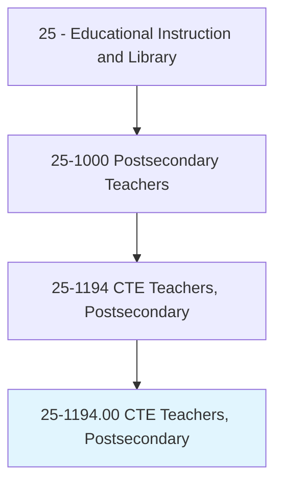
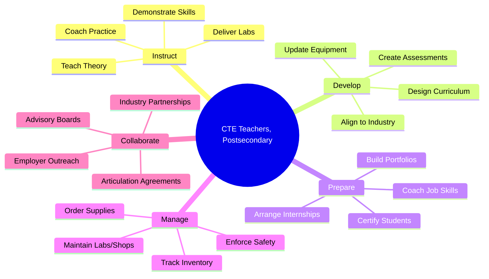
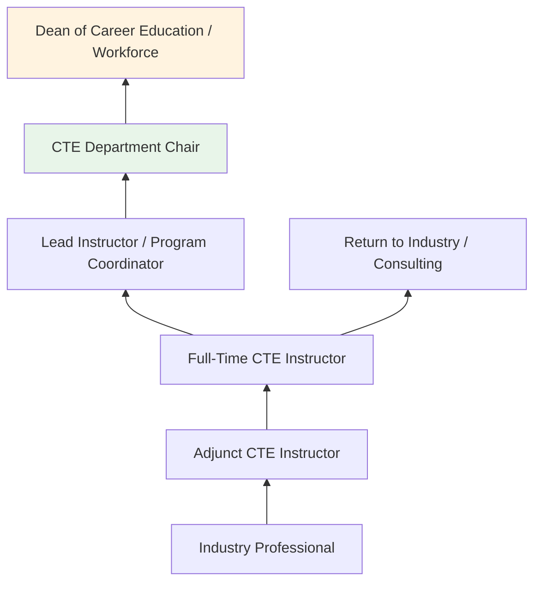
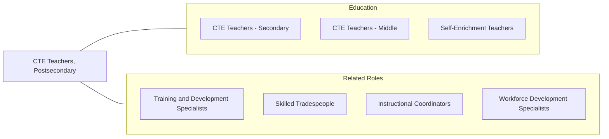

# Career/Technical Education Teachers, Postsecondary

> Teach vocational courses intended to provide occupational training below the baccalaureate level in subjects such as construction, mechanics/repair, manufacturing, transportation, or cosmetology, using individualized instruction to accommodate the different learning styles of students. Teaching takes place in public or private schools whose primary business is academic or vocational education.

## Overview

Career/Technical Education (CTE) Teachers at the postsecondary level instruct students in trade, technical, and vocational subjects at community colleges, technical institutes, and vocational schools. They teach practical skills in fields such as automotive technology, welding, electrical systems, HVAC, nursing assisting, culinary arts, cosmetology, information technology, and manufacturing. These educators prepare students for direct entry into skilled occupations through certificate, diploma, and associate degree programs.

CTE postsecondary teachers typically bring extensive industry experience to their teaching, many having worked 10-20+ years in their trade before transitioning to education. They combine hands-on laboratory instruction with classroom theory, safety training, and professional development to produce workforce-ready graduates. Programs are often aligned with industry certifications (ASE, AWS, CompTIA, ServSafe) that students earn alongside their academic credentials.

The growing demand for skilled workers in trades, healthcare, and technology has increased enrollment in CTE programs and elevated the importance of these educators. They maintain industry connections through advisory boards, internship coordination, and continuing professional development to keep curricula current with evolving workplace technologies and practices.

## Classification Hierarchy

## Key Statistics

| Metric | Value |
|--------|-------|
| SOC Code | 25-1194.00 |
| Job Zone | 3-4 (Medium to Considerable Preparation) |
| Category | [Educational Instruction and Library](/occupations/Education/index) |
| Median Salary | $58,000 - $72,000 |
| Employment | ~120,000 |
| Projected Growth | 3-5% (Average) |
| Source | O*NET |

## Core Tasks

### instruct.TechnicalSkills

CTE Teachers deliver hands-on occupational training.

**Actions:**
- `demonstrate.TechnicalSkills.in.Laboratory` - Model trade-specific procedures and techniques for students
- `instruct.Students.in.OccupationalTheory` - Teach the science and principles underlying trade practices
- `coach.Students.toward.IndustryCertification` - Prepare students for ASE, AWS, NCCER, CompTIA, and other credentials

### develop.WorkforceReadyGraduates

CTE Teachers prepare students for employment.

**Actions:**
- `align.Curriculum.to.IndustryStandards` - Ensure programs reflect current workplace practices and requirements
- `coordinate.Internships.with.EmployerPartners` - Arrange work-based learning experiences for students
- `maintain.IndustryConnections.through.AdvisoryBoards` - Keep programs current through employer input

## Skills & Competencies

### Technical Skills
- **Trade Expertise** - Expert (deep knowledge of specific occupational field)
- **Laboratory Instruction** - Expert (hands-on demonstration, safety, equipment operation)
- **Industry Standards** - Advanced (certification requirements, codes, regulations)
- **Safety Management** - Advanced (OSHA, shop/lab safety, PPE, hazard awareness)
- **Curriculum Development** - Intermediate (aligning programs with industry and accreditation standards)
- **Assessment** - Intermediate (competency-based evaluation, performance testing)

### Soft Skills
- **Communication** - Critical (explaining technical concepts to diverse learners)
- **Patience** - Essential (teaching hands-on skills to beginners)
- **Industry Awareness** - Essential (staying current with trade developments)
- **Mentorship** - Essential (guiding students into careers)
- **Safety Consciousness** - Critical (maintaining safe learning environments)
- **Adaptability** - Important (accommodating diverse learning styles)

## Education & Certifications

| Requirement | Details |
|-------------|---------|
| Typical Education | Associate's degree or bachelor's with extensive industry experience; varies by institution |
| Industry Experience | Typically 5-10+ years in the trade required |
| Trade Certifications | Field-specific: ASE, AWS, NCCER, EPA, CompTIA, journeyman license, etc. |
| Teaching Credential | May require vocational teaching certificate or credential |
| Common Certifications | Trade-specific journeyman/master certifications; OSHA 30; NATEF/ASE for automotive; CTE teaching credential |

## Career Progression

## Setting Variations

### Community Colleges
Associate degree and certificate programs. General education combined with technical training. Largest employer.

### Technical Institutes
Focused vocational training. Certificate and diploma programs. Hands-on emphasis.

### Trade Schools
Private, for-profit institutions offering concentrated skills training. Quick program completion.

### Apprenticeship Programs
Combine classroom instruction with paid on-the-job training. Union and employer partnerships.

### Corporate Training Centers
Industry-specific training for current employees. Equipment manufacturer programs.

## Technology & Tools

| Category | Tools |
|----------|-------|
| Shop/Lab Equipment | Industry-specific machinery, tools, vehicles, and systems |
| Simulation | Virtual welding, automotive simulators, CNC programming |
| Learning Management | Canvas, Blackboard, Brightspace |
| Safety | PPE, ventilation systems, lockout/tagout, first aid |
| Assessment | Performance rubrics, competency checklists, certification exams |
| Communication | Email, LMS messaging, student information systems |

## Related Occupations

## Industries

- [Educational Services - Community Colleges](/industries/Education/index) - Primary Employment
- [Government](/industries/PublicAdministration) - Public Technical Colleges
- [Other Services](/industries/OtherServices) - Trade Schools
- [Manufacturing](/industries/Manufacturing) - Corporate Training

## Departments

This occupation typically works in:
- Career and Technical Education Division
- Workforce Development
- Applied Technology

---

*Source: O*NET 25-1194.00 - ONETOccupation*
