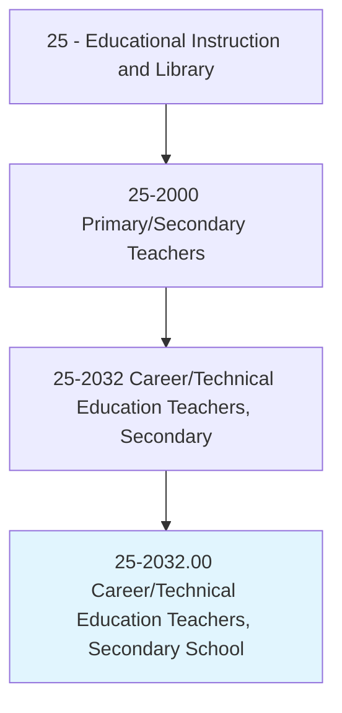
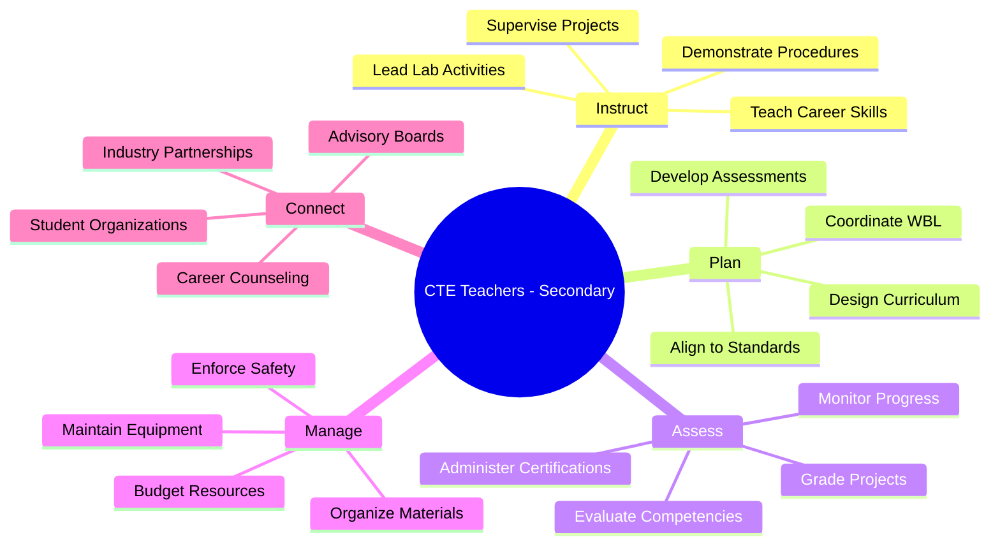
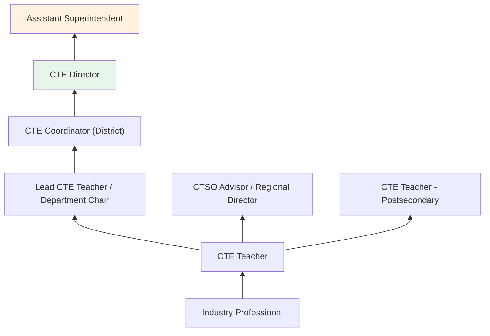
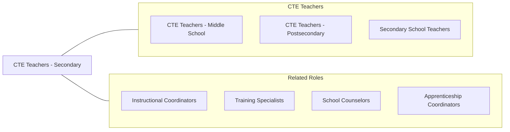

# Career/Technical Education Teachers, Secondary School

> Teach occupational, career and technical, or vocational subjects at the secondary school level in public or private schools. Includes agriculture, business, family and consumer science, health occupations, technology education, and trade and industry teachers.

## Overview

Career/Technical Education (CTE) Teachers at the secondary school level instruct high school students in career-focused subjects that combine academic foundations with practical, industry-aligned skills. They teach in career clusters including agriculture, business and marketing, health sciences, information technology, manufacturing, construction, transportation, culinary arts, and cosmetology. These educators prepare students for both immediate employment and postsecondary education through structured career pathways that include classroom instruction, laboratory experiences, work-based learning, and industry certifications.

Secondary CTE teachers create dynamic learning environments that often include specialized workshops, laboratories, kitchens, healthcare simulation rooms, and technology suites. They design project-based curricula aligned with industry standards, coordinate with local employers for internships and apprenticeships, and guide students toward industry-recognized credentials. Many CTE teachers enter the profession from industry backgrounds, bringing real-world expertise to their instruction.

CTE programs have experienced significant growth driven by employer demand for skilled workers, state and federal Perkins Act funding, and growing recognition that career preparation should begin in high school. CTE teachers play a vital role in reducing dropout rates, increasing graduation rates, and ensuring all students have viable pathways to economic self-sufficiency.

## Classification Hierarchy

## Key Statistics

| Metric | Value |
|--------|-------|
| SOC Code | 25-2032.00 |
| Job Zone | 4 (Considerable Preparation) |
| Category | [Educational Instruction and Library](/occupations/Education/index) |
| Median Salary | $62,000 - $72,000 |
| Employment | ~75,000 |
| Projected Growth | 3-5% (Average) |
| Source | O*NET |

## Core Tasks

### instruct.CareerTechnicalSubjects

CTE Teachers deliver hands-on career-focused instruction.

**Actions:**
- `instruct.Students.in.IndustrySkills` - Teach technical competencies aligned with career pathways
- `demonstrate.Procedures.in.LaboratorySettings` - Model proper techniques for equipment and tool use
- `supervise.WorkBasedLearning.with.Employers` - Coordinate internships, job shadowing, and apprenticeships

### manage.CTEPrograms

CTE Teachers oversee career pathway programs and facilities.

**Actions:**
- `manage.LaboratoryEquipment.for.SafeOperation` - Maintain and inspect all tools, machinery, and supplies
- `coordinate.IndustryAdvisoryBoards.for.CurriculumAlignment` - Engage employers in program development
- `lead.StudentOrganizations.for.LeadershipDevelopment` - Advise DECA, FBLA, SkillsUSA, FFA, HOSA, and similar CTSOs

## Skills & Competencies

### Technical Skills
- **Industry Expertise** - Expert (specialized career area knowledge)
- **Safety Management** - Advanced (OSHA, equipment safety, hazard prevention)
- **Curriculum Design** - Advanced (career pathway standards, Perkins compliance)
- **Assessment** - Advanced (competency-based, industry certification preparation)
- **Work-Based Learning** - Advanced (internship coordination, employer partnerships)
- **Educational Technology** - Intermediate (simulation, industry software, LMS)

### Soft Skills
- **Communication** - Critical (instruction, employer relations, parent engagement)
- **Safety Awareness** - Critical (supervising hands-on activities)
- **Mentorship** - Essential (career guidance and professional development)
- **Organization** - Essential (managing labs, budgets, and partnerships)
- **Adaptability** - Essential (evolving industry requirements)
- **Enthusiasm** - Important (inspiring career interest)

## Education & Certifications

| Requirement | Details |
|-------------|---------|
| Typical Education | Bachelor's degree in education or career field |
| Alternative Entry | Industry experience plus alternative certification (varies by state) |
| State Licensure | Required; CTE endorsement with secondary teaching license |
| Industry Requirements | Many states require industry experience and/or industry certification |
| Common Certifications | State CTE license; OSHA certifications; industry credentials (ASE, ServSafe, AWS, CompTIA, etc.) |

## Career Progression

## Setting Variations

### Comprehensive High Schools
CTE pathways offered alongside academic courses. Shared facilities with general education departments.

### Career and Technical Centers
Regional centers providing specialized CTE programs for students from multiple high schools. Advanced equipment and facilities.

### Magnet and Career Academies
Theme-based schools with deep CTE integration. Strong industry partnerships and internship programs.

### Online/Hybrid Programs
Digital CTE instruction in IT, business, and health information. Hands-on components at local facilities.

### Rural Schools
Multi-pathway CTE programs with emphasis on agriculture, trades, and local workforce needs.

## Technology & Tools

| Category | Tools |
|----------|-------|
| Industry-Specific | Varies by pathway: welding equipment, CNC machines, commercial kitchens, medical simulators, automotive lifts |
| Design & Fabrication | AutoCAD, SolidWorks, 3D printers, laser cutters |
| Business & IT | Microsoft Office, QuickBooks, coding platforms, networking equipment |
| Learning Management | Google Classroom, Canvas, Schoology |
| Career Exploration | Xello, Naviance, career interest inventories |
| Assessment | Industry certification exams, performance-based rubrics |

## Related Occupations

## Industries

- [Educational Services - Secondary Schools](/industries/Education/index) - Primary Employment
- [Government](/industries/PublicAdministration) - Public School Districts, State CTE Agencies
- [Manufacturing](/industries/Manufacturing) - Industry Partnership Programs
- [Healthcare](/industries/Healthcare) - Health Science Pathway Programs

## Departments

This occupation typically works in:
- Career and Technical Education Department
- Business Education
- Health Sciences Academy
- Industrial Technology

---

*Source: O*NET 25-2032.00 - ONETOccupation*
