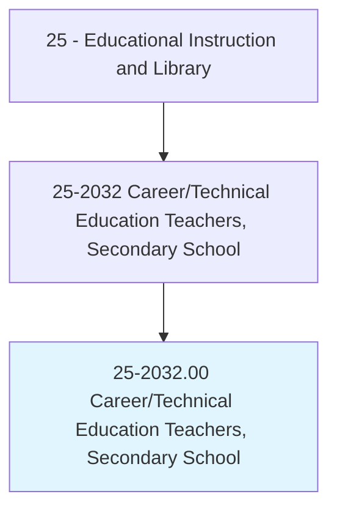
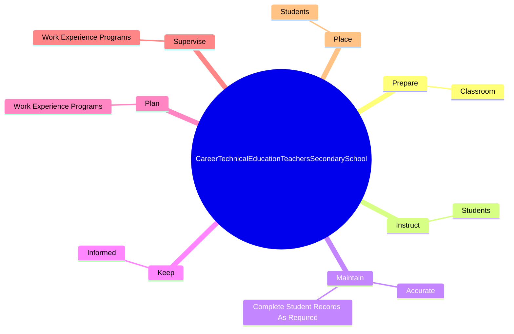

# Career/Technical Education Teachers, Secondary School

> Teach occupational, vocational, career, or technical subjects to students at the secondary school level.

## Overview

Career/Technical Education Teachers, Secondary School is classified under Educational Instruction and Library (SOC 25). Teach occupational, vocational, career, or technical subjects to students at the secondary school level.

## Classification Hierarchy

## Key Statistics

| Metric | Value |
|--------|-------|
| SOC Code | 25-2032.00 |
| Category | [Educational Instruction and Library](/occupations/Education) |
| Task Count | 23 |
| Source | O*NET |

## Core Tasks

### prepare.Classroom

Career/Technical Education Teachers, Secondary School prepare classroom as part of their core responsibilities.

**Actions:**
- `prepare.Classroom.for.ClassActivities`

### instruct.Students

Career/Technical Education Teachers, Secondary School instruct students as part of their core responsibilities.

**Actions:**
- `instruct.Students.in.KnowledgeRequired.in.SpecificOccupationOccupationalField`
- `instruct.Students.in.SkillsRequired.in.SpecificOccupationOccupationalField`
- `instruct.Students.in.UsingSystematicPlan.of.Lectures`
- `instruct.Students.in.Discussions`

### maintain.Accurate

Career/Technical Education Teachers, Secondary School maintain accurate as part of their core responsibilities.

**Actions:**
- `maintain.Accurate.by.Law`
- `maintain.Accurate.by.DistrictPolicy`
- `maintain.CompleteStudentRecordsAsRequired.by.Law`
- `maintain.CompleteStudentRecordsAsRequired.by.DistrictPolicy`

## Skills & Competencies

### Technical Skills
- **Curriculum Development** - Advanced
- **Instructional Design** - Advanced
- **Assessment** - Advanced

### Soft Skills
- **Communication** - Essential
- **Problem Solving** - Essential
- **Critical Thinking** - Important
- **Teamwork** - Important
- **Adaptability** - Important

## Related Occupations

## Industries

This occupation is found across multiple industries. See [Industries](/industries) for sector-specific employment data.

## Career Progression

---

*Source: O*NET 25-2032.00 - ONETOccupation*
