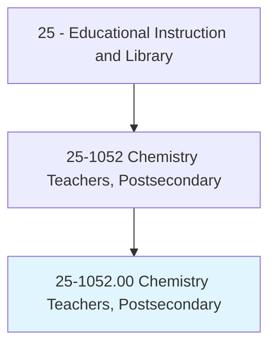
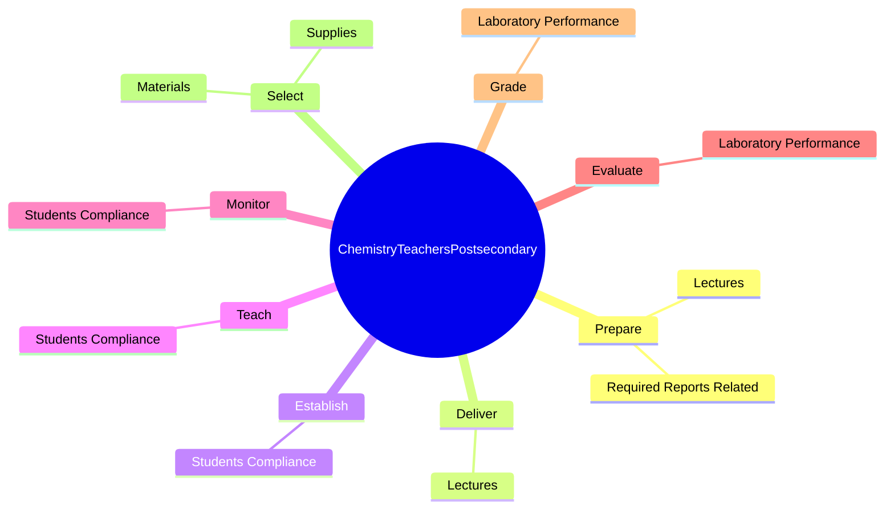

# Chemistry Teachers, Postsecondary

> Teach courses pertaining to the chemical and physical properties and compositional changes of substances. Work may include providing instruction in the methods of qualitative and quantitative chemical analysis. Includes both teachers primarily engaged in teaching, and those who do a combination of teaching and research.

## Overview

Chemistry Teachers, Postsecondary is an occupation within the Educational Instruction and Library category. Teach courses pertaining to the chemical and physical properties and compositional changes of substances. Work may include providing instruction in the methods of qualitative and quantitative chemical analysis.

## Classification Hierarchy

## Key Statistics

| Metric | Value |
|--------|-------|
| SOC Code | 25-1052.00 |
| Category | [Educational Instruction and Library](/occupations/Education) |
| Task Count | 51 |
| Source | O*NET |

## Core Tasks

### prepare.Lectures

Chemistry Teachers, Postsecondary prepare lectures as part of their core responsibilities.

**Actions:**
- `prepare.Lectures.to.OrganicChemistry`
- `prepare.Lectures.to.AnalyticalChemistry`
- `prepare.Lectures.to.ChemicalSeparation`
- `prepare.RequiredReportsRelated.to.Instruction`

### deliver.Lectures

Chemistry Teachers, Postsecondary deliver lectures as part of their core responsibilities.

**Actions:**
- `deliver.Lectures.to.OrganicChemistry`
- `deliver.Lectures.to.AnalyticalChemistry`
- `deliver.Lectures.to.ChemicalSeparation`

### establish.StudentsCompliance

Chemistry Teachers, Postsecondary establish students compliance as part of their core responsibilities.

**Actions:**
- `establish.StudentsCompliance.with.SafetyRules.for.HandlingChemicals`
- `establish.StudentsCompliance.with.Equipment`
- `establish.StudentsCompliance.with.OtherHazardousMaterials`

## Skills & Competencies

### Technical Skills
- **Curriculum Development** - Advanced
- **Instructional Design** - Advanced
- **Assessment** - Advanced

### Soft Skills
- **Communication** - Essential
- **Problem Solving** - Essential
- **Critical Thinking** - Important
- **Teamwork** - Important
- **Adaptability** - Important

## Related Occupations

## Industries

This occupation is found across multiple industries. See [Industries](/industries) for sector-specific employment data.

## Career Progression

---

*Source: O*NET 25-1052.00 - ONETOccupation*
