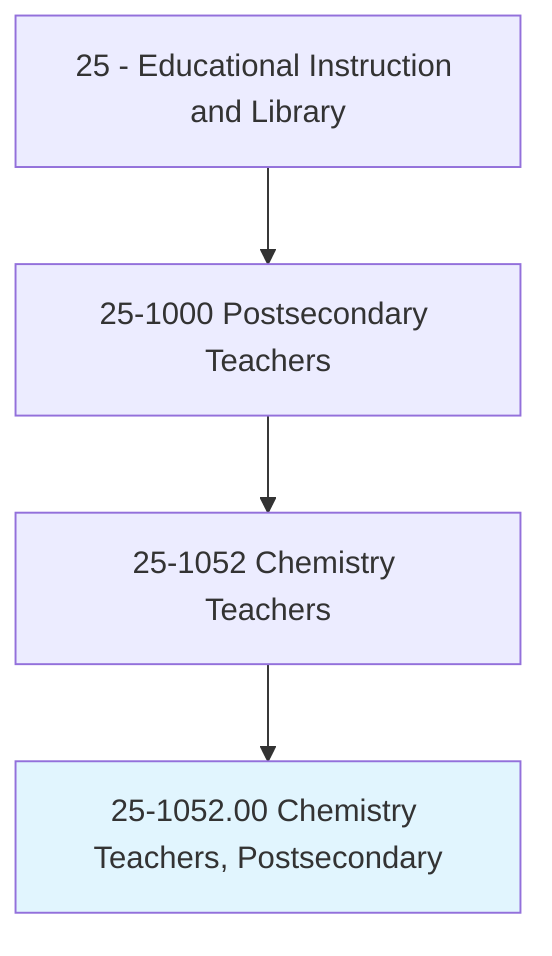
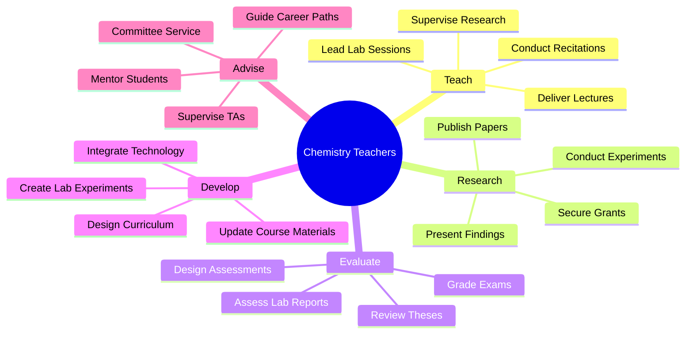
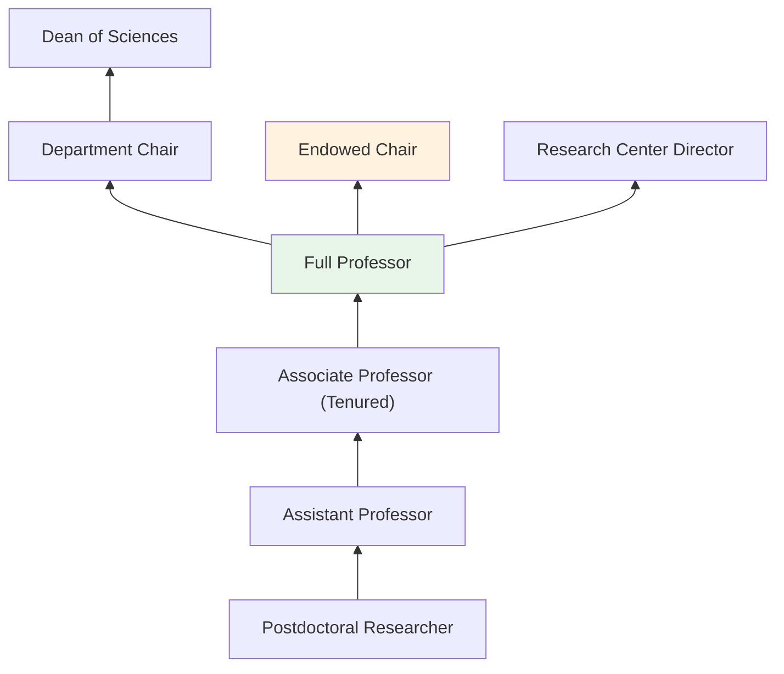
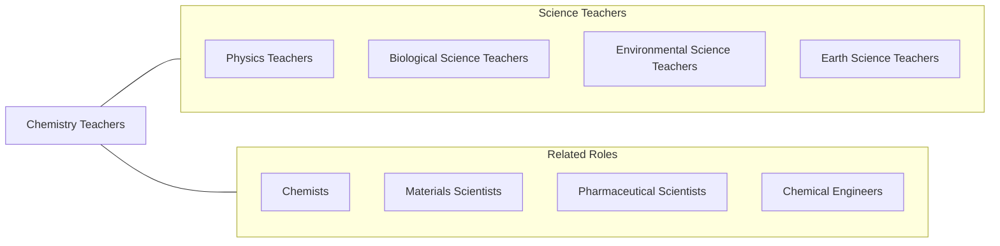

# Chemistry Teachers, Postsecondary

> Teach courses pertaining to the chemical and physical properties and compositional changes of substances. Work may include instruction in the methods of qualitative and quantitative chemical analysis. Includes both teachers primarily engaged in teaching and those who do a combination of teaching and research.

## Overview

Chemistry Teachers in postsecondary education instruct students in general chemistry, organic chemistry, inorganic chemistry, analytical chemistry, physical chemistry, biochemistry, and specialized topics such as polymer chemistry, environmental chemistry, and medicinal chemistry. They teach through lectures, laboratory sessions, and problem-solving workshops, helping students understand atomic structure, chemical bonding, reaction mechanisms, thermodynamics, and kinetics. These educators work at research universities, liberal arts colleges, and community colleges.

Laboratory instruction is central to chemistry education, requiring faculty to design experiments that reinforce theoretical concepts, teach safe handling of chemicals and equipment, and develop students' analytical and observational skills. Faculty oversee teaching assistants, maintain laboratory safety standards, and ensure compliance with chemical hygiene plans and hazardous waste regulations.

Many postsecondary chemistry teachers conduct research in areas such as materials science, pharmaceutical development, catalysis, environmental remediation, and nanotechnology. They secure external funding from agencies like NSF, NIH, and DOE, supervise graduate students and postdoctoral researchers, and publish in journals such as the Journal of the American Chemical Society, Angewandte Chemie, and Chemical Reviews.

## Classification Hierarchy

## Key Statistics

| Metric | Value |
|--------|-------|
| SOC Code | 25-1052.00 |
| Job Zone | 5 (Extensive Preparation) |
| Category | [Educational Instruction and Library](/occupations/Education/index) |
| Median Salary | $80,000 - $105,000 |
| Employment | ~23,000 |
| Projected Growth | 4-6% (Average) |
| Source | O*NET |

## Core Tasks

### teach.ChemistryCoursework

Faculty deliver chemistry instruction through lectures and laboratories.

**Actions:**
- `deliver.Lectures.on.ChemicalPrinciples` - Teach atomic theory, bonding, reactions, and thermodynamics
- `conduct.LaboratorySessions.for.ExperimentalSkills` - Guide students through synthesis, analysis, and characterization
- `supervise.GraduateResearch.in.ChemistryLaboratory` - Mentor thesis and dissertation research

### conduct.ChemistryResearch

Faculty pursue original research in chemistry subdisciplines.

**Actions:**
- `conduct.Research.in.ChemicalSciences` - Investigate materials, reactions, and molecular properties
- `publish.Papers.in.PeerReviewedJournals` - Disseminate findings in chemistry literature
- `secure.Grants.from.FundingAgencies` - Obtain NSF, NIH, and DOE research support

## Skills & Competencies

### Technical Skills
- **Chemistry Knowledge** - Expert (organic, inorganic, analytical, physical, biochemistry)
- **Laboratory Techniques** - Expert (spectroscopy, chromatography, synthesis, characterization)
- **Research Methods** - Expert (experimental design, data analysis, computational chemistry)
- **Safety Management** - Advanced (chemical hygiene, hazardous waste, OSHA compliance)
- **Instrumentation** - Advanced (NMR, mass spec, IR, UV-Vis, HPLC, GC)
- **Grant Writing** - Advanced (federal proposals, budget management)

### Soft Skills
- **Communication** - Critical (explaining abstract concepts clearly)
- **Analytical Thinking** - Critical (problem-solving and experimental design)
- **Mentorship** - Essential (guiding students through research)
- **Patience** - Essential (teaching challenging material)
- **Collaboration** - Important (interdisciplinary and multi-lab research)
- **Safety Awareness** - Critical (protecting students in laboratory settings)

## Education & Certifications

| Requirement | Details |
|-------------|---------|
| Typical Education | Ph.D. in Chemistry or related field |
| Alternative Entry | M.S. for community college positions |
| Postdoctoral | 1-3 years postdoctoral research common for R1 positions |
| Work Experience | Teaching and research experience required |
| Common Certifications | ACS membership; chemical hygiene officer training; laboratory safety certifications |

## Career Progression

## Setting Variations

### Research Universities
Large departments with doctoral programs. Emphasis on externally funded research. Teaching loads of 1-2 courses per semester.

### Liberal Arts Colleges
Undergraduate-focused with strong teaching emphasis. Research with undergraduate students. Teaching loads of 3-4 courses.

### Community Colleges
General and introductory chemistry for transfer students and allied health programs. No research expectation.

### Industry-Adjacent Programs
Programs emphasizing pharmaceutical, materials, or environmental chemistry with industry partnerships.

## Technology & Tools

| Category | Tools |
|----------|-------|
| Instrumentation | NMR, Mass Spectrometry, HPLC, GC, IR, UV-Vis |
| Computational | Gaussian, GAMESS, Spartan, ChemDraw, Avogadro |
| Learning Management | Canvas, Blackboard, Moodle |
| Assessment | Gradescope, ACS Exams, Sapling Learning |
| Lab Management | ChemInventory, SDS databases, Quartzy |
| Communication | Zoom, Microsoft Teams |

## Related Occupations

## Industries

- [Educational Services - Colleges and Universities](/industries/Education/index) - Primary Employment
- [Government](/industries/PublicAdministration) - Public Universities, National Labs
- [Pharmaceutical Manufacturing](/industries/Manufacturing) - Industry Research
- [Chemical Manufacturing](/industries/Manufacturing) - R&D Roles

## Departments

This occupation typically works in:
- [Department of Chemistry](/departments/Research)
- Department of Biochemistry
- College of Sciences

---

*Source: O*NET 25-1052.00 - ONETOccupation*
