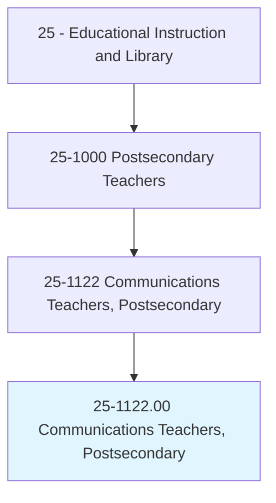
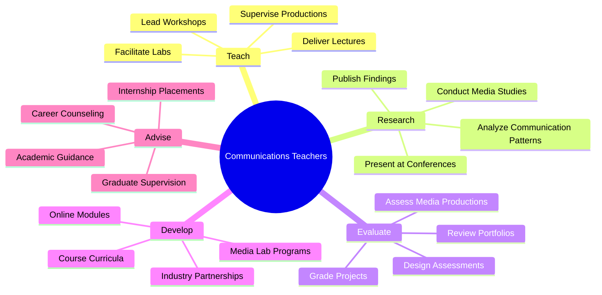
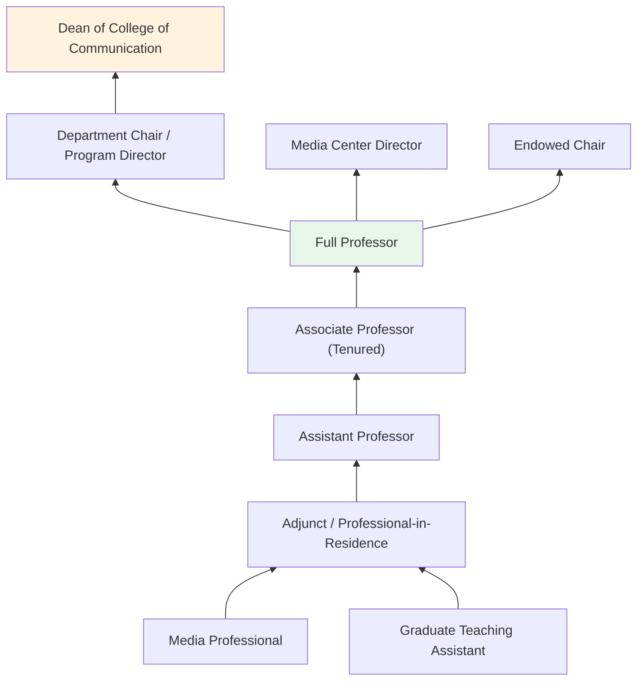
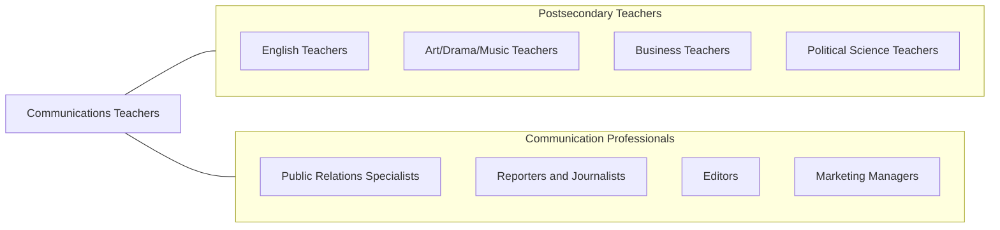

# Communications Teachers, Postsecondary

> Teach courses in communications, such as organizational communications, public relations, radio/television broadcasting, and journalism. Includes both teachers primarily engaged in teaching and those who do a combination of teaching and research.

## Overview

Communications Teachers in postsecondary education instruct students in the theory and practice of human communication across media, organizational, interpersonal, and public contexts. They teach courses covering journalism, public relations, broadcasting, media studies, organizational communication, rhetoric, digital media, advertising, and strategic communication. These educators blend theoretical understanding with hands-on practice, preparing students to create, analyze, and manage communication across traditional and digital platforms.

Many communications professors conduct research on media effects, political communication, health communication, intercultural communication, social media dynamics, and the evolving information landscape. They publish in journals such as Communication Research, Journal of Communication, and Journalism & Mass Communication Quarterly. Their scholarship addresses critical questions about how media shapes public opinion, organizational culture, and democratic discourse.

Communications faculty prepare graduates for careers in journalism, public relations, marketing, broadcasting, corporate communications, digital content creation, and media management. The field continues to evolve rapidly with digital transformation, requiring faculty to stay current with emerging platforms, data analytics, and multimedia storytelling techniques.

## Classification Hierarchy

## Key Statistics

| Metric | Value |
|--------|-------|
| SOC Code | 25-1122.00 |
| Job Zone | 5 (Extensive Preparation) |
| Category | [Educational Instruction and Library](/occupations/Education/index) |
| Median Salary | $72,000 - $92,000 |
| Employment | ~30,000 |
| Projected Growth | 5-8% (Average) |
| Source | O*NET |

## Core Tasks

### teach.Communications

Faculty deliver instruction across communication disciplines.

**Actions:**
- `deliver.Lectures.on.MediaTheory` - Teach media effects, framing, agenda-setting, and cultural studies
- `deliver.Lectures.on.PublicRelations` - Instruct on strategic communication, crisis management, and campaigns
- `supervise.MediaProductions.in.BroadcastStudios` - Oversee student work in TV, radio, podcast, and digital production

### conduct.CommunicationResearch

Faculty pursue scholarship on communication phenomena.

**Actions:**
- `conduct.Research.on.DigitalMediaEffects` - Study social media influence, misinformation, and platform dynamics
- `conduct.Research.on.OrganizationalCommunication` - Investigate workplace communication, leadership, and culture
- `publish.Findings.in.CommunicationJournals` - Contribute to peer-reviewed communication scholarship

## Skills & Competencies

### Technical Skills
- **Communication Theory** - Expert (interpersonal, mass, organizational, rhetorical)
- **Media Production** - Advanced (video, audio, digital, multimedia)
- **Research Methods** - Advanced (content analysis, surveys, experiments, discourse analysis)
- **Digital Media** - Advanced (social media analytics, SEO, content management)
- **Curriculum Design** - Advanced (ACEJMC accreditation standards)
- **Writing** - Expert (journalistic, scholarly, strategic)

### Soft Skills
- **Communication** - Critical (modeling effective communication practices)
- **Creativity** - Essential (media production, storytelling)
- **Critical Thinking** - Essential (media literacy, information evaluation)
- **Mentorship** - Essential (portfolio development, career guidance)
- **Adaptability** - Essential (rapidly changing media landscape)
- **Collaboration** - Important (production teams, industry partnerships)

## Education & Certifications

| Requirement | Details |
|-------------|---------|
| Typical Education | Ph.D. in Communication, Mass Communication, or Journalism |
| Alternative Entry | MFA or Master's with significant professional experience for practice-oriented teaching |
| Work Experience | Professional media/communication experience valued, especially for applied courses |
| On-the-Job Training | Faculty development; media technology training |
| Common Certifications | NCA/ICA/AEJMC membership; APR (Accreditation in Public Relations) |

## Career Progression

## Setting Variations

### Research Universities
Emphasis on communication theory research and doctoral student training. Media research labs and centers.

### Teaching-Focused Universities
Strong undergraduate programs with emphasis on applied skills. Professional media facilities and internship programs.

### Community Colleges
Introductory communication courses and media production basics. Workforce preparation for entry-level media positions.

### Online Programs
Distance learning in communication, PR, and digital media. Growing enrollment in strategic communication master's programs.

### Professional Schools
Journalism and media schools emphasizing industry preparation, ethical reporting, and multimedia storytelling.

## Technology & Tools

| Category | Tools |
|----------|-------|
| Media Production | Adobe Creative Suite, Final Cut Pro, DaVinci Resolve, Audacity |
| Content Management | WordPress, Drupal, social media management tools |
| Analytics | Google Analytics, Sprout Social, Meltwater, Cision |
| Learning Management Systems | Canvas, Blackboard, Moodle |
| Research Tools | NVivo, SPSS, content analysis software |
| Broadcasting | Studio cameras, audio boards, teleprompters, streaming platforms |

## Related Occupations

## Industries

- [Educational Services - Colleges and Universities](/industries/Education/index) - Primary Employment
- [Information](/industries/Information) - Media and Publishing
- [Professional Services](/industries/ProfessionalServices) - PR and Advertising Agencies
- [Government](/industries/Government) - Public Communication and Affairs

## Departments

This occupation typically works in:
- [School of Communication](/departments/Communication)
- [Department of Journalism](/departments/Journalism)
- [Department of Media Studies](/departments/MediaStudies)
- [School of Mass Communication](/departments/MassCommunication)

---

*Source: O*NET 25-1122.00 - ONETOccupation*
