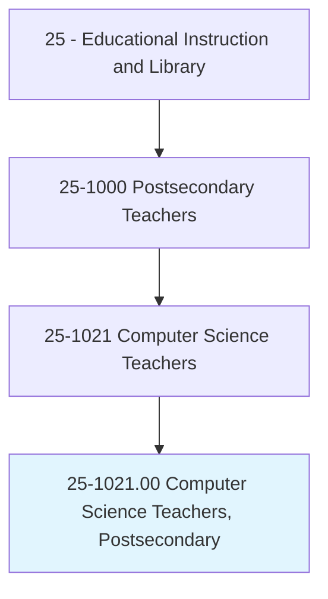
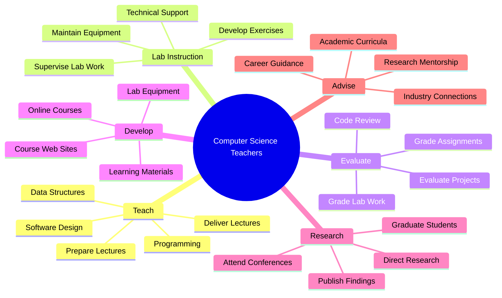
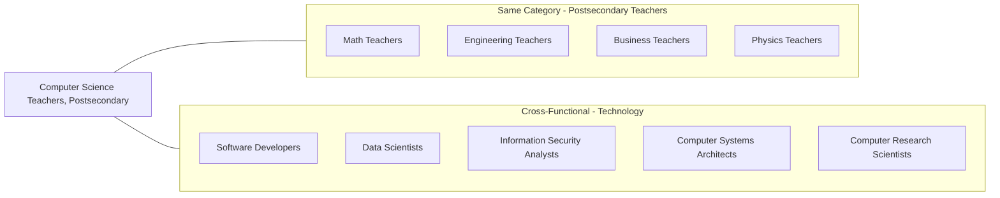
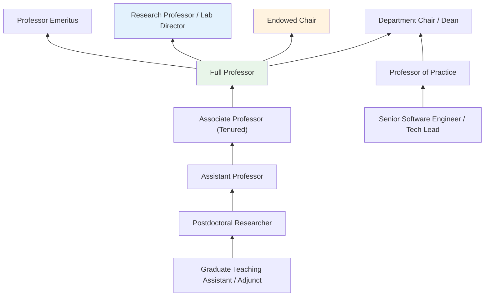

# Computer Science Teachers, Postsecondary

> Teach courses in computer science. May specialize in a field of computer science, such as the design and function of computers or operations and research analysis. Includes both teachers primarily engaged in teaching and those who do a combination of teaching and research.

## Overview

Computer Science Teachers in postsecondary education instruct students in the theoretical foundations and practical applications of computing. They cover topics ranging from programming and data structures to artificial intelligence, cybersecurity, and distributed systems. These educators combine rigorous academic instruction with hands-on laboratory experience, helping students develop both conceptual understanding and practical coding skills. Many actively pursue research in cutting-edge areas of computer science, contributing to technological advancement while training the next generation of software engineers, data scientists, and computer scientists.

## Classification Hierarchy



## Key Statistics

| Metric | Value |
|--------|-------|
| SOC Code | 25-1021.00 |
| Job Zone | 5 (Extensive Preparation) |
| Category | [Educational Instruction and Library](/occupations/Education/index) |
| Core Tasks | 15+ |
| Source | O*NET |

## Core Tasks



### prepare.Lectures

Computer Science Teachers develop comprehensive instructional content covering theoretical concepts and practical applications in computing.

**Actions:**
- `prepare.Lectures.to.Programming` - Create lectures covering programming languages, paradigms, and best practices
- `prepare.Lectures.to.DataStructures` - Develop content on arrays, trees, graphs, and algorithmic complexity
- `prepare.Lectures.to.SoftwareDesign` - Prepare lectures on software architecture, design patterns, and engineering principles

### deliver.Lectures

Computer Science Teachers present course material through lectures, demonstrations, and interactive coding sessions.

**Actions:**
- `deliver.Lectures.to.Programming` - Teach programming fundamentals and advanced techniques
- `deliver.Lectures.to.DataStructures` - Instruct students on data organization and algorithm design
- `deliver.Lectures.to.SoftwareDesign` - Present software engineering methodologies and practices

### evaluate.LaboratoryWork

Computer Science Teachers assess student learning through programming assignments, projects, and hands-on laboratory exercises.

**Actions:**
- `evaluate.LaboratoryWork` - Review and grade hands-on programming exercises and lab projects
- `grade.LaboratoryWork` - Assess student code quality, correctness, and efficiency
- `supervise.StudentsLaboratoryWork` - Oversee student work in computer labs and coding sessions

### develop.WebSites

Computer Science Teachers create and maintain digital learning resources and online course platforms.

**Actions:**
- `develop.WebSites.for.OnlineCourses` - Build course websites with materials, assignments, and resources
- `maintain.WebSites.for.OnlineCourses` - Update course sites with current content and fix technical issues
- `maintain.ComputerEquipmentUsed.in.Instruction` - Ensure lab computers and software are properly configured

### direct.Research

Computer Science Teachers guide graduate students and colleagues in research activities advancing the field of computer science.

**Actions:**
- `direct.Research.of.OtherTeachersGraduateStudentsWorking.for.AdvancedAcademicDegrees` - Supervise doctoral and master's thesis research
- `direct.Research.of.OfGraduateStudentsWorkingForAdvancedAcademicDegrees` - Guide graduate students through research methodology and publication
- `keep.Abreast.of.Participating.in.ProfessionalConferences` - Stay current with technological developments and present at conferences

### advise.Students

Computer Science Teachers provide academic guidance and career counseling to help students navigate the computing field.

**Actions:**
- `advise.Students.on.AcademicCurricula.on.CareerIssues` - Guide students on course selection and academic paths
- `advise.Students.on.VocationalCurricula.on.CareerIssues` - Counsel students on industry careers and job opportunities
- `select.LaboratoryEquipment` - Choose appropriate hardware and software for instruction
- `obtain.LaboratoryEquipment` - Procure computing resources for teaching and research

## Skills & Competencies

### Technical Skills
- **Programming** - Expert (multiple languages: Python, Java, C++, etc.)
- **Algorithms and Data Structures** - Expert
- **Software Engineering** - Advanced
- **Systems Design** - Advanced
- **Research Methods** - Advanced (computational research, empirical studies)
- **Educational Technology** - Advanced (IDEs, version control, autograders, LMS)

### Soft Skills
- **Communication** - Critical (explaining abstract concepts clearly)
- **Problem Solving** - Critical
- **Patience** - Essential (debugging with students)
- **Adaptability** - Essential (rapidly evolving technology)
- **Collaboration** - Essential (research teams, industry partnerships)

## Related Occupations



## Industry Variations

### Research Universities
Heavy emphasis on cutting-edge research; publication in top venues (ACM, IEEE); significant grant funding; doctoral student supervision; lighter teaching loads.

### Teaching-Focused Institutions
Primary focus on undergraduate instruction; practical programming skills; industry-relevant technologies; higher course loads; applied projects.

### Technical Institutes
Emphasis on practical skills and industry certifications; hands-on lab work; career preparation; close industry partnerships.

### Community Colleges
Introduction to programming; transfer preparation; workforce development; diverse student populations; flexible scheduling.

### Online Programs
Asynchronous course delivery; coding platform integration; automated assessment; global student body; scalable instruction methods.

### Bootcamp Partnerships
Industry-focused curriculum; rapid skill development; career placement focus; intensive short-term programs; practical project emphasis.

## Industries

- [Educational Services - Colleges and Universities](/industries/Education/index) - Primary Employment
- [Professional, Scientific, and Technical Services](/industries/ProfessionalServices) - Consulting/Research
- [Information Technology](/industries/InformationTechnology) - Industry Collaboration
- [Finance and Insurance](/industries/FinanceInsurance) - FinTech Research
- [Government](/industries/Government) - Public Universities, Research Labs

## Career Progression



## Education & Training

| Requirement | Details |
|-------------|---------|
| Typical Education | Ph.D. in Computer Science, Computer Engineering, or closely related field |
| Work Experience | Research experience required; industry experience valued, especially for practical courses |
| On-the-Job Training | Faculty development; teaching workshops; research mentoring |
| Common Certifications | Cloud certifications (AWS, GCP, Azure); Security certifications (CISSP); Professional memberships (ACM, IEEE) |

## Departments

This occupation typically works in:
- [Department of Computer Science](/departments/ComputerScience)
- [School of Engineering](/departments/Engineering)
- [College of Information Sciences](/departments/InformationSciences)
- [Institute for Artificial Intelligence](/departments/AI)
- [Cybersecurity Center](/departments/Cybersecurity)

## GraphDL Semantic Structure

The core semantic patterns for Computer Science Teachers follow this structure:

```
verb.Object.preposition.PrepObject

Primary Actions:
- prepare.Lectures.to.{Topic}
- deliver.Lectures.to.{Topic}
- evaluate.LaboratoryWork
- grade.LaboratoryWork
- supervise.StudentsLaboratoryWork
- develop.WebSites.for.OnlineCourses
- maintain.WebSites.for.OnlineCourses
- maintain.ComputerEquipmentUsed.in.Instruction
- direct.Research.of.{StudentType}.for.{DegreeType}
- advise.Students.on.{CurriculaType}.on.CareerIssues
- select.LaboratoryEquipment
- obtain.LaboratoryEquipment
- keep.Abreast.of.{Developments}.in.{Field}
```

## Specialization Areas

### Core Computer Science
- **Theory of Computation** - Algorithms, complexity, formal languages
- **Programming Languages** - Compilers, interpreters, language design
- **Operating Systems** - Systems programming, kernel development

### Applied Areas
- **Artificial Intelligence / Machine Learning** - Neural networks, NLP, computer vision
- **Data Science** - Statistical computing, big data analytics
- **Cybersecurity** - Network security, cryptography, ethical hacking
- **Software Engineering** - Development methodologies, DevOps
- **Human-Computer Interaction** - UX research, interface design

### Emerging Fields
- **Quantum Computing** - Quantum algorithms, quantum programming
- **Blockchain** - Distributed systems, smart contracts
- **Edge Computing / IoT** - Embedded systems, distributed sensors

---

*Source: O*NET 25-1021.00 - ONETOccupation*
