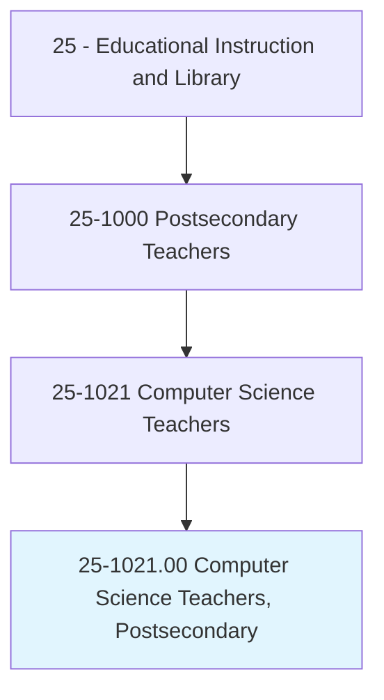
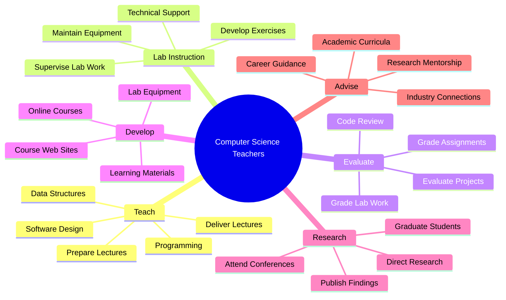
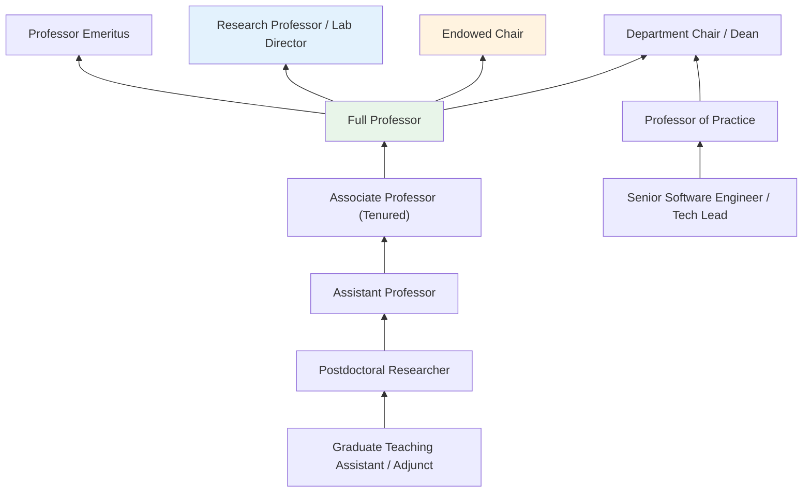
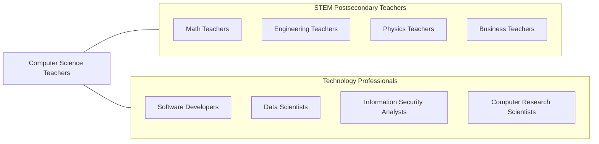

# Computer Science Teachers, Postsecondary

> Teach courses in computer science. May specialize in a field of computer science, such as the design and function of computers or operations and research analysis. Includes both teachers primarily engaged in teaching and those who do a combination of teaching and research.

## Overview

Computer Science Teachers in postsecondary education instruct students in the theoretical foundations and practical applications of computing. They cover topics ranging from programming and data structures to artificial intelligence, cybersecurity, and distributed systems. These educators combine rigorous academic instruction with hands-on laboratory experience, helping students develop both conceptual understanding and practical coding skills. Many actively pursue research in cutting-edge areas of computer science, contributing to technological advancement while training the next generation of software engineers, data scientists, and computer scientists.

The explosive growth of technology has made computer science one of the most popular and fastest-growing academic disciplines. Faculty face surging enrollment across all levels, creating significant demand for qualified instructors. They must continuously update curricula to reflect rapid technological change while maintaining rigorous foundations in algorithms, theory of computation, and systems design.

Computer science faculty often collaborate with industry partners, bringing real-world perspectives into the classroom and facilitating internship and employment opportunities for students. Many conduct funded research in artificial intelligence, machine learning, cybersecurity, quantum computing, and human-computer interaction, publishing in venues such as ACM and IEEE conferences and journals.

## Classification Hierarchy

## Key Statistics

| Metric | Value |
|--------|-------|
| SOC Code | 25-1021.00 |
| Job Zone | 5 (Extensive Preparation) |
| Category | [Educational Instruction and Library](/occupations/Education/index) |
| Median Salary | $95,000 - $140,000 |
| Employment | ~45,000 |
| Projected Growth | 12-18% (Much faster than average) |
| Source | O*NET |

## Core Tasks

### prepare.Lectures

Computer Science Teachers develop comprehensive instructional content covering theoretical concepts and practical applications in computing.

**Actions:**
- `prepare.Lectures.to.Programming` - Create lectures covering programming languages, paradigms, and best practices
- `prepare.Lectures.to.DataStructures` - Develop content on arrays, trees, graphs, and algorithmic complexity
- `prepare.Lectures.to.SoftwareDesign` - Prepare lectures on software architecture, design patterns, and engineering principles

### evaluate.LaboratoryWork

Computer Science Teachers assess student learning through programming assignments, projects, and hands-on laboratory exercises.

**Actions:**
- `evaluate.LaboratoryWork` - Review and grade hands-on programming exercises and lab projects
- `grade.LaboratoryWork` - Assess student code quality, correctness, and efficiency
- `supervise.StudentsLaboratoryWork` - Oversee student work in computer labs and coding sessions

### direct.Research

Computer Science Teachers guide graduate students and colleagues in research activities advancing the field.

**Actions:**
- `direct.Research.of.GraduateStudents` - Supervise doctoral and master's thesis research
- `publish.Findings.in.CSConferences` - Present and publish at ACM, IEEE, and USENIX venues
- `apply.ForGrants.from.NSFAndIndustry` - Secure research funding from federal agencies and technology companies

## Skills & Competencies

### Technical Skills
- **Programming** - Expert (multiple languages: Python, Java, C++, Rust, etc.)
- **Algorithms and Data Structures** - Expert
- **Software Engineering** - Advanced (systems design, DevOps, architecture)
- **Machine Learning / AI** - Advanced (neural networks, NLP, computer vision)
- **Systems Design** - Advanced (distributed systems, databases, networking)
- **Educational Technology** - Advanced (IDEs, version control, autograders, LMS)

### Soft Skills
- **Communication** - Critical (explaining abstract concepts clearly)
- **Problem Solving** - Critical
- **Patience** - Essential (debugging with students)
- **Adaptability** - Essential (rapidly evolving technology)
- **Collaboration** - Essential (research teams, industry partnerships)
- **Mentorship** - Essential (guiding diverse student populations)

## Education & Certifications

| Requirement | Details |
|-------------|---------|
| Typical Education | Ph.D. in Computer Science, Computer Engineering, or closely related field |
| Alternative Entry | Master's with industry experience for teaching-focused or community college positions |
| Work Experience | Research experience required; industry experience valued for practical courses |
| On-the-Job Training | Faculty development; teaching workshops |
| Common Certifications | Cloud certifications (AWS, GCP, Azure); Security certifications (CISSP); ACM/IEEE membership |

## Career Progression

## Setting Variations

### Research Universities
Heavy emphasis on cutting-edge research; publication in top venues (ACM, IEEE); significant grant funding; doctoral student supervision; lighter teaching loads.

### Teaching-Focused Institutions
Primary focus on undergraduate instruction; practical programming skills; industry-relevant technologies; higher course loads; applied projects.

### Community Colleges
Introduction to programming; transfer preparation; workforce development; diverse student populations; flexible scheduling.

### Online Programs
Asynchronous course delivery; coding platform integration; automated assessment; global student body; scalable instruction methods.

### Bootcamp Partnerships
Industry-focused curriculum; rapid skill development; career placement focus; intensive short-term programs.

## Technology & Tools

| Category | Tools |
|----------|-------|
| Programming | Python, Java, C++, JavaScript, Rust, Go |
| Development | VS Code, IntelliJ, Git/GitHub, Docker, Linux |
| Autograding | Gradescope, CodeGrade, Vocareum, GitHub Classroom |
| Learning Management Systems | Canvas, Blackboard, Moodle, Ed Discussion |
| Cloud Platforms | AWS Academy, Google Cloud, Azure Education |
| Research | arXiv, ACM Digital Library, IEEE Xplore |

## Related Occupations

## Industries

- [Educational Services - Colleges and Universities](/industries/Education/index) - Primary Employment
- [Professional, Scientific, and Technical Services](/industries/Scientific) - Consulting/Research
- Information Technology - Industry Collaboration
- [Government](/industries/PublicAdministration) - Public Universities, Research Labs

## Departments

This occupation typically works in:
- Department of Computer Science
- [School of Engineering](/departments/Technology)
- College of Information Sciences
- Institute for Artificial Intelligence

---

*Source: O*NET 25-1021.00 - ONETOccupation*
