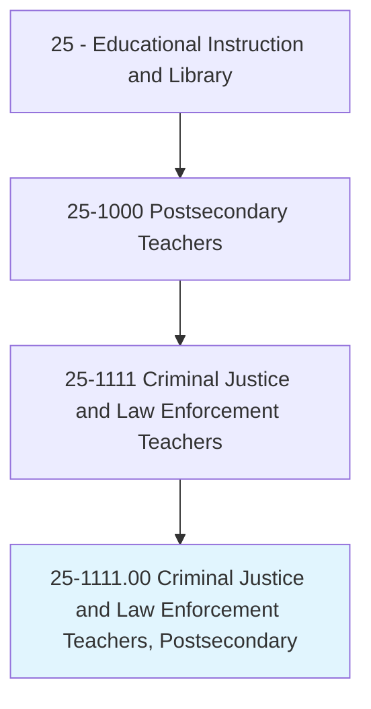
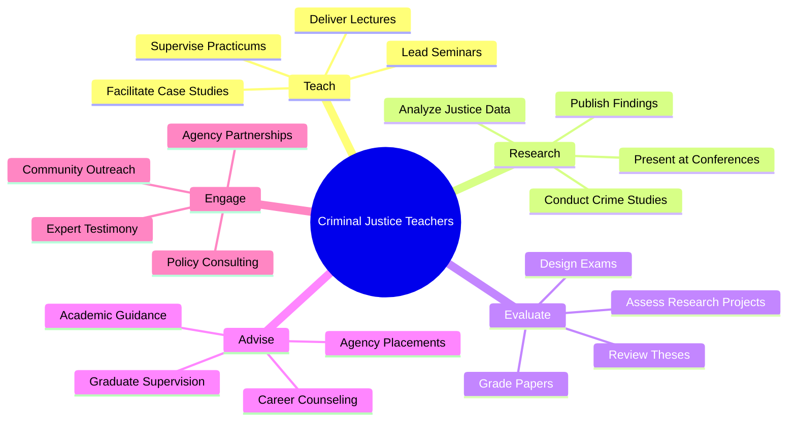
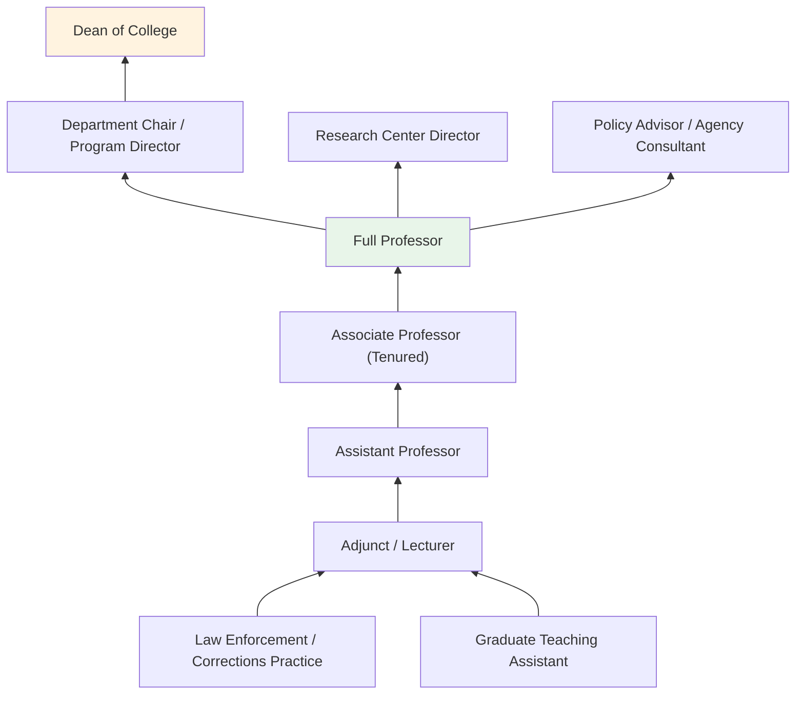
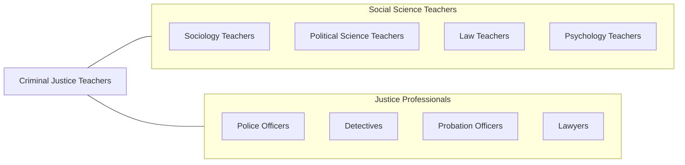

# Criminal Justice and Law Enforcement Teachers, Postsecondary

> Teach courses in criminal justice, corrections, and law enforcement administration. Includes both teachers primarily engaged in teaching and those who do a combination of teaching and research.

## Overview

Criminal Justice and Law Enforcement Teachers in postsecondary education instruct students in the study of crime, criminal behavior, law enforcement operations, corrections, courts, and the broader justice system. They teach courses covering criminological theory, policing, forensic science, juvenile justice, victimology, corrections management, homeland security, and criminal law. These educators prepare students for professional careers in law enforcement, probation, corrections, court administration, and federal agencies.

Many criminal justice professors are active researchers who study topics including crime prevention, recidivism, police-community relations, sentencing disparities, drug policy, cybercrime, and terrorism. Their research informs policy debates and practical reforms in the justice system. Faculty members often bring professional experience in law enforcement, corrections, or legal practice to their teaching, enriching classroom instruction with real-world perspectives.

Criminal justice is one of the fastest-growing academic disciplines in higher education, driven by strong student interest and expanding career opportunities in public safety, homeland security, and private security. Faculty must balance theoretical foundations with practical application, preparing graduates who can think critically about justice issues while possessing the professional competencies demanded by employers.

## Classification Hierarchy

## Key Statistics

| Metric | Value |
|--------|-------|
| SOC Code | 25-1111.00 |
| Job Zone | 5 (Extensive Preparation) |
| Category | [Educational Instruction and Library](/occupations/Education/index) |
| Median Salary | $65,000 - $85,000 |
| Employment | ~17,000 |
| Projected Growth | 6-10% (Faster than average) |
| Source | O*NET |

## Core Tasks

### teach.CriminalJusticeCourses

Criminal Justice Teachers deliver instruction across justice system disciplines.

**Actions:**
- `deliver.Lectures.on.CriminologicalTheory` - Teach theories of crime causation and criminal behavior
- `deliver.Lectures.on.LawEnforcementOperations` - Instruct on policing strategies, procedures, and administration
- `facilitate.CaseStudies.on.JusticeIssues` - Lead analysis of real-world criminal justice scenarios

### conduct.CriminalJusticeResearch

Faculty pursue original research on crime and justice topics.

**Actions:**
- `conduct.Research.on.CrimePrevention` - Study evidence-based policing and crime reduction strategies
- `conduct.Research.on.CorrectionalOutcomes` - Analyze recidivism, rehabilitation, and reentry programs
- `publish.Findings.in.CriminologyJournals` - Contribute to journals such as Criminology and Justice Quarterly

## Skills & Competencies

### Technical Skills
- **Criminological Theory** - Expert (classical, positivist, critical approaches)
- **Research Methods** - Advanced (quantitative, qualitative, program evaluation)
- **Statistical Analysis** - Advanced (SPSS, Stata, R, crime mapping)
- **Criminal Law** - Advanced (substantive and procedural law)
- **Curriculum Design** - Advanced (criminal justice pedagogy)
- **Forensic Methods** - Intermediate (evidence analysis, crime scene procedures)

### Soft Skills
- **Communication** - Critical (engaging diverse student populations)
- **Critical Thinking** - Critical (analyzing justice system issues)
- **Cultural Competency** - Essential (diversity in justice contexts)
- **Mentorship** - Essential (career guidance for justice professionals)
- **Ethical Judgment** - Essential (justice ethics and professional standards)
- **Public Engagement** - Important (community relations, media commentary)

## Education & Certifications

| Requirement | Details |
|-------------|---------|
| Typical Education | Ph.D. in Criminal Justice, Criminology, or related field |
| Alternative Entry | Master's degree with professional experience for applied programs |
| Work Experience | Law enforcement or corrections experience valued |
| On-the-Job Training | Faculty development; pedagogical workshops |
| Common Certifications | ACJS membership; CPP (Certified Protection Professional); specialized forensic certifications |

## Career Progression

## Setting Variations

### Research Universities
Emphasis on original criminological research and doctoral student training. Publication in top-tier journals expected.

### Teaching-Focused Universities
Strong enrollment in criminal justice bachelor's programs. Focus on practitioner preparation with guest speakers from agencies.

### Community Colleges
Associate degree programs and law enforcement academy partnerships. High enrollment with workforce-focused curriculum.

### Online Programs
Large online enrollment in criminal justice programs. Asynchronous delivery with practicum components.

### Police Academies and Training Centers
Advanced law enforcement training, in-service education, and leadership development.

## Technology & Tools

| Category | Tools |
|----------|-------|
| Crime Mapping | ArcGIS, CrimeStat, CompStat tools |
| Statistical Software | SPSS, Stata, R |
| Learning Management Systems | Canvas, Blackboard, Moodle |
| Research Databases | NCJRS, Bureau of Justice Statistics, ICPSR |
| Forensic Tools | Forensic analysis software, evidence management systems |
| Simulation | Firearms training simulators, scenario-based platforms |

## Related Occupations

## Industries

- [Educational Services - Colleges and Universities](/industries/Education/index) - Primary Employment
- [Government](/industries/Government) - Public Universities, Federal Agencies
- [Public Administration](/industries/PublicAdministration) - Law Enforcement Training
- [Professional Services](/industries/ProfessionalServices) - Security Consulting

## Departments

This occupation typically works in:
- [Department of Criminal Justice](/departments/CriminalJustice)
- [School of Criminology](/departments/Criminology)
- [Department of Sociology and Criminal Justice](/departments/SociologyCJ)
- [Homeland Security Studies](/departments/HomelandSecurity)

---

*Source: O*NET 25-1111.00 - ONETOccupation*
