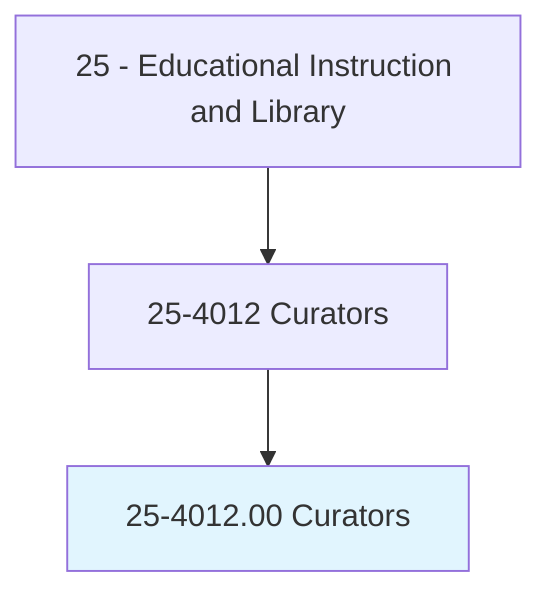
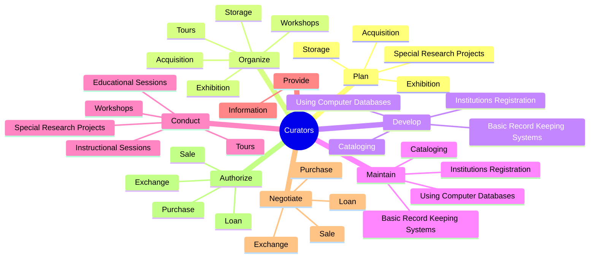
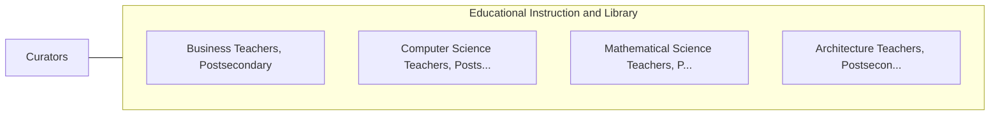

# Curators

> Administer collections, such as artwork, collectibles, historic items, or scientific specimens of museums or other institutions. May conduct instructional, research, or public service activities of institution.

## Overview

Curators is an occupation within the Educational Instruction and Library category. Administer collections, such as artwork, collectibles, historic items, or scientific specimens of museums or other institutions. 

## Classification Hierarchy

## Key Statistics

| Metric | Value |
|--------|-------|
| SOC Code | 25-4012.00 |
| Category | [Educational Instruction and Library](/occupations/Education/index) |
| Task Count | 133 |
| Source | O*NET |

## Core Tasks

### plan.Acquisition

Curators plan acquisition as part of their core responsibilities.

**Actions:**
- `plan.Acquisition.of.Collections`
- `plan.Acquisition.of.RelatedMaterials`
- `plan.Acquisition.of.IncludingSelection.of.ExhibitionThemes`
- `plan.Acquisition.of.Designs`

### organize.Acquisition

Curators organize acquisition as part of their core responsibilities.

**Actions:**
- `organize.Acquisition.of.Collections`
- `organize.Acquisition.of.RelatedMaterials`
- `organize.Acquisition.of.IncludingSelection.of.ExhibitionThemes`
- `organize.Acquisition.of.Designs`

### develop.InstitutionsRegistration

Curators develop institutions registration as part of their core responsibilities.

**Actions:**
- `develop.InstitutionsRegistration`
- `develop.Cataloging`
- `develop.BasicRecordKeepingSystems`
- `develop.UsingComputerDatabases`

## Skills & Competencies

### Technical Skills
- **Curriculum Development** - Advanced
- **Instructional Design** - Advanced
- **Assessment** - Advanced

### Soft Skills
- **Communication** - Essential
- **Problem Solving** - Essential
- **Critical Thinking** - Important
- **Teamwork** - Important
- **Adaptability** - Important

## Related Occupations

## Industries

This occupation is found across multiple industries. See [Industries](/industries) for sector-specific employment data.

## Career Progression

---

*Source: O*NET 25-4012.00 - ONETOccupation*
