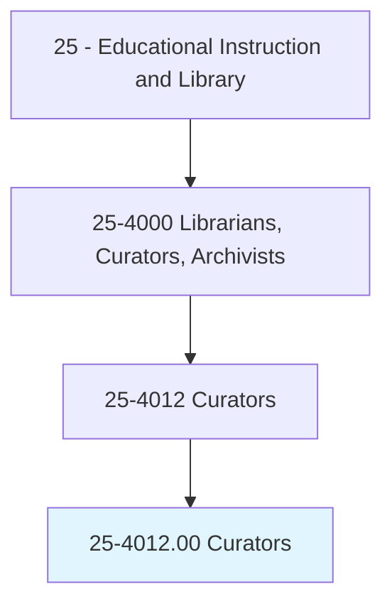
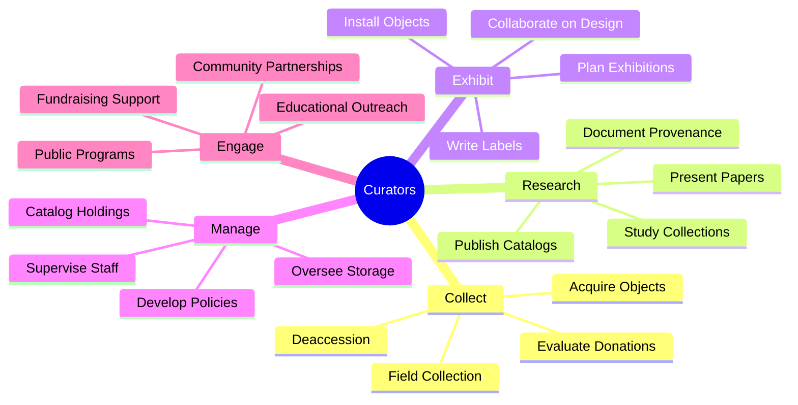
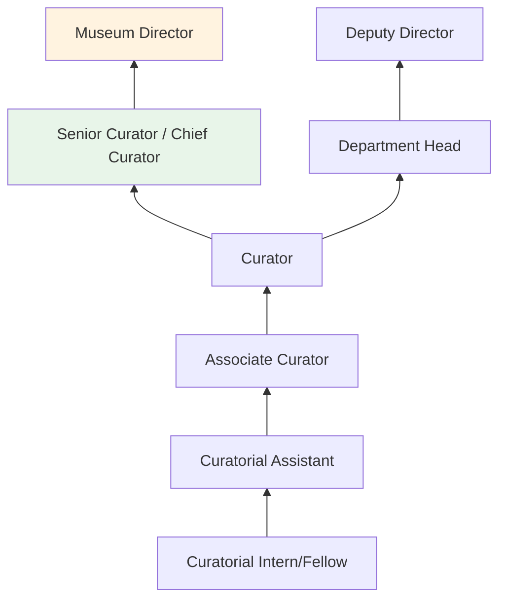
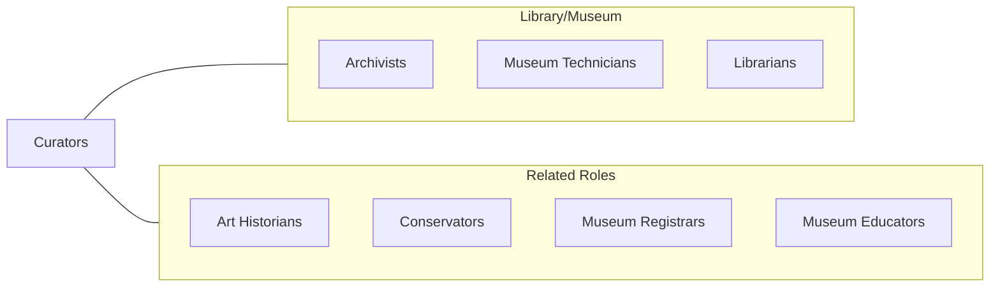

# Curators

> Administer collections, such as artwork, collectibles, historic items, or scientific specimens of museums or other institutions. May conduct instructional, research, or public service activities of institution.

## Overview

Curators manage, develop, and interpret collections in museums, galleries, botanical gardens, zoos, and other cultural institutions. They acquire objects through purchase, donation, or field collection; research their provenance, significance, and context; organize exhibitions that tell compelling stories; and ensure proper care and documentation of all items under their stewardship. Curators serve as the intellectual leaders of their institutions, shaping collecting priorities and exhibition programs.

The curatorial role demands deep subject-matter expertise in a specific discipline such as art history, natural history, anthropology, science, or history. Curators research their collections extensively, publish scholarly catalogs and articles, deliver lectures, and contribute to the broader academic discourse in their fields. They collaborate with conservators, designers, educators, and registrars to bring exhibitions from concept to public presentation.

Modern curators increasingly engage with digital technologies, developing virtual exhibitions, managing digital collections databases, and reaching audiences through social media and online programming. They also navigate complex ethical questions around repatriation of cultural objects, decolonization of collections, and equitable representation in exhibition narratives.

## Classification Hierarchy

## Key Statistics

| Metric | Value |
|--------|-------|
| SOC Code | 25-4012.00 |
| Job Zone | 5 (Extensive Preparation) |
| Category | [Educational Instruction and Library](/occupations/Education/index) |
| Median Salary | $60,000 - $78,000 |
| Employment | ~14,000 |
| Projected Growth | 9-12% (Faster than average) |
| Source | O*NET |

## Core Tasks

### curate.InstitutionalCollections

Curators develop and manage collections to fulfill institutional missions.

**Actions:**
- `acquire.Objects.for.InstitutionalCollection` - Evaluate and obtain items through purchase, gift, or field work
- `research.Collections.for.ScholarlyInterpretation` - Study objects' history, significance, and context
- `develop.Exhibitions.for.PublicEngagement` - Conceptualize and organize exhibitions that interpret collections

### manage.CollectionStewardship

Curators ensure long-term care and documentation of holdings.

**Actions:**
- `catalog.Objects.using.CollectionManagementSystems` - Document and track all items in institutional databases
- `develop.Policies.for.CollectionManagement` - Establish guidelines for acquisition, loans, and deaccession
- `collaborate.WithConservators.for.ObjectPreservation` - Ensure proper care and treatment of collection items

## Skills & Competencies

### Technical Skills
- **Subject Expertise** - Expert (art history, natural history, anthropology, or relevant discipline)
- **Collection Management** - Expert (accessioning, cataloging, loans, deaccession)
- **Exhibition Development** - Advanced (concept development, interpretation, design collaboration)
- **Research** - Advanced (primary source analysis, provenance research, publication)
- **Conservation Knowledge** - Intermediate (handling, storage, environmental requirements)
- **Digital Collections** - Advanced (databases, digital imaging, virtual exhibitions)

### Soft Skills
- **Communication** - Critical (writing exhibition text, public speaking, donor relations)
- **Aesthetic Judgment** - Essential (exhibition design and collection development)
- **Critical Thinking** - Essential (interpreting objects and developing narratives)
- **Collaboration** - Essential (working with diverse institutional teams)
- **Leadership** - Important (guiding institutional direction)
- **Diplomacy** - Important (navigating repatriation and ethical issues)

## Education & Certifications

| Requirement | Details |
|-------------|---------|
| Typical Education | Master's degree or Ph.D. in relevant discipline (art history, museum studies, natural science, etc.) |
| Alternative Entry | M.A. in Museum Studies with subject specialization |
| Work Experience | Internships and fellowships at museums expected |
| On-the-Job Training | Moderate; institutional practices and collections |
| Common Certifications | AAM membership; specialized discipline credentials |

## Career Progression

## Setting Variations

### Art Museums
Fine art, decorative arts, and contemporary art collections. Exhibition-driven programs with scholarly catalogs.

### Natural History Museums
Biological, geological, and paleontological specimens. Research collections supporting scientific study.

### History Museums
Material culture, documents, and artifacts interpreting historical narratives. Community engagement focus.

### Science Centers
Interactive exhibits and educational programming. Less collection-driven, more visitor experience focused.

### Botanical Gardens and Zoos
Living collections requiring horticultural or zoological expertise alongside curatorial skills.

## Technology & Tools

| Category | Tools |
|----------|-------|
| Collection Management | TMS (The Museum System), EMu, PastPerfect, CollectiveAccess |
| Digital Imaging | DSLR systems, flatbed scanners, 3D scanning |
| Exhibition Design | SketchUp, Adobe Creative Suite, CAD software |
| Research | JSTOR, ARTstor, discipline-specific databases |
| Virtual Exhibitions | Google Arts & Culture, Omeka, WordPress |
| Communication | Zoom, social media platforms |

## Related Occupations

## Industries

- Arts, Entertainment, and Recreation - Museums and Galleries
- [Educational Services](/industries/Education/index) - University Museums
- [Government](/industries/PublicAdministration) - National and State Museums
- [Other Services](/industries/OtherServices) - Historical Societies

## Departments

This occupation typically works in:
- Curatorial Department
- Collections Management
- Exhibitions

---

*Source: O*NET 25-4012.00 - ONETOccupation*
