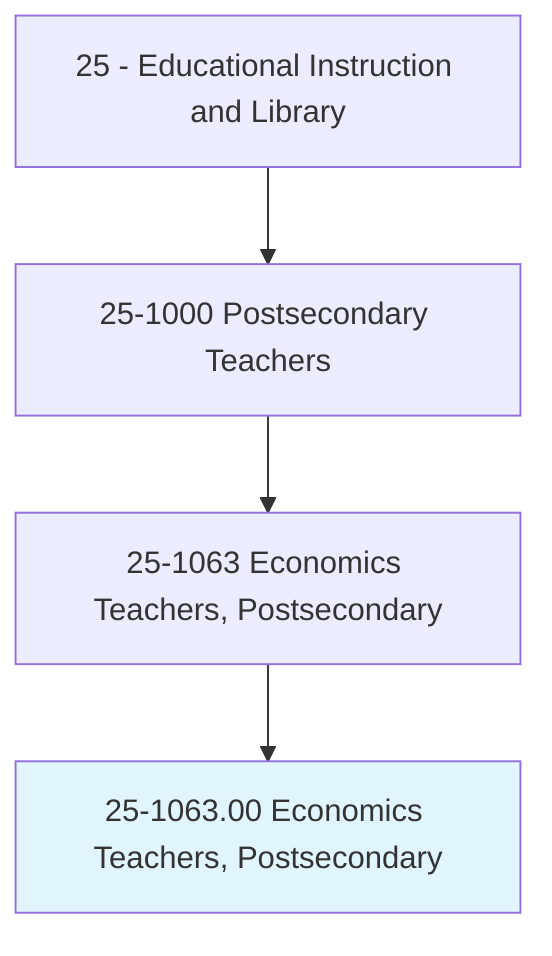
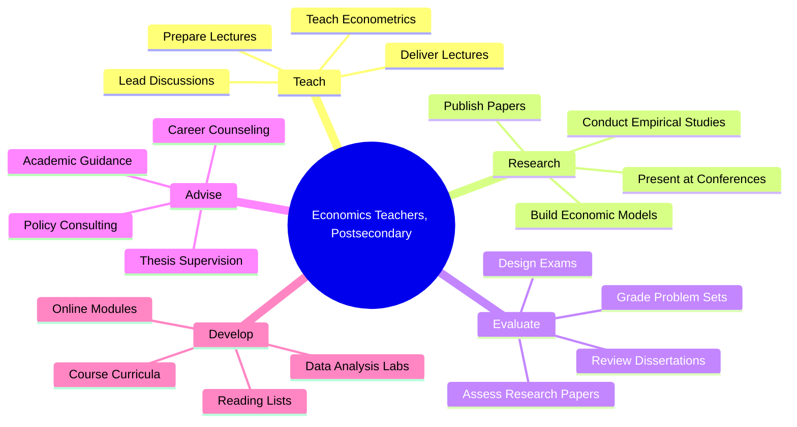
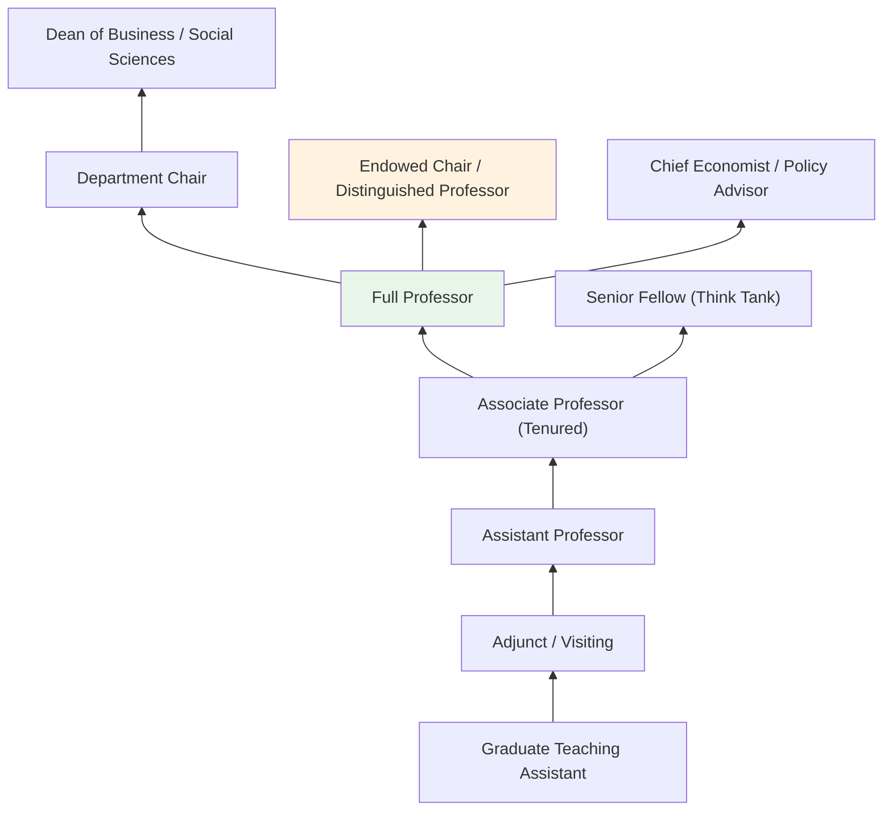
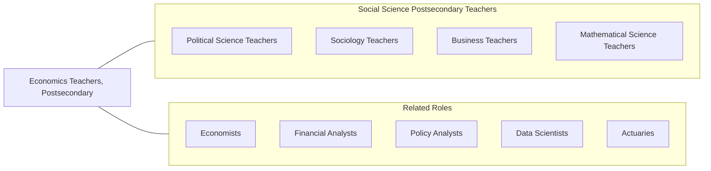

# Economics Teachers, Postsecondary

> Teach courses in economics. Includes both teachers primarily engaged in teaching and those who do a combination of teaching and research.

## Overview

Economics Teachers in postsecondary education instruct students in the principles and applications of economic theory, analysis, and policy. They teach courses covering microeconomics, macroeconomics, econometrics, international trade, labor economics, public finance, development economics, and financial economics. These educators combine theoretical instruction with data-driven analysis, training students to apply economic reasoning to real-world problems in business, government, and society.

Many economics professors are active researchers who contribute to the advancement of economic knowledge through empirical studies, theoretical modeling, and policy analysis. They publish in leading academic journals, participate in professional organizations such as the American Economic Association, and often serve as consultants or advisors to government agencies, central banks, and international organizations. Their research addresses topics ranging from monetary policy and market regulation to income inequality and behavioral economics.

Economics faculty serve an important bridge function between the social sciences and business disciplines. They prepare students for careers in finance, consulting, government policy, data analytics, and academia while also contributing to public discourse on economic issues. Their quantitative training makes them increasingly valuable in an era of data-driven decision-making across all sectors.

## Classification Hierarchy

## Key Statistics

| Metric | Value |
|--------|-------|
| SOC Code | 25-1063.00 |
| Job Zone | 5 (Extensive Preparation) |
| Category | [Educational Instruction and Library](/occupations/Education/index) |
| Median Salary | $105,000 - $130,000 |
| Employment | ~15,500 |
| Projected Growth | 5-8% (Average) |
| Source | O*NET |

## Core Tasks

### prepare.Lectures

Economics Teachers develop instructional content across economic disciplines.

**Actions:**
- `prepare.Lectures.to.Econometrics` - Create lectures on statistical methods for economic data analysis
- `prepare.Lectures.to.price.Theory` - Develop content on microeconomic theory and market analysis
- `prepare.Lectures.to.Macroeconomics` - Design lectures on aggregate economic behavior and policy

### deliver.Lectures

Economics Teachers present course material through various instructional methods.

**Actions:**
- `deliver.Lectures.to.Econometrics` - Teach statistical modeling and data analysis techniques
- `deliver.Lectures.to.price.Theory` - Instruct on supply, demand, market structures, and welfare economics
- `deliver.Lectures.to.Macroeconomics` - Present monetary policy, fiscal policy, and growth theory

### conduct.Research

Economics Teachers pursue scholarly research advancing economic knowledge.

**Actions:**
- `conduct.EmpiricalStudies.using.EconometricMethods` - Analyze economic data to test hypotheses
- `build.EconomicModels.for.PolicyAnalysis` - Develop theoretical and computational models
- `publish.Papers.in.EconomicJournals` - Contribute original research to peer-reviewed publications

## Skills & Competencies

### Technical Skills
- **Economic Theory** - Expert (micro, macro, game theory, welfare economics)
- **Econometrics** - Expert (statistical modeling, causal inference)
- **Data Analysis** - Expert (Stata, R, Python, MATLAB, EViews)
- **Mathematical Methods** - Advanced (optimization, calculus, linear algebra)
- **Research Design** - Advanced (empirical strategy, natural experiments)
- **Curriculum Design** - Advanced (economics pedagogy)

### Soft Skills
- **Analytical Thinking** - Critical (economic reasoning and modeling)
- **Communication** - Critical (explaining quantitative concepts clearly)
- **Writing** - Essential (academic papers, policy briefs)
- **Mentorship** - Essential (advising doctoral students)
- **Public Engagement** - Important (economic policy commentary)
- **Collaboration** - Important (co-authored research)

## Education & Certifications

| Requirement | Details |
|-------------|---------|
| Typical Education | Ph.D. in Economics or closely related field (Finance, Agricultural Economics, Public Policy) |
| Alternative Entry | Master's degree for community college or adjunct positions |
| Work Experience | Research experience required; policy or industry experience valued |
| On-the-Job Training | Faculty development; pedagogical workshops |
| Common Certifications | AEA membership; NBER affiliation (research universities); CFA (finance-oriented faculty) |

## Career Progression

## Setting Variations

### Research Universities
Strong emphasis on publishing in top-5 economics journals. Significant grant funding, doctoral student supervision, and lighter teaching loads.

### Liberal Arts Colleges
Focus on undergraduate teaching excellence. Broader course coverage including principles courses. Close mentorship of student research.

### Business Schools
Economics taught within MBA and business programs. Applied focus on managerial economics, financial economics, and strategy.

### Community Colleges
Principles of economics courses for transfer students. Higher teaching loads with emphasis on accessible instruction.

### Policy Institutions
Applied economic research and teaching at affiliated programs. Focus on policy-relevant empirical work and public engagement.

## Technology & Tools

| Category | Tools |
|----------|-------|
| Statistical Software | Stata, R, Python, MATLAB, EViews, SAS |
| Data Sources | FRED, BLS, Census Bureau, World Bank, IPUMS |
| Learning Management Systems | Canvas, Blackboard, Moodle |
| Presentation | LaTeX/Beamer, PowerPoint, Jupyter Notebooks |
| Reference Management | Zotero, BibTeX, Mendeley |
| Simulation | NetLogo, Wolfram Mathematica, GAMS |

## Related Occupations

## Industries

- [Educational Services - Colleges and Universities](/industries/Education/index) - Primary Employment
- [Government](/industries/PublicAdministration) - Federal Reserve, Treasury, Congressional Budget Office
- [Professional, Scientific, and Technical Services](/industries/Scientific) - Economic Consulting
- [Finance and Insurance](/industries/Finance) - Financial Research

## Departments

This occupation typically works in:
- Department of Economics
- School of Business
- School of Public Policy
- Department of Agricultural and Resource Economics

---

*Source: O*NET 25-1063.00 - ONETOccupation*
