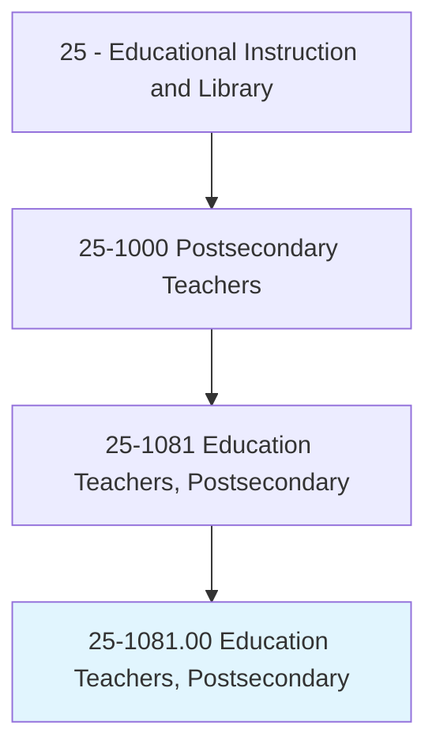
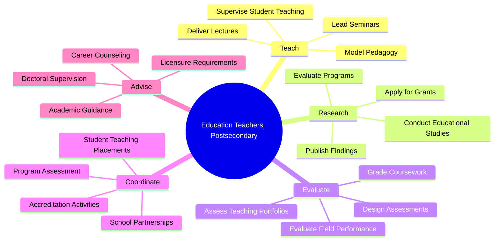
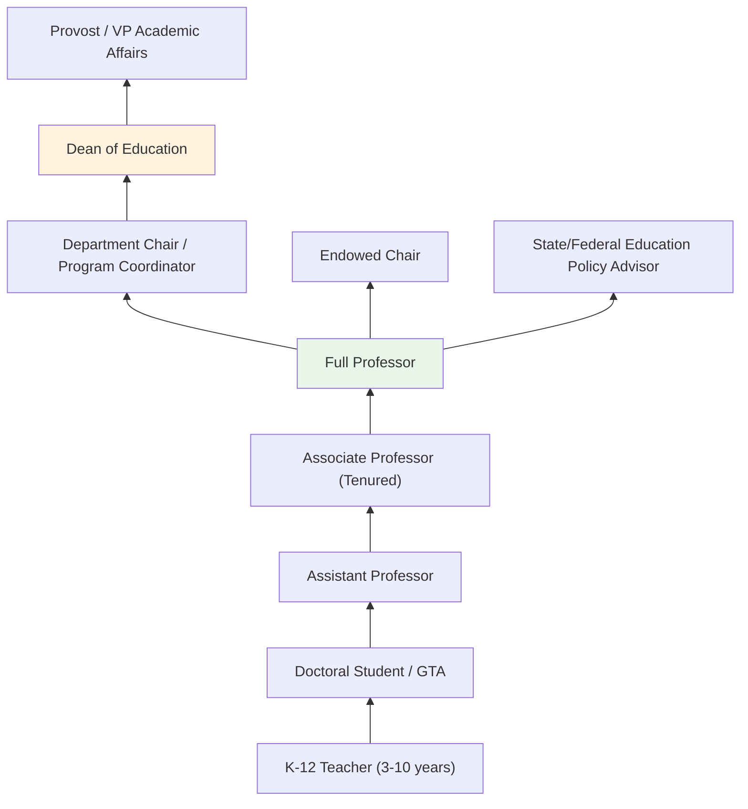
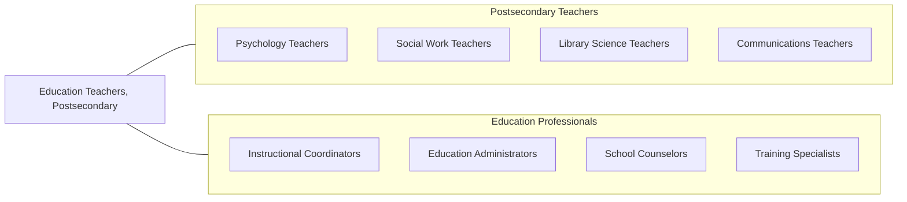

# Education Teachers, Postsecondary

> Teach courses pertaining to education, such as counseling, curriculum, guidance, instruction, teacher education, and teaching English as a second language. Includes both teachers primarily engaged in teaching and those who do a combination of teaching and research.

## Overview

Education Teachers in postsecondary education instruct current and future educators in pedagogical theory, instructional methods, curriculum design, educational leadership, school counseling, and specialized areas such as special education, literacy, and English language learning. They teach courses in schools and colleges of education at the undergraduate, master's, and doctoral levels, preparing teachers, administrators, counselors, and educational researchers for careers across the K-20 education spectrum.

Many education professors conduct research on teaching effectiveness, student learning outcomes, educational equity, technology integration, teacher professional development, and education policy. They publish in journals such as the American Educational Research Journal, Teaching and Teacher Education, and Educational Researcher. Their scholarship directly informs classroom practice, school improvement efforts, and educational policy decisions at local, state, and national levels.

Education faculty serve a distinctive dual role: they must be expert practitioners of the pedagogical methods they teach while also contributing to the scholarly understanding of how learning works. They model effective teaching practices, supervise student teachers in field placements, collaborate with partner school districts, and prepare graduates who will shape the educational experiences of millions of students.

## Classification Hierarchy

## Key Statistics

| Metric | Value |
|--------|-------|
| SOC Code | 25-1081.00 |
| Job Zone | 5 (Extensive Preparation) |
| Category | [Educational Instruction and Library](/occupations/Education/index) |
| Median Salary | $68,000 - $88,000 |
| Employment | ~80,000 |
| Projected Growth | 8-12% (Faster than average) |
| Source | O*NET |

## Core Tasks

### teach.EducationCourses

Education Teachers deliver instruction in pedagogical theory and practice.

**Actions:**
- `deliver.Lectures.on.CurriculumDesign` - Teach principles of curriculum development, standards alignment, and backward design
- `deliver.Lectures.on.InstructionalMethods` - Instruct on differentiated instruction, assessment strategies, and classroom management
- `model.EffectiveTeachingPractices.for.PreServiceTeachers` - Demonstrate pedagogical techniques students will replicate

### supervise.StudentTeaching

Education Teachers oversee field-based teacher preparation experiences.

**Actions:**
- `supervise.StudentTeachers.in.K12Classrooms` - Observe, evaluate, and coach student teachers during placements
- `coordinate.FieldPlacements.with.PartnerSchools` - Arrange and manage clinical experiences
- `evaluate.TeachingPortfolios.for.LicensureReadiness` - Assess evidence of pedagogical competence

### conduct.EducationalResearch

Education Teachers pursue scholarship advancing educational practice and policy.

**Actions:**
- `conduct.Research.on.TeachingEffectiveness` - Study instructional strategies and learning outcomes
- `conduct.Research.on.EducationalEquity` - Investigate disparities in educational access and achievement
- `publish.Findings.in.EducationJournals` - Contribute to peer-reviewed educational research literature

## Skills & Competencies

### Technical Skills
- **Pedagogy** - Expert (instructional design, assessment, classroom management)
- **Curriculum Design** - Expert (standards-based, culturally responsive, UDL)
- **Research Methods** - Advanced (action research, mixed methods, program evaluation)
- **Educational Technology** - Advanced (LMS, digital tools, blended learning)
- **Assessment** - Advanced (formative, summative, performance-based)
- **Accreditation** - Advanced (CAEP/AAQEP standards, program review)

### Soft Skills
- **Communication** - Critical (modeling clear instruction)
- **Mentorship** - Critical (developing emerging educators)
- **Cultural Competency** - Essential (preparing teachers for diverse schools)
- **Collaboration** - Essential (school partnerships, co-teaching)
- **Empathy** - Essential (understanding pre-service teacher development)
- **Leadership** - Important (program development, educational advocacy)

## Education & Certifications

| Requirement | Details |
|-------------|---------|
| Typical Education | Ph.D. or Ed.D. in Education, Curriculum and Instruction, or related specialization |
| Teaching License | Prior K-12 teaching license with classroom experience typically required |
| Work Experience | 3-5+ years K-12 teaching experience expected |
| On-the-Job Training | Faculty development; clinical supervision training |
| Common Certifications | State teaching license; NBPTS certification valued; AERA/AACTE membership |

## Career Progression

## Setting Variations

### Research Universities
Emphasis on educational research, grant funding, and doctoral student supervision. Lower teaching loads.

### Teaching-Focused Universities
Strong teacher preparation programs with high enrollment. Emphasis on clinical practice and school partnerships.

### Community Colleges
Education courses for transfer to four-year programs. Early childhood education associate degrees.

### Online Programs
Distance teacher preparation and educational leadership programs. Growing enrollment in M.Ed. and Ed.D. programs.

### Alternative Certification Programs
Preparing career changers for teaching through accelerated programs. Emphasis on practical classroom skills.

## Technology & Tools

| Category | Tools |
|----------|-------|
| Learning Management Systems | Canvas, Blackboard, Google Classroom, Schoology |
| Observation Tools | GoReact, Edthena, video coaching platforms |
| Assessment | Watermark (Tk20/Via), LiveText, TaskStream |
| Research Tools | SPSS, NVivo, Qualtrics, HLM |
| Productivity | Microsoft Office, Google Workspace |
| Presentation | PowerPoint, Nearpod, Pear Deck |

## Related Occupations

## Industries

- [Educational Services - Schools of Education](/industries/Education/index) - Primary Employment
- [Government](/industries/PublicAdministration) - State Education Agencies, Federal DOE
- [Professional Services](/industries/Scientific) - Educational Consulting
- [Other Services](/industries/OtherServices) - Educational Nonprofits

## Departments

This occupation typically works in:
- [School/College of Education](/departments/HR)
- Department of Curriculum and Instruction
- Department of Educational Leadership
- Teacher Education Program

---

*Source: O*NET 25-1081.00 - ONETOccupation*
