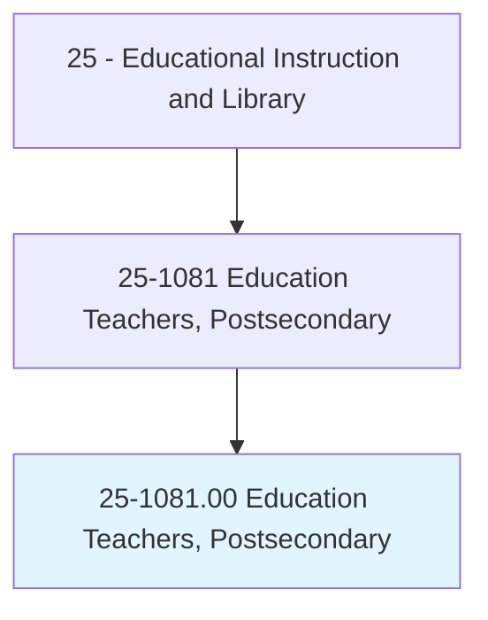
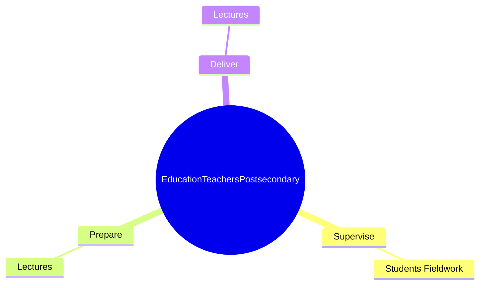
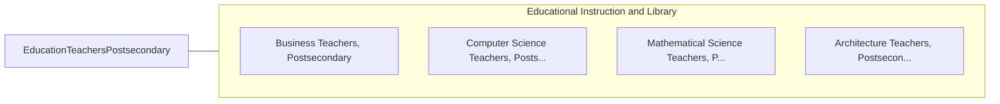

# Education Teachers, Postsecondary

> Teach courses pertaining to education, such as counseling, curriculum, guidance, instruction, teacher education, and teaching English as a second language. Includes both teachers primarily engaged in teaching and those who do a combination of teaching and research.

## Overview

Education Teachers, Postsecondary is an occupation within the Educational Instruction and Library category. Teach courses pertaining to education, such as counseling, curriculum, guidance, instruction, teacher education, and teaching English as a second language. 

## Classification Hierarchy

## Key Statistics

| Metric | Value |
|--------|-------|
| SOC Code | 25-1081.00 |
| Category | [Educational Instruction and Library](/occupations/Education/index) |
| Task Count | 16 |
| Source | O*NET |

## Core Tasks

### supervise.StudentsFieldwork

Education Teachers, Postsecondary supervise students fieldwork as part of their core responsibilities.

**Actions:**
- `supervise.StudentsFieldwork`

### prepare.Lectures

Education Teachers, Postsecondary prepare lectures as part of their core responsibilities.

**Actions:**
- `prepare.Lectures.to.ChildrensLiterature`
- `prepare.Lectures.to.Learning`
- `prepare.Lectures.to.Development`
- `prepare.Lectures.to.ReadingInstruction`

### deliver.Lectures

Education Teachers, Postsecondary deliver lectures as part of their core responsibilities.

**Actions:**
- `deliver.Lectures.to.ChildrensLiterature`
- `deliver.Lectures.to.Learning`
- `deliver.Lectures.to.Development`
- `deliver.Lectures.to.ReadingInstruction`

## Skills & Competencies

### Technical Skills
- **Curriculum Development** - Advanced
- **Instructional Design** - Advanced
- **Assessment** - Advanced

### Soft Skills
- **Communication** - Essential
- **Problem Solving** - Essential
- **Critical Thinking** - Important
- **Teamwork** - Important
- **Adaptability** - Important

## Related Occupations

## Industries

This occupation is found across multiple industries. See [Industries](/industries) for sector-specific employment data.

## Career Progression

---

*Source: O*NET 25-1081.00 - ONETOccupation*
