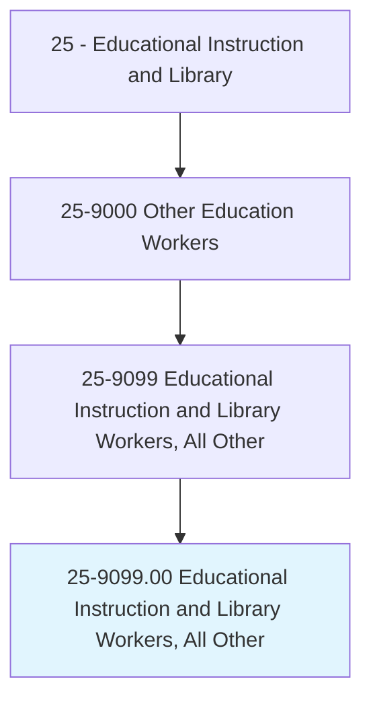
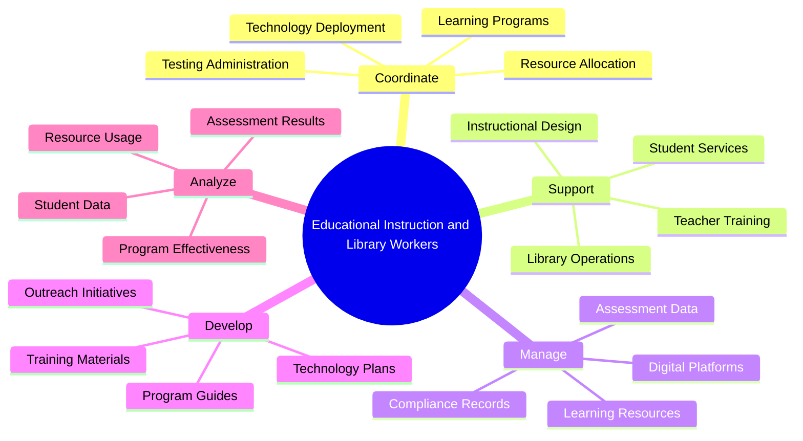
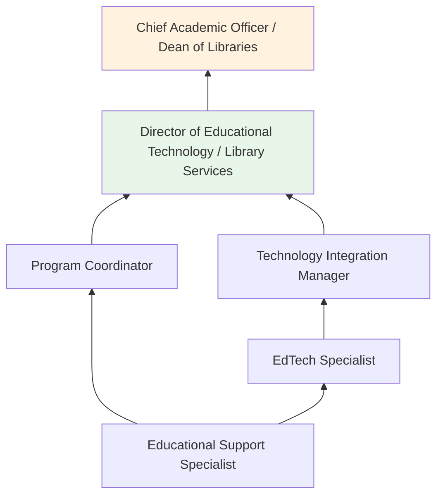
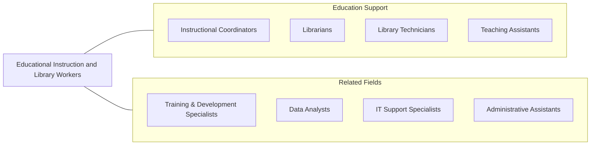

# Educational Instruction and Library Workers, All Other

> All educational instruction and library workers not listed separately.

## Overview

Educational Instruction and Library Workers, All Other is a residual classification capturing the wide array of professionals who support education and library services but do not fall into specifically defined occupational categories. These workers may include educational technology specialists, learning resource coordinators, literacy coaches, academic success advisors, testing coordinators, and library outreach specialists. They operate in schools, colleges, public libraries, corporate learning centers, and non-profit organizations.

The roles within this category are characterized by their hybrid nature, often blending instructional, technological, and administrative functions. For example, an educational technology specialist might train teachers on digital tools while also managing learning platform configurations. A testing coordinator may oversee standardized assessment administration while analyzing data to improve instructional outcomes. These workers serve as the connective tissue between educators, administrators, and learners.

As educational institutions increasingly adopt technology-driven approaches and data-informed decision making, the demand for workers who bridge instructional practice and operational support continues to grow. These professionals must be comfortable working across departments, translating between technical and pedagogical languages, and adapting to the evolving needs of modern educational environments.

## Classification Hierarchy

## Key Statistics

| Metric | Value |
|--------|-------|
| SOC Code | 25-9099.00 |
| Job Zone | 4 (Considerable Preparation) |
| Category | [Educational Instruction and Library](/occupations/Education/index) |
| Median Salary | $42,000 - $58,000 |
| Employment | ~65,000 |
| Projected Growth | 5-8% (Average) |
| Source | O*NET |

## Core Tasks

### coordinate.LearningPrograms

Educational Instruction and Library Workers organize and manage educational programs and services.

**Actions:**
- `coordinate.LearningPrograms.across.Departments` - Ensure alignment of instructional initiatives across the organization
- `coordinate.TestingAdministration.for.ComplianceRequirements` - Oversee standardized testing logistics
- `coordinate.TechnologyDeployment.for.InstructionalUse` - Manage rollout of educational technology tools

### support.EducationalOperations

These workers provide support services to teachers, students, and library patrons.

**Actions:**
- `support.TeacherTraining.on.NewTechnologies` - Assist educators with adopting digital tools
- `support.StudentServices.through.AcademicGuidance` - Help students access learning resources
- `support.LibraryOperations.with.CollectionManagement` - Assist with cataloging and resource organization

### manage.DigitalPlatforms

These workers oversee educational technology systems and data management.

**Actions:**
- `manage.LearningManagementSystems.for.InstitutionalUse` - Administer LMS platforms and user accounts
- `manage.AssessmentData.for.InstructionalImprovement` - Collect and organize student performance data
- `manage.DigitalResources.for.LibraryAccess` - Maintain electronic databases and digital collections

## Skills & Competencies

### Technical Skills
- **Educational Technology** - Advanced (LMS administration, digital tools)
- **Data Analysis** - Intermediate to Advanced (assessment data, program metrics)
- **Instructional Support** - Advanced (coaching, training, resource development)
- **Library Science** - Intermediate (cataloging, reference, collection management)
- **Project Management** - Intermediate (program coordination, event planning)
- **Information Systems** - Intermediate (databases, student information systems)

### Soft Skills
- **Communication** - Critical (liaising between stakeholders)
- **Organization** - Critical (managing multiple programs and systems)
- **Problem Solving** - Essential (troubleshooting technical and logistical issues)
- **Collaboration** - Essential (cross-departmental teamwork)
- **Adaptability** - Essential (evolving technology and educational practices)
- **Attention to Detail** - Important (data accuracy, compliance)

## Education & Certifications

| Requirement | Details |
|-------------|---------|
| Typical Education | Bachelor's degree in education, library science, or related field |
| Preferred Education | Master's degree in educational technology, library science, or instructional design |
| Work Experience | 1-3 years in educational or library setting |
| On-the-Job Training | Moderate; institutional systems and procedures |
| Common Certifications | Google Certified Educator; ISTE Certification; Library Support Staff Certification; state-specific credentials |

## Career Progression

## Setting Variations

### K-12 Schools
Support instructional technology integration, testing coordination, and media center operations. Work closely with teachers and administrators.

### Higher Education
Manage learning management systems, coordinate faculty development programs, and support digital library services.

### Public Libraries
Coordinate outreach programs, manage digital resources, and support community education initiatives.

### Corporate Learning Centers
Oversee e-learning platforms, coordinate professional development, and manage compliance training records.

### Online Education
Support virtual learning infrastructure, manage content delivery systems, and coordinate remote student services.

## Technology & Tools

| Category | Tools |
|----------|-------|
| Learning Management Systems | Canvas, Blackboard, Moodle, Schoology |
| Student Information Systems | PowerSchool, Banner, PeopleSoft |
| Library Systems | Koha, Alma, Sierra, Follett Destiny |
| Assessment Platforms | NWEA MAP, Renaissance Star, DnA |
| Data Analytics | Tableau, Power BI, Google Data Studio |
| Productivity | Microsoft Office, Google Workspace, Slack |

## Related Occupations

## Industries

- [Educational Services - Elementary and Secondary Schools](/industries/Education/index) - Primary Employment
- [Educational Services - Colleges and Universities](/industries/Education/index) - Higher Education Support
- [Government](/industries/Government) - Public Libraries and Agencies
- [Professional Services](/industries/ProfessionalServices) - EdTech Companies

## Departments

This occupation typically works in:
- [Educational Technology](/departments/EdTech)
- [Library Services](/departments/LibraryServices)
- [Academic Affairs](/departments/AcademicAffairs)
- [Assessment and Accountability](/departments/Assessment)
- [Student Services](/departments/StudentServices)

---

*Source: O*NET 25-9099.00 - ONETOccupation*
