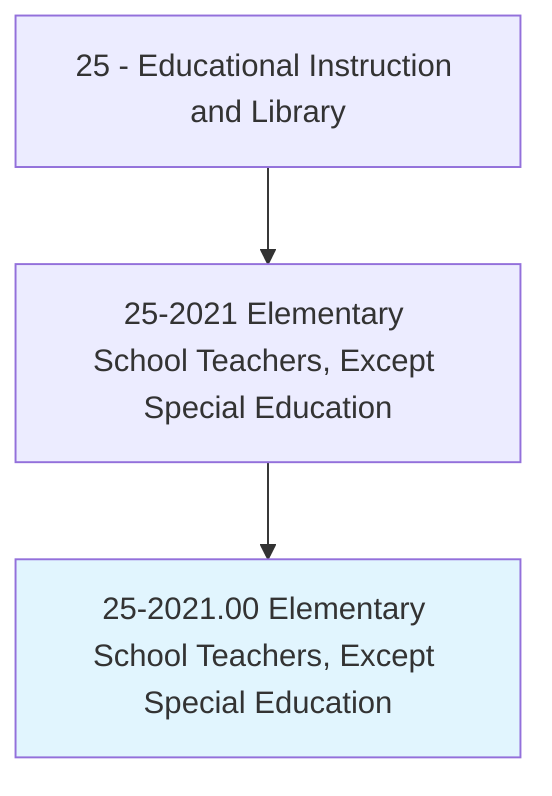
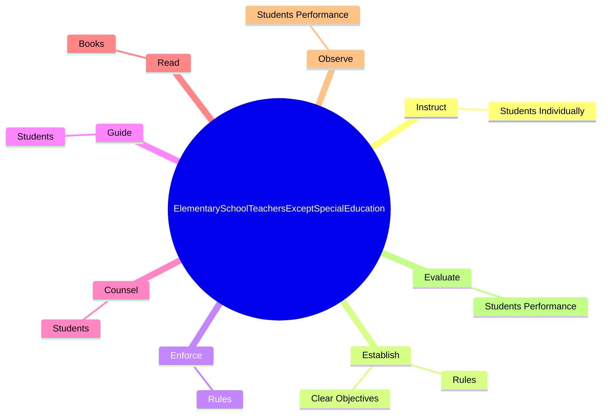
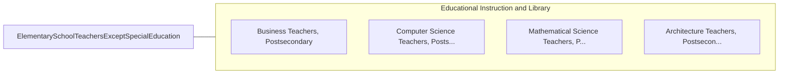

# Elementary School Teachers, Except Special Education

> Teach academic and social skills to students at the elementary school level.

## Overview

Elementary School Teachers, Except Special Education is classified under Educational Instruction and Library (SOC 25). Teach academic and social skills to students at the elementary school level.

## Classification Hierarchy

## Key Statistics

| Metric | Value |
|--------|-------|
| SOC Code | 25-2021.00 |
| Category | [Educational Instruction and Library](/occupations/Education) |
| Task Count | 47 |
| Source | O*NET |

## Core Tasks

### instruct.StudentsIndividually

Elementary School Teachers, Except Special Education instruct students individually as part of their core responsibilities.

**Actions:**
- `instruct.StudentsIndividually.in.UsingTeachingMethods`
- `instruct.StudentsIndividually.in.Lectures`
- `instruct.StudentsIndividually.in.Discussions`
- `instruct.StudentsIndividually.in.Demonstrations`

### establish.Rules

Elementary School Teachers, Except Special Education establish rules as part of their core responsibilities.

**Actions:**
- `establish.Rules.for.Behavior.for.MaintainingOrderAmongStudents`
- `establish.Rules.for.Procedures.for.MaintainingOrderAmongStudents`
- `establish.ClearObjectives.for.ProjectsObjectives.to.Students`
- `establish.ClearObjectives.for.CommunicateObjectives.to.Students`

### enforce.Rules

Elementary School Teachers, Except Special Education enforce rules as part of their core responsibilities.

**Actions:**
- `enforce.Rules.for.Behavior.for.MaintainingOrderAmongStudents`
- `enforce.Rules.for.Procedures.for.MaintainingOrderAmongStudents`

## Skills & Competencies

### Technical Skills
- **Curriculum Development** - Advanced
- **Instructional Design** - Advanced
- **Assessment** - Advanced

### Soft Skills
- **Communication** - Essential
- **Problem Solving** - Essential
- **Critical Thinking** - Important
- **Teamwork** - Important
- **Adaptability** - Important

## Related Occupations

## Industries

This occupation is found across multiple industries. See [Industries](/industries) for sector-specific employment data.

## Career Progression

---

*Source: O*NET 25-2021.00 - ONETOccupation*
