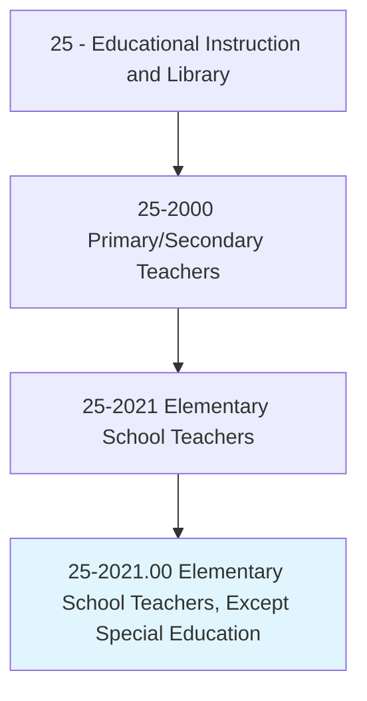
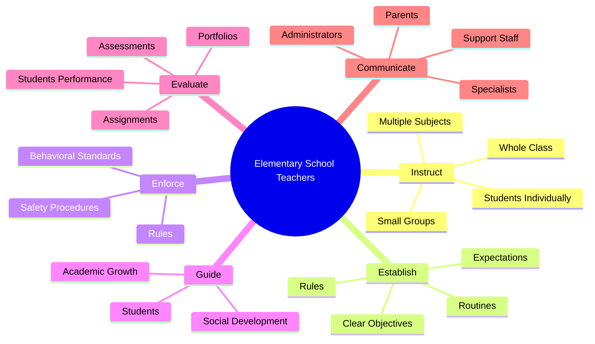
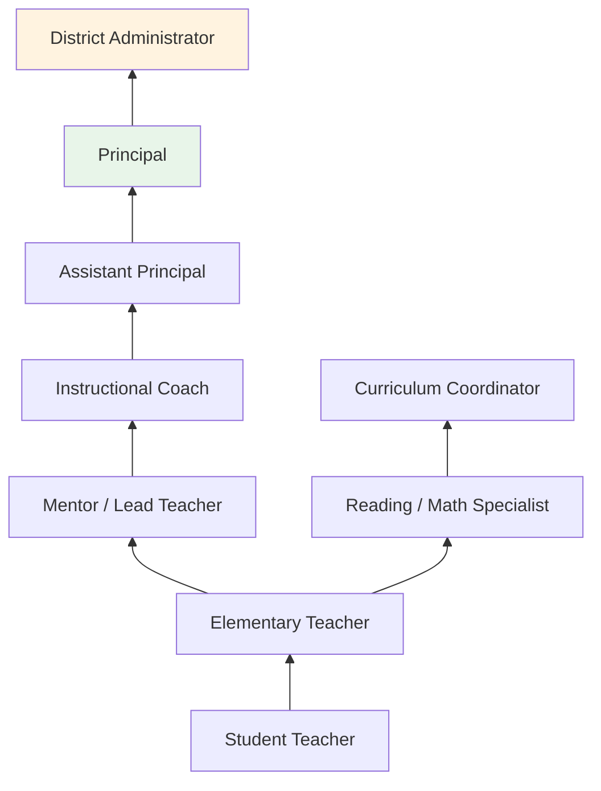
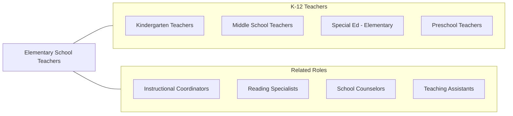

# Elementary School Teachers, Except Special Education

> Teach academic and social skills to students at the elementary school level.

## Overview

Elementary School Teachers instruct children in grades K-5 (or K-6) across all core academic subjects including reading, mathematics, science, social studies, and writing. They are responsible for providing the foundational academic skills, social competencies, and learning habits that students will build upon throughout their educational careers. These educators design comprehensive daily instruction that spans multiple subject areas, differentiating for diverse learning needs within a single classroom of 20-30 students.

Elementary teaching demands exceptional versatility, as teachers must be skilled across multiple content areas while also addressing the social-emotional development of young children. They create structured yet nurturing classroom environments, establish behavioral expectations, build reading and mathematical fluency, develop scientific curiosity, and foster creative expression. Many elementary teachers integrate subjects through thematic units that connect reading, writing, science, and social studies around engaging topics.

The elementary level represents the most labor-intensive period of foundational skill development. Teachers must identify students who need additional support, implement tiered interventions, communicate regularly with families, and collaborate with specialists including reading coaches, ESL teachers, and school counselors. Their influence on students' academic trajectories and attitudes toward learning is profound and lasting.

## Classification Hierarchy

## Key Statistics

| Metric | Value |
|--------|-------|
| SOC Code | 25-2021.00 |
| Job Zone | 4 (Considerable Preparation) |
| Category | [Educational Instruction and Library](/occupations/Education/index) |
| Median Salary | $61,000 - $70,000 |
| Employment | ~1,400,000 |
| Projected Growth | 2-4% (Average) |
| Source | O*NET |

## Core Tasks

### instruct.StudentsIndividually

Elementary Teachers deliver multi-subject instruction using varied strategies.

**Actions:**
- `instruct.StudentsIndividually.in.UsingTeachingMethods` - Provide differentiated instruction based on learning needs
- `instruct.StudentsIndividually.in.Lectures` - Present whole-class lessons on new concepts
- `instruct.StudentsIndividually.in.Discussions` - Facilitate student discourse and collaborative learning
- `instruct.StudentsIndividually.in.Demonstrations` - Model skills and strategies for student practice

### establish.Rules

Elementary Teachers create structured classroom environments.

**Actions:**
- `establish.Rules.for.Behavior.for.MaintainingOrderAmongStudents` - Set behavioral expectations and consequences
- `establish.Rules.for.Procedures.for.MaintainingOrderAmongStudents` - Create routines for transitions, materials, and activities
- `establish.ClearObjectives.for.ProjectsObjectives.to.Students` - Communicate learning goals clearly
- `establish.ClearObjectives.for.CommunicateObjectives.to.Students` - Share expectations for quality work

## Skills & Competencies

### Technical Skills
- **Multi-Subject Pedagogy** - Expert (reading, math, science, social studies, writing)
- **Literacy Instruction** - Expert (phonics, fluency, comprehension, writing process)
- **Mathematics Instruction** - Advanced (number sense, operations, problem-solving)
- **Classroom Management** - Advanced (PBIS, responsive classroom, morning meeting)
- **Assessment** - Advanced (formative, summative, running records, portfolio)
- **Educational Technology** - Advanced (interactive whiteboards, tablets, LMS, apps)

### Soft Skills
- **Patience** - Critical (working with young children and diverse needs)
- **Communication** - Critical (parent engagement, clear instruction, reporting)
- **Empathy** - Essential (understanding childhood emotions and development)
- **Creativity** - Essential (designing engaging, cross-curricular activities)
- **Organization** - Essential (managing multiple subjects, materials, and data)
- **Energy** - Important (sustaining engagement throughout the school day)

## Education & Certifications

| Requirement | Details |
|-------------|---------|
| Typical Education | Bachelor's degree in Elementary Education or related field |
| State Licensure | Required in all states; elementary education endorsement |
| Student Teaching | Supervised clinical experience in elementary classrooms required |
| Continuing Education | Professional development hours for license renewal |
| Common Certifications | State elementary teaching license; NBPTS Early/Middle Childhood; Praxis Elementary Education; ESL endorsement |

## Career Progression

## Setting Variations

### Public Elementary Schools
Standards-aligned instruction serving diverse student populations. State testing and accountability requirements.

### Private and Independent Schools
May have more curricular flexibility. Smaller class sizes. Mission-driven education.

### Charter Schools
Innovative pedagogical models (Montessori, Expeditionary Learning, etc.). Varied governance structures.

### Online/Virtual Elementary Schools
Digital instruction for young learners with parent facilitation. Growing but limited compared to secondary.

### International Schools
American or IB curriculum abroad. Multicultural student populations.

## Technology & Tools

| Category | Tools |
|----------|-------|
| Learning Management | Google Classroom, Seesaw, ClassDojo |
| Reading | Epic, Raz-Kids, Lexia, Amplify Reading |
| Math | Dreambox, Zearn, ST Math, IXL |
| Assessment | mCLASS (DIBELS), MAP Growth, STAR |
| Communication | Remind, ParentSquare, ClassDojo |
| Student Information | PowerSchool, Infinite Campus |

## Related Occupations

## Industries

- [Educational Services - Elementary Schools](/industries/Education/index) - Primary Employment
- [Government](/industries/Government) - Public School Districts
- [Religious Organizations](/industries/ReligiousOrganizations) - Private Schools
- [Other Services](/industries/OtherServices) - Charter Schools

## Departments

This occupation typically works in:
- [Grade-Level Teams](/departments/GradeLevelTeams) (K, 1st, 2nd, 3rd, 4th, 5th)
- [Curriculum and Instruction](/departments/CurriculumInstruction)
- [Student Support Team](/departments/StudentSupport)

---

*Source: O*NET 25-2021.00 - ONETOccupation*
