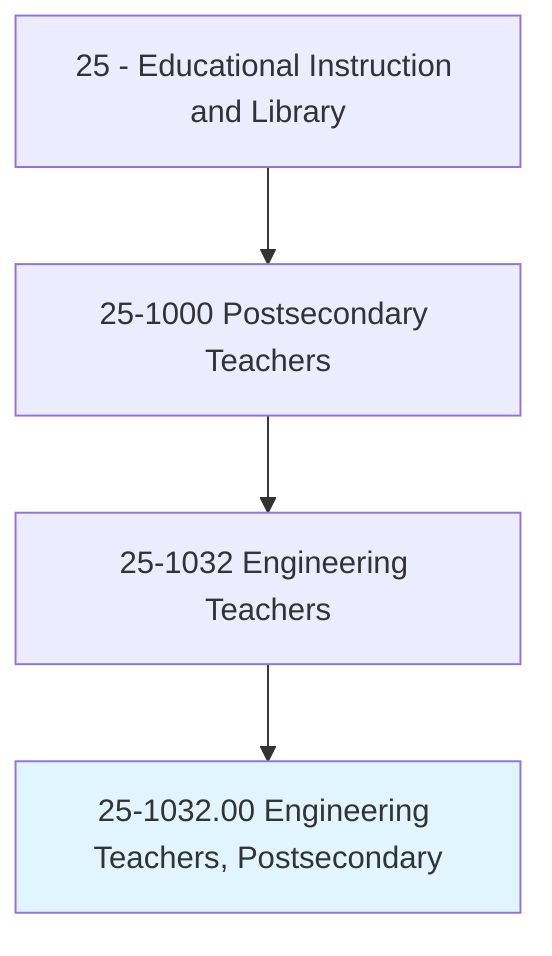
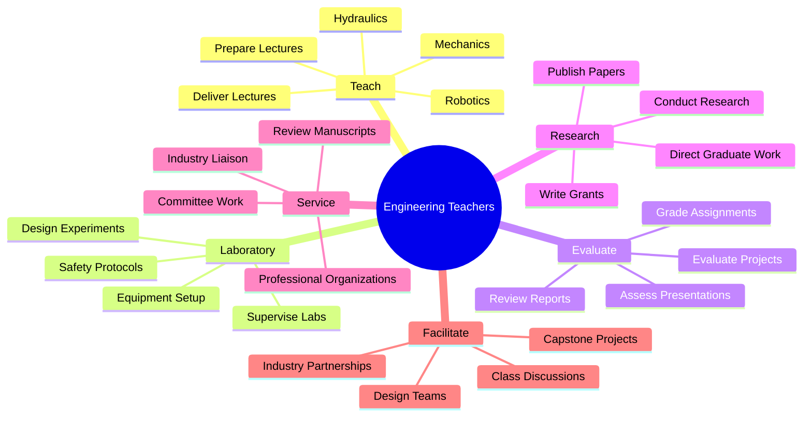
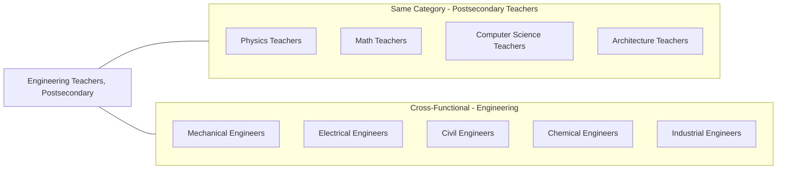
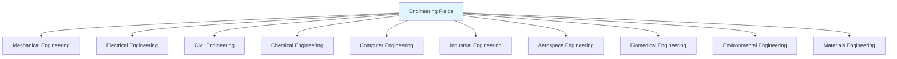
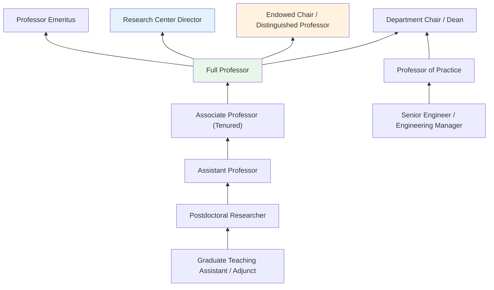
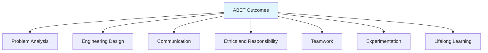

# Engineering Teachers, Postsecondary

> Teach courses pertaining to the application of physical laws and principles of engineering for the development of machines, materials, instruments, processes, and services. Includes teachers of subjects such as chemical, civil, electrical, industrial, mechanical, mineral, and petroleum engineering. Includes both teachers primarily engaged in teaching and those who do a combination of teaching and research.

## Overview

Engineering Teachers in postsecondary education instruct students in the application of scientific and mathematical principles to design, develop, and improve systems, products, and processes. They cover diverse engineering disciplines including civil, mechanical, electrical, chemical, computer, industrial, and aerospace engineering. These educators combine theoretical instruction with hands-on laboratory experience and design projects, preparing students for professional engineering practice. Many maintain active research programs funded by government agencies and industry partners, advancing technological innovation while mentoring graduate students. Engineering faculty often serve as bridges between academia and industry, engaging in consulting, technology transfer, and collaborative research.

## Classification Hierarchy



## Key Statistics

| Metric | Value |
|--------|-------|
| SOC Code | 25-1032.00 |
| Job Zone | 5 (Extensive Preparation) |
| Category | [Educational Instruction and Library](/occupations/Education) |
| Core Tasks | 15+ |
| Source | O*NET |

## Core Tasks



### prepare.Lectures

Engineering Teachers develop instructional content covering engineering principles, analysis methods, and design applications.

**Actions:**
- `prepare.Lectures.to.Mechanics` - Create lectures on statics, dynamics, and mechanics of materials
- `prepare.Lectures.to.Hydraulics` - Develop content on fluid mechanics and hydraulic systems
- `prepare.Lectures.to.Robotics` - Prepare lectures on robotics, automation, and control systems

### deliver.Lectures

Engineering Teachers present course material through lectures, demonstrations, simulations, and practical examples.

**Actions:**
- `deliver.Lectures.to.Mechanics` - Teach principles of force, motion, and material behavior
- `deliver.Lectures.to.Hydraulics` - Instruct students on fluid flow, pressure systems, and hydraulic design
- `deliver.Lectures.to.Robotics` - Present robotics theory, kinematics, and programming

### facilitate.ClassDiscussions

Engineering Teachers engage students in active learning through discussions, problem-solving sessions, and collaborative activities.

**Actions:**
- `initiate.ClassDiscussions` - Start discussions on engineering problems and design challenges
- `facilitate.ClassDiscussions` - Guide student discourse and collaborative problem-solving
- `moderate.ClassDiscussions` - Manage classroom dialogue to ensure productive engagement

### review.Manuscripts

Engineering Teachers contribute to the scholarly community through peer review and professional service.

**Actions:**
- `review.Manuscripts.for.ProfessionalJournals` - Evaluate research papers submitted to engineering journals

## Skills & Competencies

### Technical Skills
- **Engineering Fundamentals** - Expert (mathematics, physics, chemistry foundations)
- **Discipline-Specific Knowledge** - Expert (specialized engineering field)
- **Research Methods** - Advanced (experimental design, data analysis)
- **Engineering Software** - Advanced (CAD, FEA, MATLAB, simulation tools)
- **Laboratory Skills** - Advanced (instrumentation, measurement, safety)
- **Technical Writing** - Expert (proposals, publications, reports)

### Soft Skills
- **Communication** - Critical (explaining technical concepts)
- **Problem Solving** - Critical (engineering challenges)
- **Project Management** - Essential (research coordination, capstone supervision)
- **Mentorship** - Essential (graduate student development)
- **Collaboration** - Essential (interdisciplinary research, industry partnerships)

## Related Occupations



## Industry Variations

### Research Universities
Heavy emphasis on funded research; doctoral program direction; publication in top journals (IEEE, ASME, ASCE); significant NSF/DoD/DOE grant portfolios; lighter teaching loads; graduate student mentorship.

### Teaching-Focused Institutions
Primary focus on undergraduate education; ABET-accredited programs; higher course loads; industry-relevant curriculum; capstone design projects; student success orientation.

### Technical Institutes
Emphasis on practical engineering skills; strong laboratory components; industry partnerships; cooperative education; hands-on design-build projects.

### Community Colleges
Engineering fundamentals; transfer preparation; technician training; workforce development; industry certifications.

### Professional Schools
Graduate engineering education; executive programs; professional master's degrees; continuing education; industry customized training.

### Industry-Affiliated Programs
Corporate university partnerships; sponsored research; adjunct faculty from industry; applied research focus; technology transfer emphasis.

## Engineering Disciplines



## Industries

- [Educational Services - Colleges and Universities](/industries/EducationalServices) - Primary Employment
- [Professional, Scientific, and Technical Services](/industries/ProfessionalServices) - Consulting/Research
- [Manufacturing](/industries/Manufacturing) - Industry Partnerships
- [Government](/industries/Government) - Public Universities, Research Labs
- [Defense and Aerospace](/industries/DefenseAerospace) - Sponsored Research
- [Energy](/industries/Energy) - Alternative Energy Research

## Career Progression



## Education & Training

| Requirement | Details |
|-------------|---------|
| Typical Education | Ph.D. in Engineering or closely related field; M.S. may suffice for teaching-focused positions |
| Work Experience | Postdoctoral research common; industry experience highly valued; professional engineering license (PE) desirable |
| On-the-Job Training | Faculty development; grant writing workshops; teaching effectiveness programs; lab safety training |
| Common Certifications | Professional Engineer (PE); discipline-specific certifications; professional society memberships (IEEE, ASME, ASCE, AIChE) |

## Departments

This occupation typically works in:
- [Department of Mechanical Engineering](/departments/MechanicalEngineering)
- [Department of Electrical Engineering](/departments/ElectricalEngineering)
- [Department of Civil Engineering](/departments/CivilEngineering)
- [Department of Chemical Engineering](/departments/ChemicalEngineering)
- [Department of Computer Engineering](/departments/ComputerEngineering)
- [College of Engineering](/departments/Engineering)

## GraphDL Semantic Structure

The core semantic patterns for Engineering Teachers follow this structure:

```
verb.Object.preposition.PrepObject

Primary Actions:
- prepare.Lectures.to.{EngineeringTopic}
- deliver.Lectures.to.{EngineeringTopic}
- initiate.ClassDiscussions
- facilitate.ClassDiscussions
- moderate.ClassDiscussions
- review.Manuscripts.for.ProfessionalJournals
```

## Specialization Areas

### Mechanical Engineering
- **Thermodynamics** - Heat transfer, energy systems
- **Mechanics** - Solid mechanics, dynamics, vibrations
- **Manufacturing** - Processes, automation, quality
- **Design** - Machine design, CAD/CAE

### Electrical Engineering
- **Power Systems** - Generation, transmission, distribution
- **Electronics** - Circuit design, semiconductor devices
- **Control Systems** - Automation, feedback control
- **Communications** - Signal processing, wireless systems

### Civil Engineering
- **Structural** - Buildings, bridges, infrastructure
- **Geotechnical** - Foundations, soil mechanics
- **Transportation** - Traffic, highway, rail systems
- **Water Resources** - Hydrology, hydraulics, treatment

### Chemical Engineering
- **Process Engineering** - Chemical processes, reactors
- **Biochemical** - Biotechnology, pharmaceuticals
- **Materials** - Polymers, ceramics, composites
- **Environmental** - Pollution control, sustainability

### Computer Engineering
- **Hardware** - Computer architecture, embedded systems
- **Software** - Systems programming, algorithms
- **Networks** - Communications, distributed systems
- **Cybersecurity** - System security, cryptography

### Emerging Fields
- **Artificial Intelligence** - Machine learning for engineering
- **Renewable Energy** - Solar, wind, energy storage
- **Nanotechnology** - Nanomaterials, nanofabrication
- **Bioengineering** - Medical devices, tissue engineering

## ABET Accreditation

Engineering programs in the US are accredited by ABET, requiring faculty to ensure students achieve specific outcomes:



---

*Source: O*NET 25-1032.00 - ONETOccupation*
