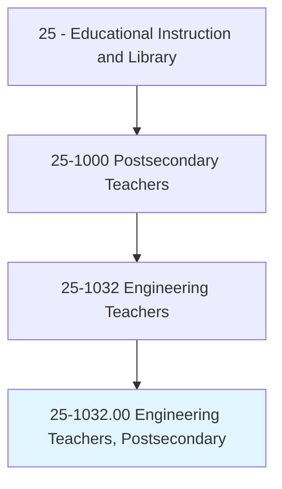
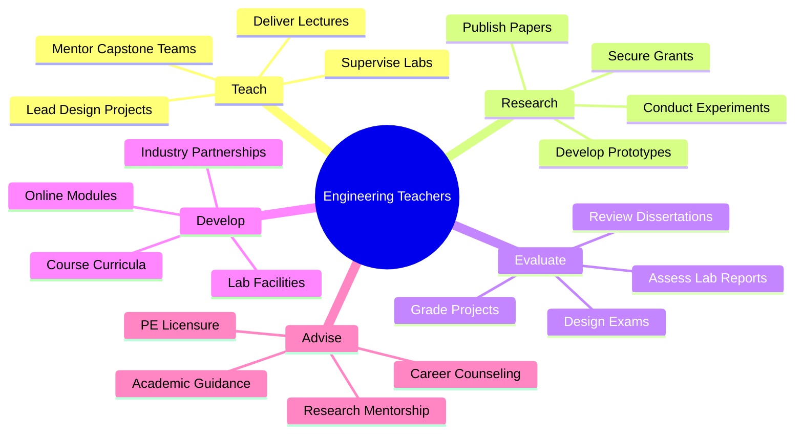
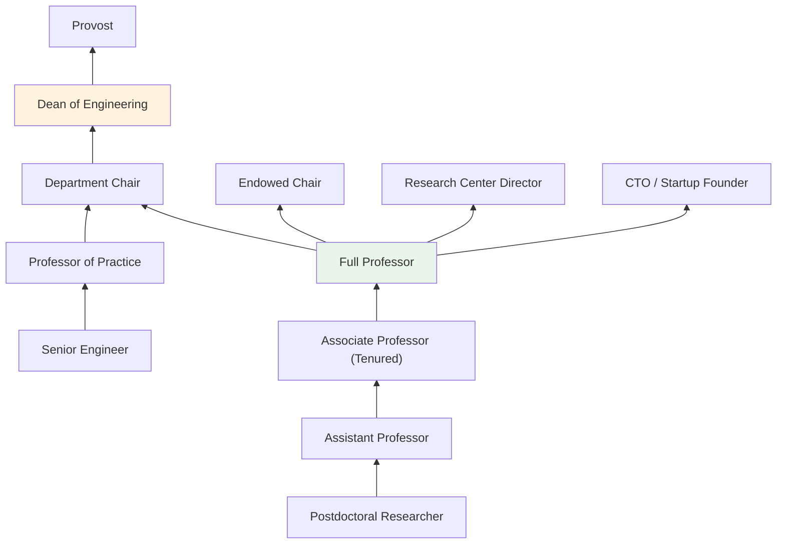
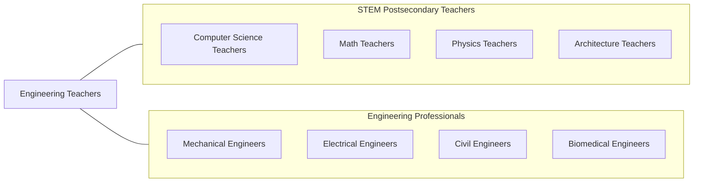

# Engineering Teachers, Postsecondary

> Teach courses pertaining to the application of physical laws and principles of engineering for the development of machines, materials, instruments, processes, and services. Includes teachers of subjects such as chemical, civil, electrical, industrial, mechanical, mineral, and petroleum engineering. Includes both teachers primarily engaged in teaching and those who do a combination of teaching and research.

## Overview

Engineering Teachers in postsecondary education instruct students in the application of physical laws, mathematics, and scientific principles to design, build, and maintain machines, structures, systems, and processes. They teach across engineering disciplines including mechanical, electrical, civil, chemical, industrial, biomedical, aerospace, computer, and environmental engineering. These educators combine theoretical instruction with laboratory experiments, design projects, and capstone experiences that prepare students for professional engineering practice.

Many engineering professors are active researchers securing substantial funding from NSF, DOD, DOE, NASA, NIH, and industry partners. Their research spans areas such as renewable energy, robotics, nanotechnology, structural resilience, biomedical devices, artificial intelligence applications, and advanced manufacturing. Engineering research is inherently applied, often producing patents, spin-off companies, and technologies that directly impact industry and society.

Engineering faculty play a critical role in STEM workforce development, preparing graduates for one of the most in-demand and well-compensated career fields. They work within ABET-accredited programs that require rigorous assessment of student learning outcomes, industry advisory boards, and continuous program improvement.

## Classification Hierarchy

## Key Statistics

| Metric | Value |
|--------|-------|
| SOC Code | 25-1032.00 |
| Job Zone | 5 (Extensive Preparation) |
| Category | [Educational Instruction and Library](/occupations/Education/index) |
| Median Salary | $105,000 - $145,000 |
| Employment | ~42,000 |
| Projected Growth | 8-12% (Faster than average) |
| Source | O*NET |

## Core Tasks

### teach.EngineeringCourses

Faculty deliver instruction across engineering disciplines.

**Actions:**
- `deliver.Lectures.on.EngineeringFundamentals` - Teach statics, dynamics, thermodynamics, circuits, and materials
- `supervise.Laboratories.for.ExperimentalEngineering` - Guide hands-on experiments and equipment operation
- `mentor.CapstoneDesignTeams` - Oversee senior design projects with industry sponsors

### conduct.EngineeringResearch

Faculty pursue funded research advancing engineering knowledge.

**Actions:**
- `conduct.Research.on.EmergingTechnologies` - Investigate robotics, nanotech, AI, and renewable energy
- `develop.Prototypes.for.IndustrialApplication` - Create working models and proof-of-concept systems
- `publish.Papers.in.EngineeringJournals` - Contribute to IEEE, ASME, ASCE, and AIChE publications

## Skills & Competencies

### Technical Skills
- **Engineering Discipline** - Expert (specialized field mastery)
- **Mathematics** - Expert (calculus, differential equations, linear algebra, numerical methods)
- **Laboratory Methods** - Advanced (instrumentation, measurement, prototyping)
- **Computational Tools** - Advanced (MATLAB, SolidWorks, ANSYS, LabVIEW, Python)
- **Research Methods** - Advanced (experimental design, simulation, data analysis)
- **Curriculum Design** - Advanced (ABET accreditation criteria)

### Soft Skills
- **Communication** - Critical (explaining technical concepts, grant writing)
- **Problem Solving** - Critical (engineering design thinking)
- **Mentorship** - Essential (guiding student engineers)
- **Collaboration** - Essential (research teams, industry partnerships)
- **Leadership** - Important (lab management, program development)
- **Innovation** - Important (creative engineering solutions)

## Education & Certifications

| Requirement | Details |
|-------------|---------|
| Typical Education | Ph.D. in Engineering or closely related field |
| Postdoctoral Training | Common for research-intensive positions |
| Work Experience | Industry experience valued, especially for practice-focused teaching |
| On-the-Job Training | Faculty development; lab safety training |
| Common Certifications | Professional Engineer (PE) license; ASEE membership; discipline-specific society memberships |

## Career Progression

## Setting Variations

### Research Universities
Heavy emphasis on funded research, doctoral programs, and technology transfer. Major research facilities and industry partnerships.

### Teaching-Focused Universities
Strong ABET-accredited undergraduate programs. Emphasis on design projects and industry preparation.

### Community Colleges
Engineering technology and pre-engineering transfer programs. Applied instruction with hands-on focus.

### Online Programs
Distance engineering courses with virtual labs and simulations. Growing master's programs.

### Industry-Partnered Programs
Co-op and work-study engineering programs. Capstone projects sponsored by companies.

## Technology & Tools

| Category | Tools |
|----------|-------|
| Design & Simulation | SolidWorks, AutoCAD, ANSYS, COMSOL, Simulink |
| Programming | MATLAB, Python, C++, LabVIEW |
| Laboratory | Oscilloscopes, signal generators, 3D printers, CNC, materials testing equipment |
| Learning Management Systems | Canvas, Blackboard, Moodle |
| Collaboration | GitHub, Jupyter, Overleaf |
| Research Databases | IEEE Xplore, Engineering Village, Web of Science |

## Related Occupations

## Industries

- [Educational Services - Schools of Engineering](/industries/Education/index) - Primary Employment
- [Professional Services](/industries/ProfessionalServices) - Engineering Consulting
- [Manufacturing](/industries/Manufacturing) - Industry-Academia Partnerships
- [Government](/industries/Government) - National Labs, DOD, NASA

## Departments

This occupation typically works in:
- [School of Engineering](/departments/Engineering)
- [Department of Mechanical Engineering](/departments/MechanicalEngineering)
- [Department of Electrical and Computer Engineering](/departments/ElectricalEngineering)
- [Department of Civil Engineering](/departments/CivilEngineering)

---

*Source: O*NET 25-1032.00 - ONETOccupation*
