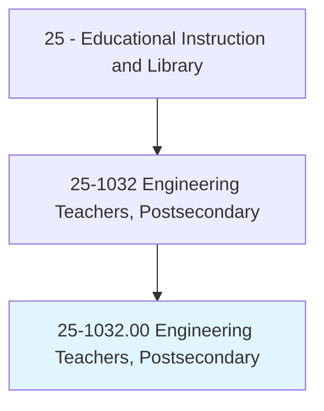
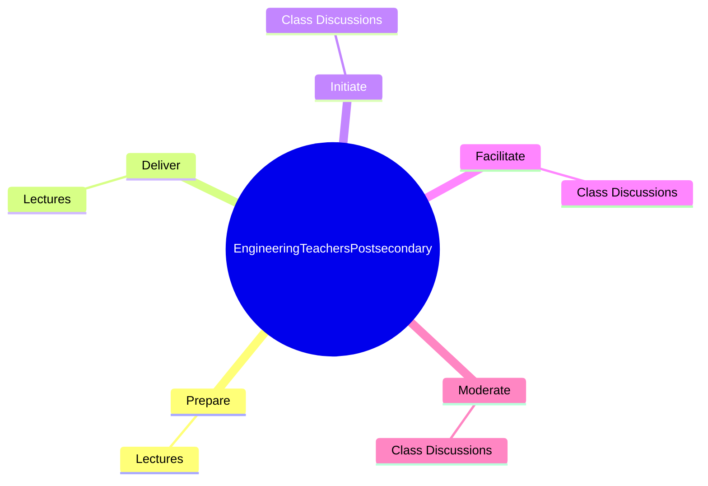
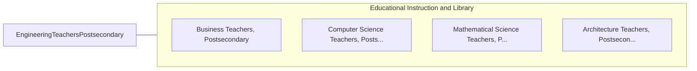

# Engineering Teachers, Postsecondary

> Teach courses pertaining to the application of physical laws and principles of engineering for the development of machines, materials, instruments, processes, and services. Includes teachers of subjects such as chemical, civil, electrical, industrial, mechanical, mineral, and petroleum engineering. Includes both teachers primarily engaged in teaching and those who do a combination of teaching and research.

## Overview

Engineering Teachers, Postsecondary is an occupation within the Educational Instruction and Library category. Teach courses pertaining to the application of physical laws and principles of engineering for the development of machines, materials, instruments, processes, and services. Includes teachers of subjects such as chemical, civil, electrical, industrial, mechanical, mineral, and petroleum engineering.

## Classification Hierarchy

## Key Statistics

| Metric | Value |
|--------|-------|
| SOC Code | 25-1032.00 |
| Category | [Educational Instruction and Library](/occupations/Education/index) |
| Task Count | 10 |
| Source | O*NET |

## Core Tasks

### prepare.Lectures

Engineering Teachers, Postsecondary prepare lectures as part of their core responsibilities.

**Actions:**
- `prepare.Lectures.to.Mechanics`
- `prepare.Lectures.to.Hydraulics`
- `prepare.Lectures.to.Robotics`

### deliver.Lectures

Engineering Teachers, Postsecondary deliver lectures as part of their core responsibilities.

**Actions:**
- `deliver.Lectures.to.Mechanics`
- `deliver.Lectures.to.Hydraulics`
- `deliver.Lectures.to.Robotics`

### initiate.ClassDiscussions

Engineering Teachers, Postsecondary initiate class discussions as part of their core responsibilities.

**Actions:**
- `initiate.ClassDiscussions`

## Skills & Competencies

### Technical Skills
- **Curriculum Development** - Advanced
- **Instructional Design** - Advanced
- **Assessment** - Advanced

### Soft Skills
- **Communication** - Essential
- **Problem Solving** - Essential
- **Critical Thinking** - Important
- **Teamwork** - Important
- **Adaptability** - Important

## Related Occupations

## Industries

This occupation is found across multiple industries. See [Industries](/industries) for sector-specific employment data.

## Career Progression

---

*Source: O*NET 25-1032.00 - ONETOccupation*
