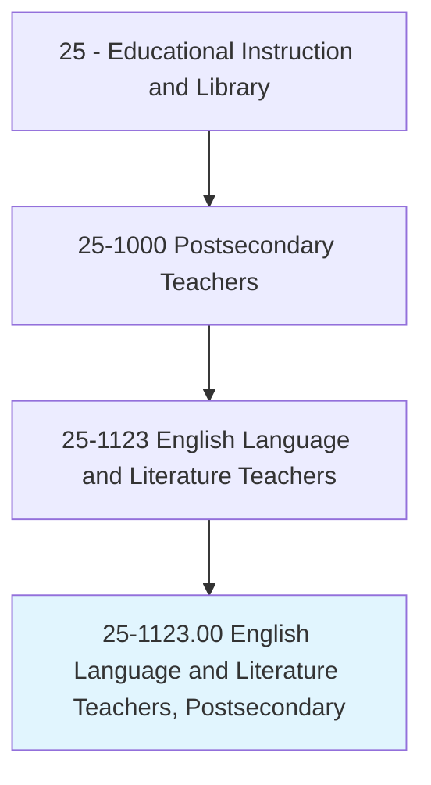
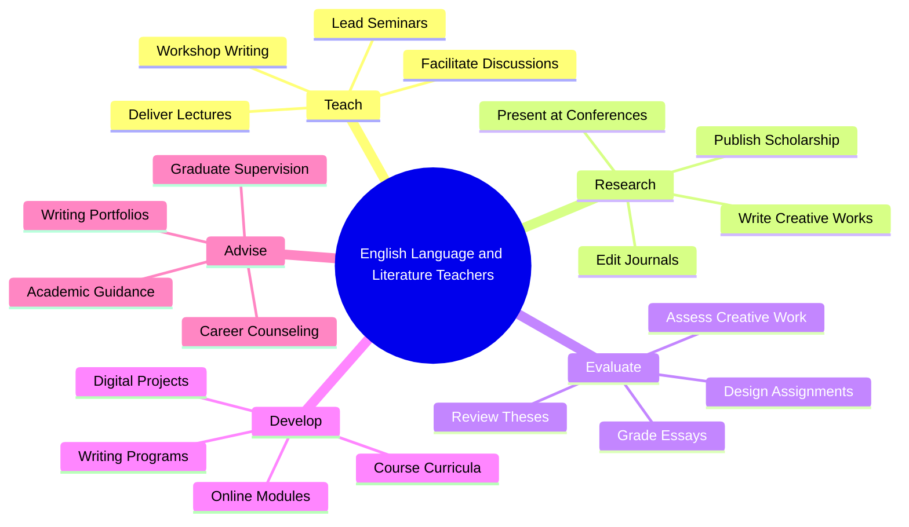
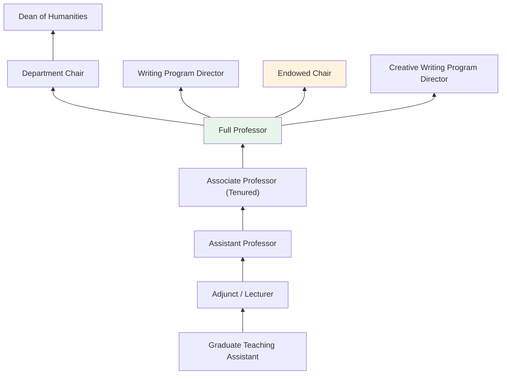
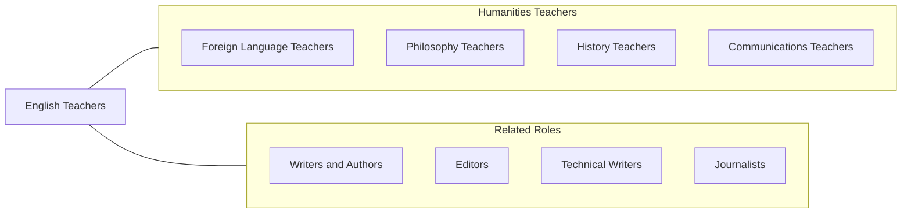

# English Language and Literature Teachers, Postsecondary

> Teach courses in English language and literature, including linguistics and comparative literature. Includes both teachers primarily engaged in teaching and those who do a combination of teaching and research.

## Overview

English Language and Literature Teachers in postsecondary education instruct students in the analysis, interpretation, and production of written texts. They teach courses covering composition and rhetoric, American literature, British literature, world literature, creative writing, literary theory, linguistics, technical writing, and digital humanities. These educators develop students' critical reading, analytical writing, and interpretive skills, which serve as foundational competencies across all academic disciplines and professional fields.

Many English professors conduct scholarly research on literary texts, cultural movements, rhetorical practices, and language systems. They publish monographs, peer-reviewed articles, and edited collections in venues such as PMLA, American Literary History, College Composition and Communication, and numerous specialized journals. Creative writing faculty produce novels, poetry collections, essays, and other literary works as their scholarly contribution.

English departments serve a central institutional role, as virtually all college students take composition courses that develop the writing skills essential for academic success and professional communication. English faculty also preserve and interpret literary traditions that shape cultural understanding and civic discourse.

## Classification Hierarchy

## Key Statistics

| Metric | Value |
|--------|-------|
| SOC Code | 25-1123.00 |
| Job Zone | 5 (Extensive Preparation) |
| Category | [Educational Instruction and Library](/occupations/Education/index) |
| Median Salary | $65,000 - $82,000 |
| Employment | ~70,000 |
| Projected Growth | 2-4% (Slower than average) |
| Source | O*NET |

## Core Tasks

### teach.EnglishAndLiterature

Faculty deliver instruction in writing, literature, and language studies.

**Actions:**
- `deliver.Lectures.on.AmericanLiterature` - Teach canonical and contemporary American literary works
- `lead.WritingWorkshops.for.CreativeWriting` - Facilitate peer review and craft development
- `teach.Composition.for.AcademicWriting` - Instruct on rhetorical strategies, research writing, and argumentation

### conduct.LiteraryScholarship

Faculty pursue original research in literary and language studies.

**Actions:**
- `publish.LiteraryScholarship.in.PeerReviewedJournals` - Contribute literary criticism and theory
- `write.CreativeWorks.for.Publication` - Produce poetry, fiction, creative nonfiction, and drama
- `present.Papers.at.MLA.and.NCA` - Share research at disciplinary conferences

## Skills & Competencies

### Technical Skills
- **Literary Analysis** - Expert (close reading, critical theory, comparative literature)
- **Academic Writing** - Expert (scholarly argumentation, research synthesis)
- **Composition Pedagogy** - Advanced (process-based writing instruction, WAC/WID)
- **Creative Writing** - Advanced to Expert (craft, workshop facilitation)
- **Curriculum Design** - Advanced (WPA outcomes, program assessment)
- **Digital Humanities** - Intermediate to Advanced (text analysis, digital archives)

### Soft Skills
- **Communication** - Critical (modeling clear, effective writing)
- **Critical Thinking** - Critical (literary interpretation and argumentation)
- **Mentorship** - Essential (developing student writers)
- **Empathy** - Essential (supporting diverse student voices)
- **Intellectual Curiosity** - Essential (engagement with texts and ideas)
- **Patience** - Important (developing writing skills is iterative)

## Education & Certifications

| Requirement | Details |
|-------------|---------|
| Typical Education | Ph.D. in English, Comparative Literature, or Rhetoric/Composition; MFA for creative writing |
| Alternative Entry | M.A. for community college or adjunct positions |
| Work Experience | Teaching and publication experience required |
| On-the-Job Training | Faculty development; writing center training |
| Common Certifications | MLA membership; AWP membership (creative writing); NCTE membership |

## Career Progression

## Setting Variations

### Research Universities
Literature and theory emphasis with doctoral programs. Composition taught largely by GTAs and lecturers.

### Liberal Arts Colleges
Integrated English programs blending literature, writing, and language. Close faculty-student mentorship.

### Community Colleges
Composition and developmental writing focus. Large enrollment with diverse preparation levels.

### Online Programs
Distance composition and literature courses. Growing enrollment in writing-intensive programs.

### MFA Programs
Creative writing workshops and craft seminars. Faculty are active published authors.

## Technology & Tools

| Category | Tools |
|----------|-------|
| Learning Management Systems | Canvas, Blackboard, Moodle |
| Writing Tools | Turnitin, Grammarly, Google Docs, peer review platforms |
| Digital Humanities | Voyant Tools, ArcGIS StoryMaps, Omeka, TEI |
| Research Databases | JSTOR, MLA International Bibliography, Project MUSE |
| Reference Management | Zotero, MLA style guides, Chicago Manual |
| Presentation | PowerPoint, Google Slides, chalk/whiteboard |

## Related Occupations

## Industries

- [Educational Services - Colleges and Universities](/industries/Education/index) - Primary Employment
- [Information](/industries/Information) - Publishing and Media
- [Professional Services](/industries/ProfessionalServices) - Writing and Editing
- [Government](/industries/Government) - Public Universities

## Departments

This occupation typically works in:
- [Department of English](/departments/English)
- [Writing Program](/departments/WritingProgram)
- [Department of Comparative Literature](/departments/ComparativeLiterature)
- [Creative Writing Program](/departments/CreativeWriting)

---

*Source: O*NET 25-1123.00 - ONETOccupation*
