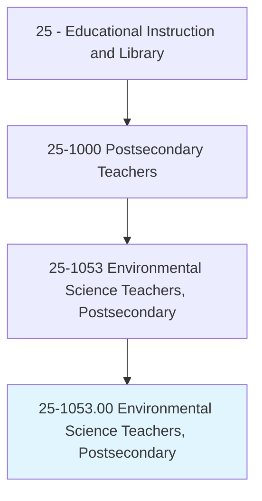
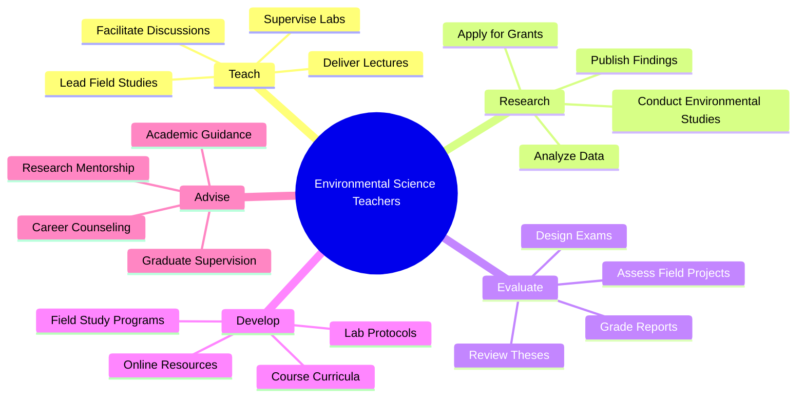
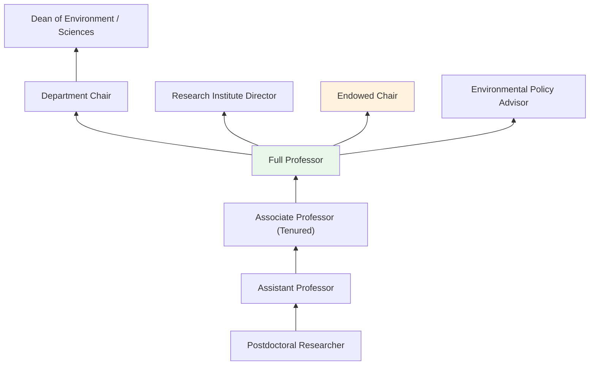
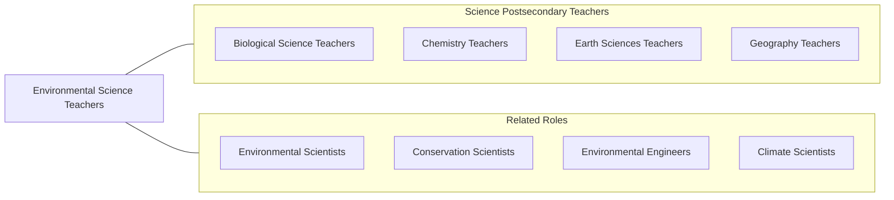

# Environmental Science Teachers, Postsecondary

> Teach courses in environmental science. Includes both teachers primarily engaged in teaching and those who do a combination of teaching and research.

## Overview

Environmental Science Teachers in postsecondary education instruct students in the interdisciplinary study of environmental systems, sustainability, pollution, conservation, and the interactions between human activities and the natural world. They teach courses covering ecology, environmental chemistry, climate science, natural resource management, environmental policy, toxicology, and sustainability science. These educators integrate knowledge from biology, chemistry, earth science, and social science to help students understand and address complex environmental challenges.

Many environmental science professors conduct research on pressing issues such as climate change, biodiversity loss, water quality, air pollution, renewable energy, waste management, and environmental justice. They secure funding from agencies including NSF, EPA, and DOE, and publish in journals such as Environmental Science & Technology and Global Change Biology. Their research often involves fieldwork, laboratory analysis, and computational modeling.

Environmental science faculty are uniquely positioned at the intersection of natural science, policy, and society. They train graduates for careers in environmental consulting, conservation, regulatory compliance, sustainability management, and environmental advocacy, while also preparing researchers and educators who will advance environmental knowledge.

## Classification Hierarchy

## Key Statistics

| Metric | Value |
|--------|-------|
| SOC Code | 25-1053.00 |
| Job Zone | 5 (Extensive Preparation) |
| Category | [Educational Instruction and Library](/occupations/Education/index) |
| Median Salary | $78,000 - $100,000 |
| Employment | ~6,000 |
| Projected Growth | 8-12% (Faster than average) |
| Source | O*NET |

## Core Tasks

### teach.EnvironmentalScience

Faculty deliver instruction across environmental science disciplines.

**Actions:**
- `deliver.Lectures.on.Ecology` - Teach ecosystem dynamics, biodiversity, and conservation biology
- `deliver.Lectures.on.ClimateScience` - Instruct on atmospheric chemistry, climate modeling, and global change
- `supervise.FieldStudies.in.NaturalEnvironments` - Guide student research in outdoor and field settings

### conduct.EnvironmentalResearch

Faculty pursue original research addressing environmental challenges.

**Actions:**
- `conduct.Research.on.ClimateChange` - Investigate impacts, adaptation, and mitigation strategies
- `conduct.Research.on.WaterQuality` - Analyze contamination, treatment, and watershed management
- `publish.Findings.in.EnvironmentalJournals` - Contribute to peer-reviewed environmental science literature

## Skills & Competencies

### Technical Skills
- **Environmental Science** - Expert (ecology, environmental chemistry, earth systems)
- **Field Methods** - Expert (sample collection, environmental monitoring)
- **Data Analysis** - Advanced (R, Python, GIS, remote sensing)
- **Laboratory Methods** - Advanced (chemical analysis, bioassays)
- **Research Design** - Advanced (experimental, observational, modeling)
- **Curriculum Design** - Advanced (interdisciplinary environmental education)

### Soft Skills
- **Communication** - Critical (engaging diverse audiences on environmental issues)
- **Critical Thinking** - Essential (systems thinking, interdisciplinary analysis)
- **Collaboration** - Essential (interdisciplinary research teams)
- **Mentorship** - Essential (guiding student researchers)
- **Public Engagement** - Important (science communication, policy advocacy)
- **Fieldwork Skills** - Important (outdoor research and teaching)

## Education & Certifications

| Requirement | Details |
|-------------|---------|
| Typical Education | Ph.D. in Environmental Science, Ecology, or related field |
| Alternative Entry | Master's degree for community college positions |
| Work Experience | Research and fieldwork experience required |
| On-the-Job Training | Faculty development; laboratory safety training |
| Common Certifications | EPA certifications; GIS Professional (GISP); hazardous materials handling |

## Career Progression

## Setting Variations

### Research Universities
Emphasis on funded environmental research, doctoral student supervision, and interdisciplinary collaboration. Field stations and laboratory facilities.

### Liberal Arts Colleges
Focus on undergraduate environmental education with integrated field experiences. Close student mentorship in research.

### Community Colleges
Introduction to Environmental Science for general education. Workforce preparation for environmental technician roles.

### Online Programs
Distance environmental science education with virtual labs and field simulations. Growing enrollment in sustainability programs.

### Environmental Research Institutes
Affiliated research positions combining investigation with student mentorship. Focus on applied environmental problem-solving.

## Technology & Tools

| Category | Tools |
|----------|-------|
| GIS & Remote Sensing | ArcGIS, QGIS, Google Earth Engine, ERDAS |
| Data Analysis | R, Python, MATLAB, JMP |
| Field Equipment | Water quality meters, GPS, weather stations, soil probes |
| Laboratory | Spectrometers, chromatographs, microscopes |
| Learning Management Systems | Canvas, Blackboard, Moodle |
| Climate Modeling | CMIP models, EdGCM, STELLA |

## Related Occupations

## Industries

- [Educational Services - Colleges and Universities](/industries/Education/index) - Primary Employment
- [Government](/industries/Government) - EPA, USGS, NOAA, State Agencies
- [Professional Services](/industries/ProfessionalServices) - Environmental Consulting
- [Utilities](/industries/Utilities) - Water and Energy Management

## Departments

This occupation typically works in:
- [Department of Environmental Science](/departments/EnvironmentalScience)
- [School of Environment and Sustainability](/departments/Sustainability)
- [Department of Earth and Atmospheric Sciences](/departments/EarthSciences)
- [Institute for Environmental Research](/departments/EnvironmentalResearch)

---

*Source: O*NET 25-1053.00 - ONETOccupation*
