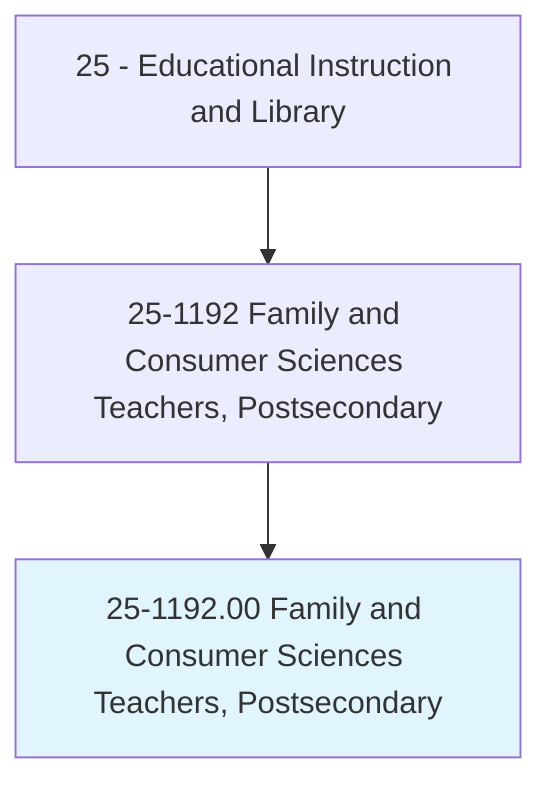
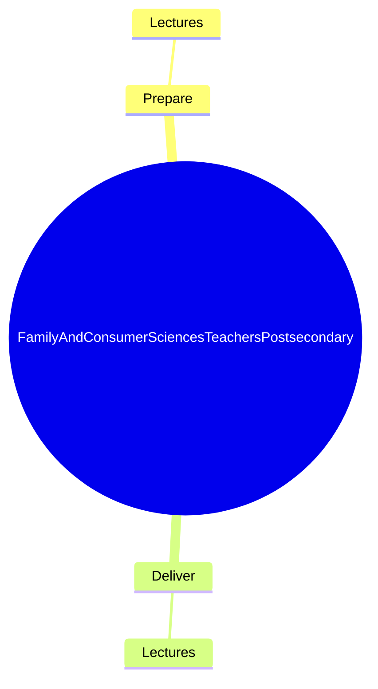
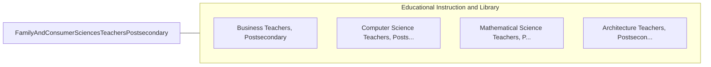

# Family and Consumer Sciences Teachers, Postsecondary

> Teach courses in childcare, family relations, finance, nutrition, and related subjects pertaining to home management. Includes both teachers primarily engaged in teaching and those who do a combination of teaching and research.

## Overview

Family and Consumer Sciences Teachers, Postsecondary is an occupation within the Educational Instruction and Library category. Teach courses in childcare, family relations, finance, nutrition, and related subjects pertaining to home management. 

## Classification Hierarchy

## Key Statistics

| Metric | Value |
|--------|-------|
| SOC Code | 25-1192.00 |
| Category | [Educational Instruction and Library](/occupations/Education/index) |
| Task Count | 6 |
| Source | O*NET |

## Core Tasks

### prepare.Lectures

Family and Consumer Sciences Teachers, Postsecondary prepare lectures as part of their core responsibilities.

**Actions:**
- `prepare.Lectures.to.FoodScience`
- `prepare.Lectures.to.Nutrition`
- `prepare.Lectures.to.ChildCare`

### deliver.Lectures

Family and Consumer Sciences Teachers, Postsecondary deliver lectures as part of their core responsibilities.

**Actions:**
- `deliver.Lectures.to.FoodScience`
- `deliver.Lectures.to.Nutrition`
- `deliver.Lectures.to.ChildCare`

## Skills & Competencies

### Technical Skills
- **Curriculum Development** - Advanced
- **Instructional Design** - Advanced
- **Assessment** - Advanced

### Soft Skills
- **Communication** - Essential
- **Problem Solving** - Essential
- **Critical Thinking** - Important
- **Teamwork** - Important
- **Adaptability** - Important

## Related Occupations

## Industries

This occupation is found across multiple industries. See [Industries](/industries) for sector-specific employment data.

## Career Progression

---

*Source: O*NET 25-1192.00 - ONETOccupation*
