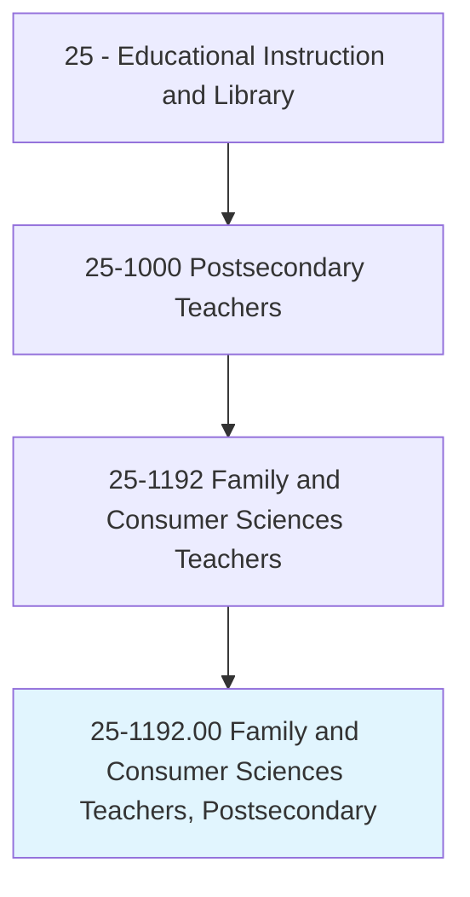
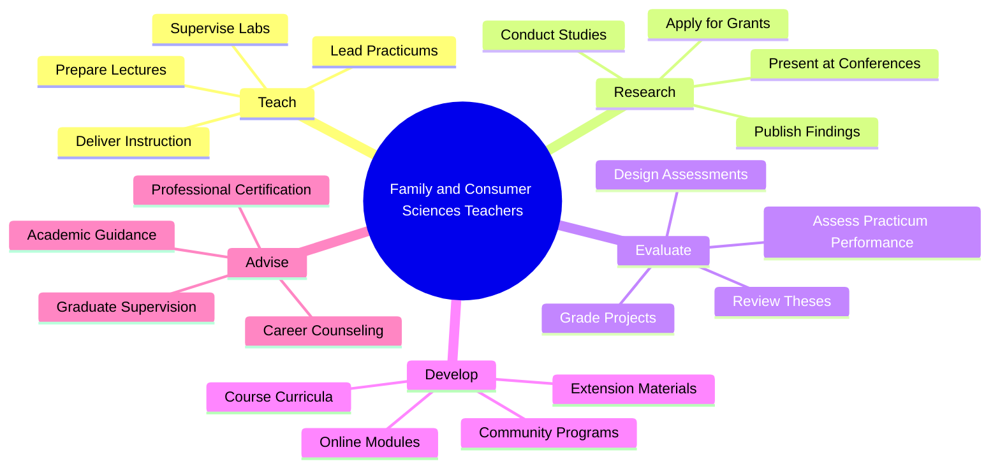
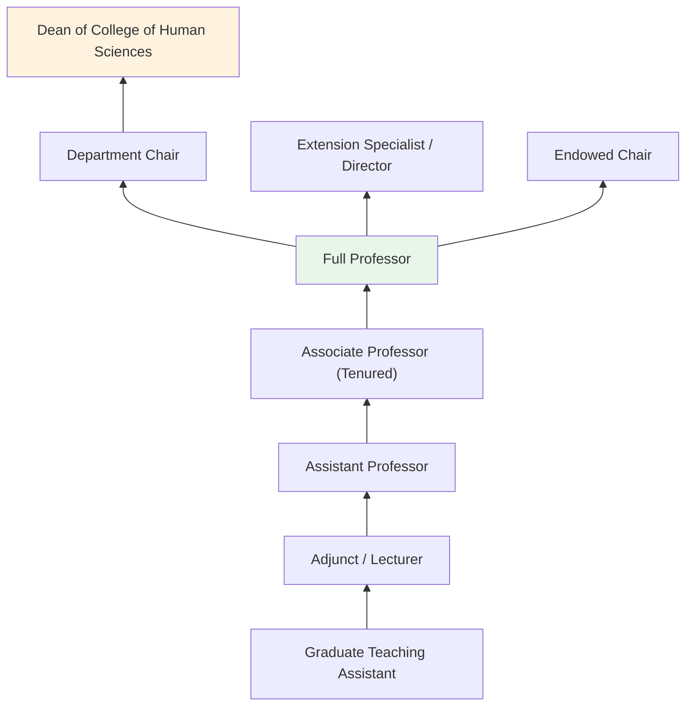
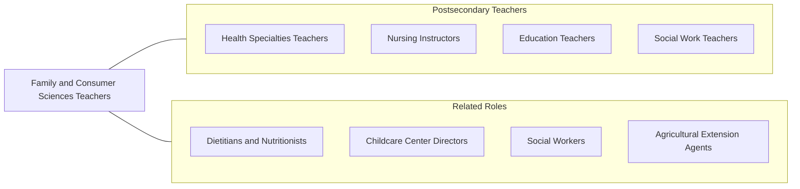

# Family and Consumer Sciences Teachers, Postsecondary

> Teach courses in family and consumer sciences. Includes both teachers primarily engaged in teaching and those who do a combination of teaching and research.

## Overview

Family and Consumer Sciences Teachers in postsecondary education instruct students in disciplines that focus on the well-being of individuals, families, and communities. They teach courses in nutrition and dietetics, child development, family studies, consumer economics, textile science, interior design, hospitality management, and family resource management. These educators prepare students for professional careers that improve quality of life through evidence-based practices in health, nutrition, human development, and household management.

Many faculty members in family and consumer sciences conduct applied research addressing issues such as childhood obesity, food insecurity, aging and elder care, financial literacy, and sustainable consumption. Their work bridges academic scholarship with community engagement, and they often partner with cooperative extension services, public health agencies, and community organizations to translate research findings into practical programs and policies.

This field has evolved significantly from its home economics origins into a multidisciplinary academic enterprise. Faculty prepare students for careers in dietetics, social services, consumer advocacy, hospitality, education, and public health while maintaining the field's core commitment to improving individual and family well-being.

## Classification Hierarchy

## Key Statistics

| Metric | Value |
|--------|-------|
| SOC Code | 25-1192.00 |
| Job Zone | 5 (Extensive Preparation) |
| Category | [Educational Instruction and Library](/occupations/Education/index) |
| Median Salary | $70,000 - $88,000 |
| Employment | ~5,500 |
| Projected Growth | 3-5% (Slower than average) |
| Source | O*NET |

## Core Tasks

### teach.FamilyAndConsumerSciences

Faculty deliver instruction across family and consumer science disciplines.

**Actions:**
- `deliver.Lectures.on.NutritionScience` - Teach principles of human nutrition, dietetics, and food science
- `deliver.Lectures.on.ChildDevelopment` - Instruct on developmental psychology and early childhood education
- `supervise.Labs.in.FoodPreparation` - Oversee hands-on laboratory sessions in culinary and nutrition labs

### conduct.AppliedResearch

Faculty pursue research that improves individual and family well-being.

**Actions:**
- `conduct.Research.on.FamilyWellBeing` - Study factors affecting family health, finances, and relationships
- `conduct.Research.on.NutritionOutcomes` - Investigate dietary interventions and public health nutrition
- `publish.Findings.in.FamilyScienceJournals` - Contribute to peer-reviewed family and consumer science literature

## Skills & Competencies

### Technical Skills
- **Subject Matter Expertise** - Expert (nutrition, child development, family studies, consumer economics)
- **Research Methods** - Advanced (survey research, experimental design, program evaluation)
- **Curriculum Design** - Advanced (competency-based education, experiential learning)
- **Laboratory Management** - Advanced (food science labs, child development centers)
- **Program Evaluation** - Advanced (community program assessment)
- **Educational Technology** - Intermediate (LMS, online instruction)

### Soft Skills
- **Communication** - Critical (translating research for diverse audiences)
- **Empathy** - Essential (family-centered teaching and advising)
- **Collaboration** - Essential (interdisciplinary and community partnerships)
- **Mentorship** - Essential (guiding students toward professional certification)
- **Cultural Sensitivity** - Important (working with diverse families and communities)
- **Organization** - Important (managing labs, field placements, and programs)

## Education & Certifications

| Requirement | Details |
|-------------|---------|
| Typical Education | Ph.D. in Family and Consumer Sciences, Nutrition, Human Development, or related field |
| Alternative Entry | Master's degree for community college or applied teaching positions |
| Work Experience | Professional experience in dietetics, child development, or related field valued |
| On-the-Job Training | Faculty development; extension service training |
| Common Certifications | Registered Dietitian (RD); Certified Family Life Educator (CFLE); Licensed Professional Counselor (for family studies); AAFCS membership |

## Career Progression

## Setting Variations

### Land-Grant Universities
Strong connection to cooperative extension services. Applied research with community impact. USDA-funded programs.

### Teaching-Focused Colleges
Emphasis on undergraduate instruction in dietetics, early childhood education, and hospitality. Accreditation-focused curricula.

### Community Colleges
Introductory courses in nutrition, child development, and culinary arts. Workforce preparation and certificate programs.

### Online Programs
Distance learning in family studies, consumer economics, and nutrition. Growing enrollment in non-traditional student populations.

### Extension Services
Teaching through agricultural extension and community education programs. Focus on outreach to rural and underserved communities.

## Technology & Tools

| Category | Tools |
|----------|-------|
| Learning Management Systems | Canvas, Blackboard, Moodle |
| Nutrition Analysis | ESHA Food Processor, Nutritionist Pro, MyFitnessPal Pro |
| Research Tools | SPSS, NVivo, Qualtrics |
| Child Development | Teaching Strategies GOLD, ASQ |
| Productivity | Microsoft Office, Google Workspace |
| Laboratory | Food science equipment, sensory evaluation software |

## Related Occupations

## Industries

- [Educational Services - Colleges and Universities](/industries/Education/index) - Primary Employment
- [Government](/industries/PublicAdministration) - Cooperative Extension, USDA
- [Healthcare and Social Assistance](/industries/Healthcare) - Nutrition and Family Services
- Social Assistance - Community Programs

## Departments

This occupation typically works in:
- Department of Family and Consumer Sciences
- School of Human Sciences
- Department of Nutrition and Dietetics
- Department of Human Development and Family Studies

---

*Source: O*NET 25-1192.00 - ONETOccupation*
