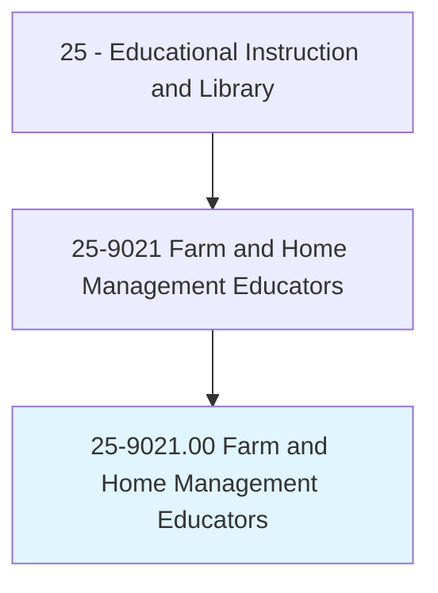
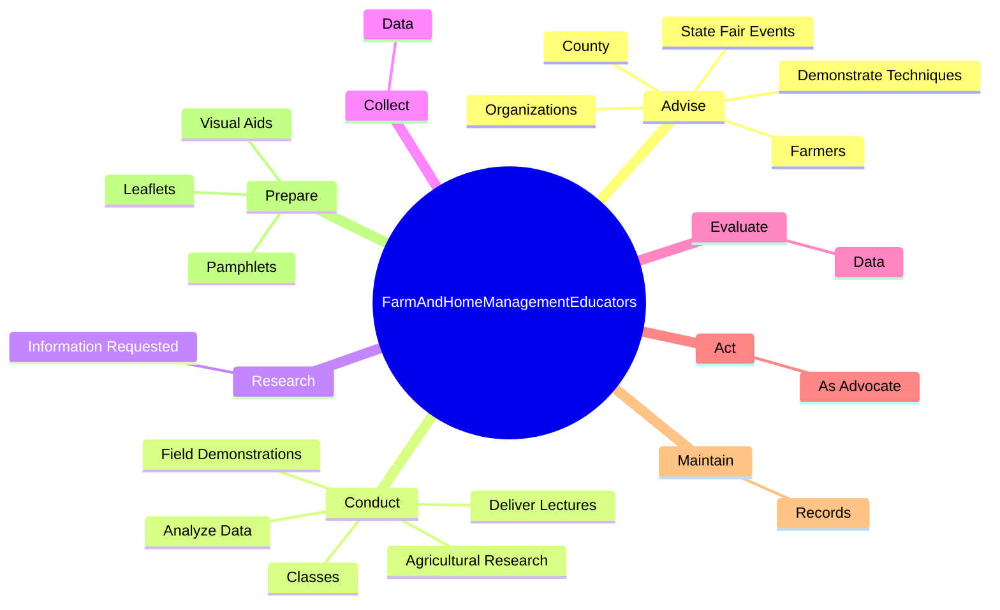

# Farm and Home Management Educators

> Instruct and advise individuals and families engaged in agriculture, agricultural-related processes, or home management activities. Demonstrate procedures and apply research findings to advance agricultural and home management activities. May develop educational outreach programs. May instruct on either agricultural issues such as agricultural processes and techniques, pest management, and food safety, or on home management issues such as budgeting, nutrition, and child development.

## Overview

Farm and Home Management Educators is an occupation within the Educational Instruction and Library category. Instruct and advise individuals and families engaged in agriculture, agricultural-related processes, or home management activities. Demonstrate procedures and apply research findings to advance agricultural and home management activities.

## Classification Hierarchy

## Key Statistics

| Metric | Value |
|--------|-------|
| SOC Code | 25-9021.00 |
| Category | [Educational Instruction and Library](/occupations/Education) |
| Task Count | 71 |
| Source | O*NET |

## Core Tasks

### advise.Farmers

Farm and Home Management Educators advise farmers as part of their core responsibilities.

**Actions:**
- `advise.Farmers.in.Areas`
- `advise.Farmers.in.Feeding`
- `advise.Farmers.in.HealthMaintenance.of.Livestock`
- `advise.Farmers.in.Growing`

### conduct.Classes

Farm and Home Management Educators conduct classes as part of their core responsibilities.

**Actions:**
- `conduct.Classes.on.Subjects`
- `conduct.Classes.on.Nutrition`
- `conduct.Classes.on.HomeManagement`
- `conduct.Classes.on.FarmingTechniques`

### research.InformationRequested

Farm and Home Management Educators research information requested as part of their core responsibilities.

**Actions:**
- `research.InformationRequested.by.Farmers`

## Skills & Competencies

### Technical Skills
- **Curriculum Development** - Advanced
- **Instructional Design** - Advanced
- **Assessment** - Advanced

### Soft Skills
- **Communication** - Essential
- **Problem Solving** - Essential
- **Critical Thinking** - Important
- **Teamwork** - Important
- **Adaptability** - Important

## Related Occupations

## Industries

This occupation is found across multiple industries. See [Industries](/industries) for sector-specific employment data.

## Career Progression

---

*Source: O*NET 25-9021.00 - ONETOccupation*
