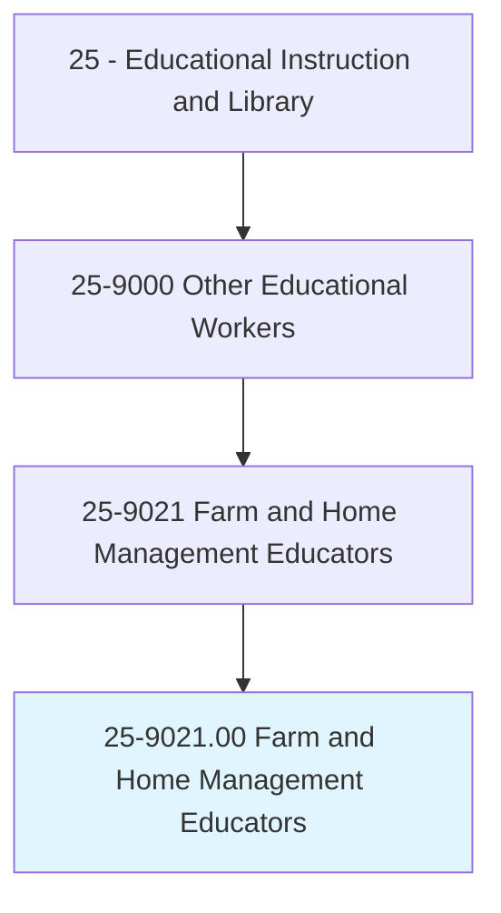
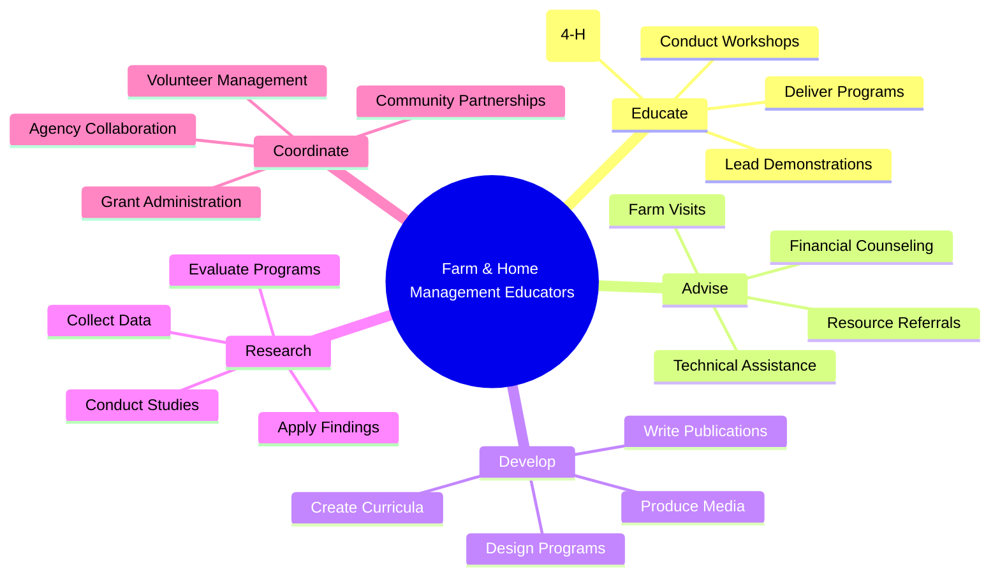
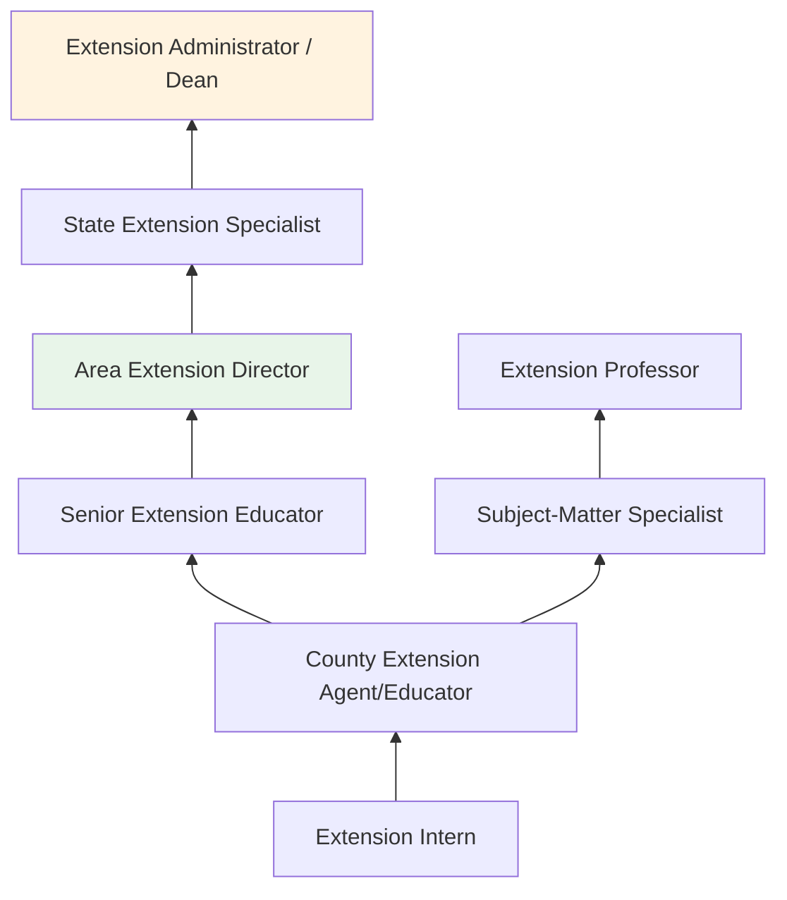
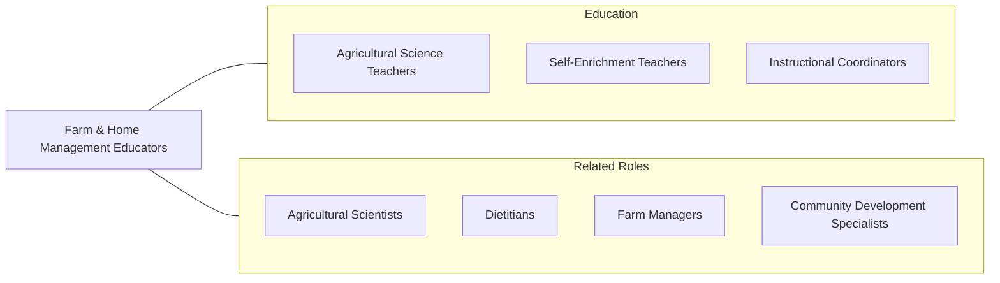

# Farm and Home Management Educators

> Instruct and advise individuals and families engaged in agriculture, agriculture-related processes, or home economics activities. Demonstrate procedures and apply research findings to advance agricultural and home economics activities. May develop educational outreach programs. May instruct on farming, horticulture, or home management topics.

## Overview

Farm and Home Management Educators provide educational programs on agricultural production, farm business management, home economics, nutrition, family resource management, and community development. They primarily work through the Cooperative Extension Service, a nationwide network connecting land-grant university research to practical application in farming communities and households. These educators translate research into accessible, actionable guidance for farmers, ranchers, families, and community organizations.

Agricultural educators cover topics including crop management, livestock production, soil conservation, pest management, farm financial planning, agricultural technology adoption, and sustainable farming practices. Home management educators address family nutrition, food preservation, financial literacy, consumer decision-making, housing, and family well-being. Many also manage 4-H youth development programs that build leadership, citizenship, and life skills.

The role requires an unusual combination of subject expertise, teaching ability, and community relationship skills. Educators conduct workshops, field demonstrations, farm visits, and individual consultations. They develop publications, fact sheets, and digital content. As agriculture faces challenges including climate change, labor shortages, and economic pressures, these educators play a vital role in helping producers adopt new technologies and practices.

## Classification Hierarchy

## Key Statistics

| Metric | Value |
|--------|-------|
| SOC Code | 25-9021.00 |
| Job Zone | 4 (Considerable Preparation) |
| Category | [Educational Instruction and Library](/occupations/Education/index) |
| Median Salary | $50,000 - $62,000 |
| Employment | ~9,000 |
| Projected Growth | 2-4% (Average) |
| Source | O*NET |

## Core Tasks

### educate.FarmersAndFamilies

Extension Educators deliver practical education to agricultural and home audiences.

**Actions:**
- `conduct.Workshops.on.AgriculturalPractices` - Teach crop management, livestock care, and sustainable farming
- `advise.Farmers.on.BusinessManagement` - Provide farm financial planning, marketing, and risk management guidance
- `deliver.Programs.on.FamilyResourceManagement` - Educate on nutrition, food safety, financial literacy, and family well-being

### develop.OutreachPrograms

Extension Educators create educational resources and programs.

**Actions:**
- `develop.Curricula.for.CommunityEducation` - Design programs addressing local agricultural and family needs
- `manage.4HPrograms.for.YouthDevelopment` - Coordinate youth leadership, STEM, and agricultural programs
- `translate.Research.into.PracticalGuidance` - Convert university research into accessible recommendations

## Skills & Competencies

### Technical Skills
- **Agricultural Science** - Advanced (agronomy, animal science, horticulture, pest management)
- **Home Economics** - Advanced (nutrition, food science, family resource management)
- **Program Development** - Advanced (needs assessment, curriculum design, evaluation)
- **Teaching Methods** - Advanced (adult education, experiential learning, demonstration)
- **Farm Management** - Advanced (financial analysis, marketing, risk management)
- **Youth Development** - Advanced (4-H methodology, positive youth development)

### Soft Skills
- **Communication** - Critical (presenting to diverse audiences, writing for public)
- **Community Building** - Essential (establishing trust with rural communities)
- **Adaptability** - Essential (addressing diverse topics and audiences)
- **Self-Direction** - Essential (managing independent work schedule)
- **Cultural Sensitivity** - Important (serving diverse agricultural communities)
- **Networking** - Important (connecting producers with resources)

## Education & Certifications

| Requirement | Details |
|-------------|---------|
| Typical Education | Bachelor's or master's degree in Agriculture, Home Economics, or Extension Education |
| Alternative Entry | Subject-area expertise with teaching experience |
| Work Experience | Farm background or agricultural experience valued |
| Continuing Education | Professional development through Extension system |
| Common Certifications | Master Gardener training; pesticide applicator license; Certified Crop Adviser; EFNEP certification |

## Career Progression

## Setting Variations

### County Extension Offices
Primary delivery point for Cooperative Extension programs. Community-based, serving local agricultural and family audiences.

### Land-Grant Universities
State Extension specialists conducting applied research and statewide program development.

### USDA Agencies
Federal programs supporting farm management, conservation, and rural development education.

### Nonprofit Organizations
Agricultural education through farm bureaus, commodity groups, and rural development organizations.

### Tribal Extension Programs
Federally recognized tribal colleges operating Extension programs for Native American communities.

## Technology & Tools

| Category | Tools |
|----------|-------|
| Precision Agriculture | GPS, GIS, drone imagery, soil sensors |
| Farm Management | QuickBooks, farm accounting software, enterprise budgets |
| Communication | Email lists, social media, video conferencing |
| Content Creation | Extension publications, fact sheets, video production |
| Data | Survey tools, program evaluation software, USDA databases |
| Learning | LMS platforms, webinar tools, field demonstration sites |

## Related Occupations

## Industries

- [Educational Services](/industries/Education/index) - Land-Grant Universities
- [Government](/industries/PublicAdministration) - USDA, State Extension Services
- [Agriculture](/industries/Agriculture) - Farm Organizations
- [Other Services](/industries/OtherServices) - Rural Development Nonprofits

## Departments

This occupation typically works in:
- Cooperative Extension Service
- County Agriculture Office
- 4-H Youth Development

---

*Source: O*NET 25-9021.00 - ONETOccupation*
