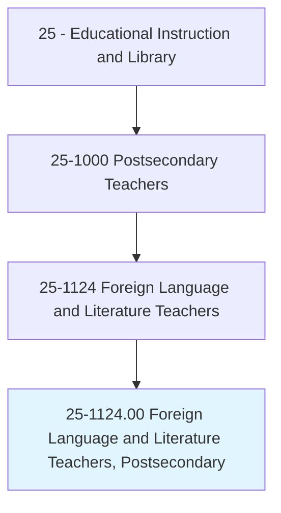
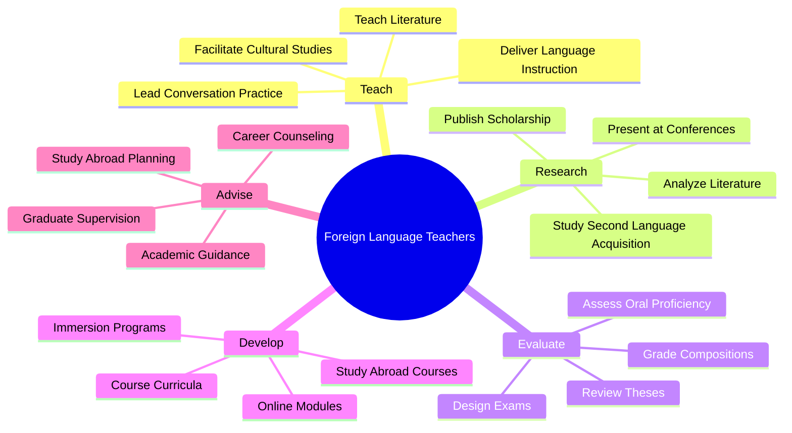
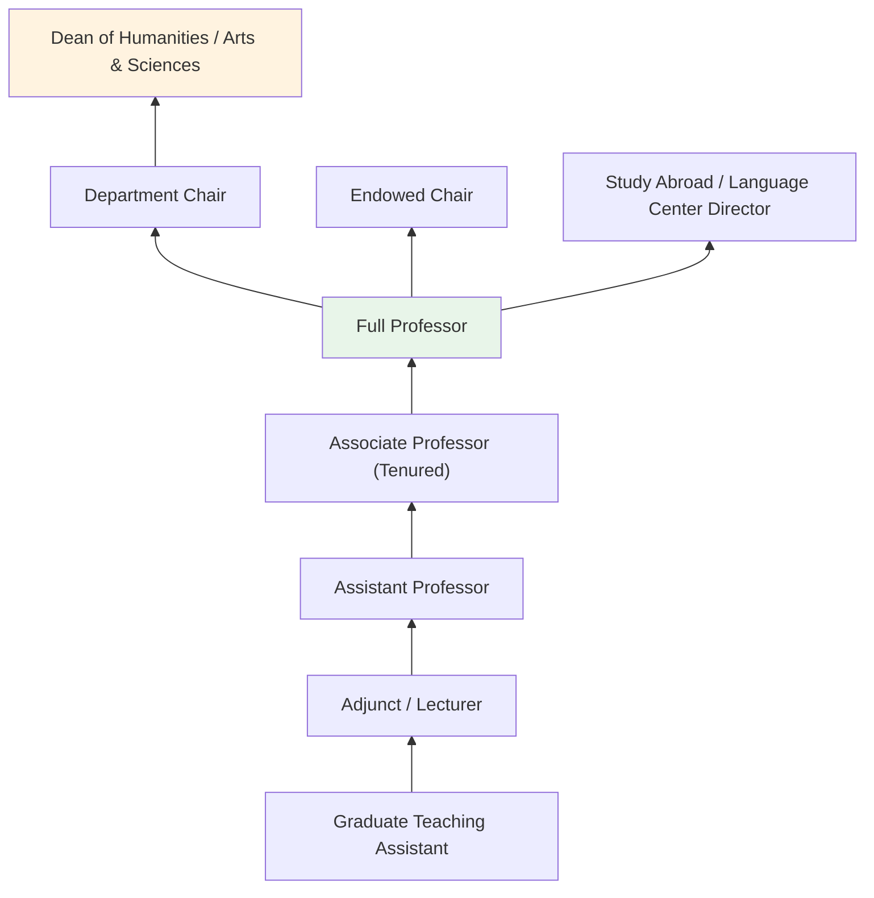
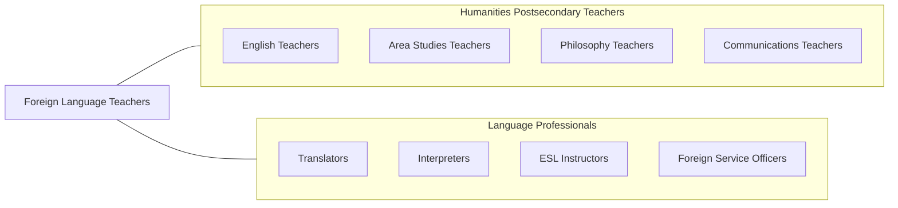

# Foreign Language and Literature Teachers, Postsecondary

> Teach languages and literature courses in languages other than English. Includes teachers of American Sign Language (ASL). Includes both teachers primarily engaged in teaching and those who do a combination of teaching and research.

## Overview

Foreign Language and Literature Teachers in postsecondary education instruct students in world languages and their associated literatures and cultures. They teach courses in Spanish, French, German, Chinese, Japanese, Arabic, Italian, Portuguese, Russian, Korean, ASL, and many other languages, covering language acquisition, grammar, composition, conversation, literature, cultural studies, translation, and linguistics. These educators develop students' communicative competence while deepening their understanding of diverse cultures and literary traditions.

Many faculty conduct research in second language acquisition, comparative literature, literary criticism, cultural studies, translation studies, and applied linguistics. They publish in journals such as the Modern Language Journal, Foreign Language Annals, and PMLA. Their scholarship contributes to understanding how languages are learned, how literature reflects and shapes culture, and how intercultural communication can be improved.

Foreign language faculty serve critical institutional roles in internationalization, study abroad programming, and global competency development. They prepare graduates for careers in translation, interpretation, international business, diplomacy, education, and any field requiring cross-cultural communication skills.

## Classification Hierarchy

## Key Statistics

| Metric | Value |
|--------|-------|
| SOC Code | 25-1124.00 |
| Job Zone | 5 (Extensive Preparation) |
| Category | [Educational Instruction and Library](/occupations/Education/index) |
| Median Salary | $65,000 - $82,000 |
| Employment | ~27,000 |
| Projected Growth | 2-4% (Slower than average) |
| Source | O*NET |

## Core Tasks

### teach.LanguageAndLiterature

Faculty deliver instruction in language skills and literary analysis.

**Actions:**
- `deliver.LanguageInstruction.at.AllLevels` - Teach beginning through advanced language courses
- `teach.Literature.in.TargetLanguage` - Instruct on literary traditions, authors, and critical analysis
- `facilitate.ConversationPractice.for.OralProficiency` - Lead communicative activities developing speaking skills

### conduct.LanguageAndLiteraryResearch

Faculty pursue scholarship in linguistics, literature, and culture.

**Actions:**
- `conduct.Research.on.SecondLanguageAcquisition` - Study how learners develop proficiency in new languages
- `analyze.Literature.from.TargetCulture` - Produce literary criticism and cultural analysis
- `publish.Findings.in.LanguageJournals` - Contribute to peer-reviewed language and literature scholarship

## Skills & Competencies

### Technical Skills
- **Language Proficiency** - Expert (near-native or native proficiency in target language)
- **Literary Analysis** - Expert (critical theory, genre analysis, cultural studies)
- **Second Language Acquisition Theory** - Advanced (pedagogical approaches to language teaching)
- **Curriculum Design** - Advanced (proficiency-based, communicative, task-based approaches)
- **Assessment** - Advanced (OPI, written proficiency, portfolio assessment)
- **Educational Technology** - Advanced (language labs, online platforms, multimedia)

### Soft Skills
- **Communication** - Critical (modeling target language use)
- **Cultural Competency** - Critical (deep understanding of target cultures)
- **Patience** - Essential (language learning is gradual)
- **Creativity** - Essential (engaging language activities)
- **Mentorship** - Essential (study abroad advising, career guidance)
- **Enthusiasm** - Important (inspiring language study)

## Education & Certifications

| Requirement | Details |
|-------------|---------|
| Typical Education | Ph.D. in target language/literature, Applied Linguistics, or Comparative Literature |
| Alternative Entry | M.A. for community college or language instructor positions |
| Work Experience | Study/residence abroad typically expected |
| On-the-Job Training | Faculty development; language pedagogy workshops |
| Common Certifications | ACTFL OPI Tester certification; MLA membership; study abroad leadership training |

## Career Progression

## Setting Variations

### Research Universities
Literature and culture focus with doctoral programs. Lower teaching loads with research expectations.

### Liberal Arts Colleges
Strong language programs with emphasis on proficiency and cultural immersion. Small classes.

### Community Colleges
Beginning and intermediate language courses. Emphasis on practical communication skills.

### Online Programs
Asynchronous and synchronous language instruction with video conferencing and language apps.

### Immersion Programs
Intensive residential or study abroad programs where target language is the exclusive medium of communication.

## Technology & Tools

| Category | Tools |
|----------|-------|
| Language Labs | Sanako, Robotel, digital language labs |
| Online Platforms | Canvas, Blackboard, Moodle, VoiceThread |
| Language Apps | Duolingo, Babbel, Rosetta Stone (as supplements) |
| Assessment | ACTFL OPIc, Avant STAMP, IPA rubrics |
| Media | Authentic video, podcasts, online newspapers |
| Reference | WordReference, Linguee, target-language corpora |

## Related Occupations

## Industries

- [Educational Services - Colleges and Universities](/industries/Education/index) - Primary Employment
- [Government](/industries/PublicAdministration) - State Department, Intelligence, DOD
- [Professional Services](/industries/Scientific) - Translation and Interpretation
- [Other Services](/industries/OtherServices) - Cultural Exchange Programs

## Departments

This occupation typically works in:
- Department of Modern Languages
- Department of Romance Languages
- Department of East Asian Studies
- School of International Affairs

---

*Source: O*NET 25-1124.00 - ONETOccupation*
