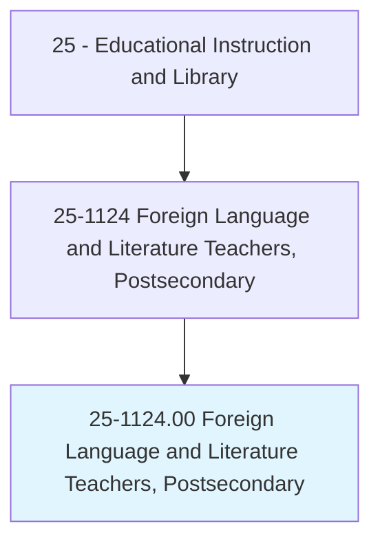
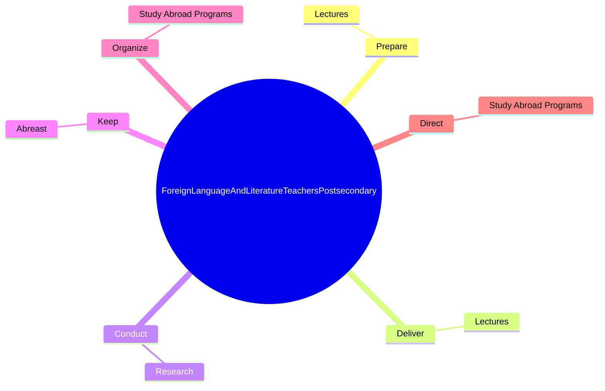
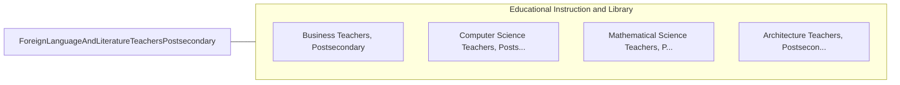

# Foreign Language and Literature Teachers, Postsecondary

> Teach languages and literature courses in languages other than English. Includes teachers of American Sign Language (ASL). Includes both teachers primarily engaged in teaching and those who do a combination of teaching and research.

## Overview

Foreign Language and Literature Teachers, Postsecondary is an occupation within the Educational Instruction and Library category. Teach languages and literature courses in languages other than English. Includes teachers of American Sign Language (ASL).

## Classification Hierarchy

## Key Statistics

| Metric | Value |
|--------|-------|
| SOC Code | 25-1124.00 |
| Category | [Educational Instruction and Library](/occupations/Education) |
| Task Count | 12 |
| Source | O*NET |

## Core Tasks

### prepare.Lectures

Foreign Language and Literature Teachers, Postsecondary prepare lectures as part of their core responsibilities.

**Actions:**
- `prepare.Lectures.to.HowToSpeak`
- `prepare.Lectures.to.write.ForeignLanguage`
- `prepare.Lectures.to.CulturalAspectsOfAreasWhereParticularLanguageIsUsed`

### deliver.Lectures

Foreign Language and Literature Teachers, Postsecondary deliver lectures as part of their core responsibilities.

**Actions:**
- `deliver.Lectures.to.HowToSpeak`
- `deliver.Lectures.to.write.ForeignLanguage`
- `deliver.Lectures.to.CulturalAspectsOfAreasWhereParticularLanguageIsUsed`

### conduct.Research

Foreign Language and Literature Teachers, Postsecondary conduct research as part of their core responsibilities.

**Actions:**
- `conduct.Research.in.PublishFindings.in.ScholarlyJournals`

## Skills & Competencies

### Technical Skills
- **Curriculum Development** - Advanced
- **Instructional Design** - Advanced
- **Assessment** - Advanced

### Soft Skills
- **Communication** - Essential
- **Problem Solving** - Essential
- **Critical Thinking** - Important
- **Teamwork** - Important
- **Adaptability** - Important

## Related Occupations

## Industries

This occupation is found across multiple industries. See [Industries](/industries) for sector-specific employment data.

## Career Progression

---

*Source: O*NET 25-1124.00 - ONETOccupation*
