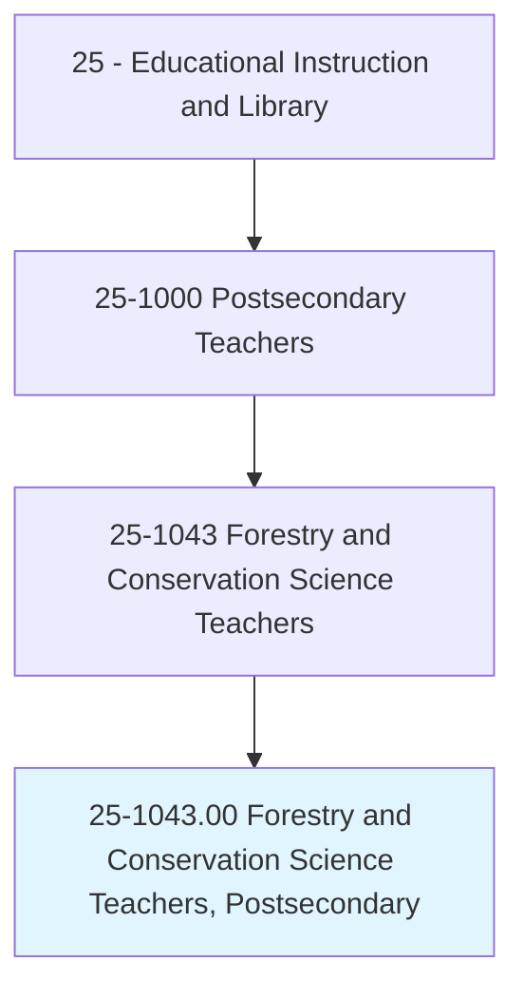
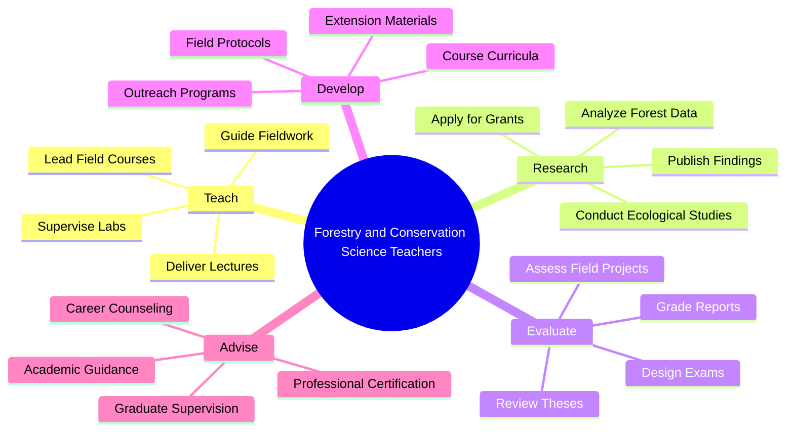
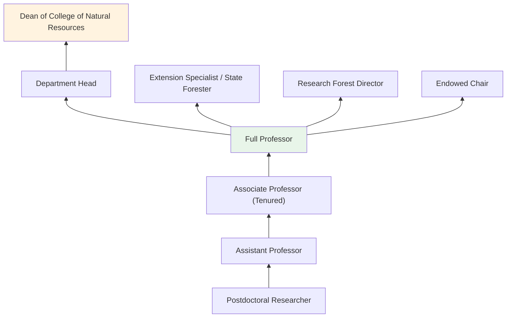
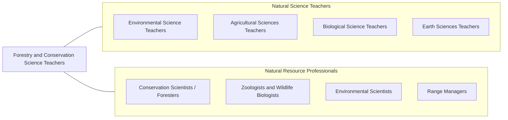

# Forestry and Conservation Science Teachers, Postsecondary

> Teach courses in forestry and conservation science. Includes both teachers primarily engaged in teaching and those who do a combination of teaching and research.

## Overview

Forestry and Conservation Science Teachers in postsecondary education instruct students in the science and management of forests, wildlife, natural resources, and conservation. They teach courses in silviculture, forest ecology, wildlife management, watershed management, fire science, natural resource economics, conservation biology, and land use planning. These educators combine classroom instruction with extensive field-based learning, preparing students for careers in forest management, wildlife conservation, environmental consulting, and public lands administration.

Many faculty conduct research on topics such as sustainable forestry practices, wildfire management, climate change impacts on forest ecosystems, endangered species recovery, carbon sequestration, and the ecology of invasive species. They secure funding from agencies including USDA Forest Service, Bureau of Land Management, Fish and Wildlife Service, and state natural resource departments. Their research directly informs forest management policies and conservation strategies.

Forestry and conservation science faculty often work at land-grant universities with strong connections to state and federal natural resource agencies, cooperative extension programs, and experimental forests. They train graduates who will manage millions of acres of public and private forestlands, protect biodiversity, and balance economic use with environmental stewardship.

## Classification Hierarchy

## Key Statistics

| Metric | Value |
|--------|-------|
| SOC Code | 25-1043.00 |
| Job Zone | 5 (Extensive Preparation) |
| Category | [Educational Instruction and Library](/occupations/Education/index) |
| Median Salary | $78,000 - $100,000 |
| Employment | ~2,500 |
| Projected Growth | 3-5% (Slower than average) |
| Source | O*NET |

## Core Tasks

### teach.ForestryAndConservation

Faculty deliver instruction in natural resource science and management.

**Actions:**
- `deliver.Lectures.on.Silviculture` - Teach forest management, regeneration, and harvest planning
- `deliver.Lectures.on.WildlifeManagement` - Instruct on habitat management, population ecology, and conservation
- `lead.FieldCourses.in.ForestEcosystems` - Guide students through hands-on field measurements and assessments

### conduct.NaturalResourceResearch

Faculty pursue research on forest ecosystems and conservation.

**Actions:**
- `conduct.Research.on.ForestEcology` - Study forest ecosystem dynamics, succession, and biodiversity
- `conduct.Research.on.WildfireManagement` - Investigate fire behavior, prescribed burning, and post-fire recovery
- `publish.Findings.in.ForestryJournals` - Contribute to journals such as Forest Science and Conservation Biology

## Skills & Competencies

### Technical Skills
- **Forest Science** - Expert (silviculture, dendrology, forest ecology)
- **Wildlife Biology** - Advanced (population dynamics, habitat management)
- **GIS and Remote Sensing** - Advanced (ArcGIS, forest inventory, LiDAR)
- **Field Methods** - Expert (forest measurement, soil sampling, wildlife surveys)
- **Statistical Analysis** - Advanced (R, SAS, forest growth models)
- **Curriculum Design** - Advanced (forestry accreditation standards)

### Soft Skills
- **Communication** - Critical (field instruction, public engagement)
- **Fieldwork Leadership** - Essential (outdoor teaching, safety management)
- **Collaboration** - Essential (agency partnerships, interdisciplinary research)
- **Mentorship** - Essential (guiding students into natural resource careers)
- **Problem Solving** - Important (complex ecosystem management)
- **Adaptability** - Important (weather, field conditions, changing science)

## Education & Certifications

| Requirement | Details |
|-------------|---------|
| Typical Education | Ph.D. in Forestry, Conservation Biology, Wildlife Science, or related field |
| Alternative Entry | M.S. for applied teaching or extension positions |
| Work Experience | Field research and professional experience valued |
| On-the-Job Training | Faculty development; safety training for field instruction |
| Common Certifications | SAF Certified Forester; TWS Certified Wildlife Biologist; ISA Certified Arborist |

## Career Progression

## Setting Variations

### Land-Grant Universities
Strong forestry programs with experimental forests, extension connections, and state agency partnerships. SAF-accredited programs.

### Research Universities
Emphasis on ecological and conservation research. Doctoral student supervision and funded research programs.

### Community Colleges
Natural resource technician programs preparing students for field-level positions. Certificate and associate degree programs.

### Online Programs
Distance learning in natural resource management and conservation. Growing demand for flexible professional development.

### Cooperative Extension
Applied teaching through forestry extension programs. Community outreach and landowner education.

## Technology & Tools

| Category | Tools |
|----------|-------|
| GIS & Remote Sensing | ArcGIS, QGIS, LiDAR, drone imaging |
| Forest Inventory | FVS (Forest Vegetation Simulator), FIA data tools |
| Statistical Software | R, SAS, Program MARK, Distance |
| Field Equipment | GPS, DBH tapes, increment borers, clinometers, camera traps |
| Learning Management Systems | Canvas, Blackboard, Moodle |
| Communication | Zoom, Microsoft Teams |

## Related Occupations

## Industries

- [Educational Services - Colleges and Universities](/industries/Education/index) - Primary Employment
- [Government](/industries/Government) - USDA Forest Service, BLM, FWS, State DNRs
- [Agriculture, Forestry, Fishing](/industries/Agriculture) - Timber and Conservation
- [Professional Services](/industries/ProfessionalServices) - Environmental Consulting

## Departments

This occupation typically works in:
- [Department of Forestry](/departments/Forestry)
- [School of Natural Resources](/departments/NaturalResources)
- [Department of Wildlife and Fisheries](/departments/WildlifeFisheries)
- [College of Agriculture and Natural Resources](/departments/AgNaturalResources)

---

*Source: O*NET 25-1043.00 - ONETOccupation*
