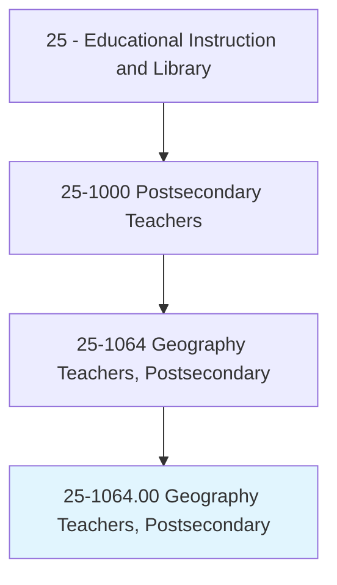
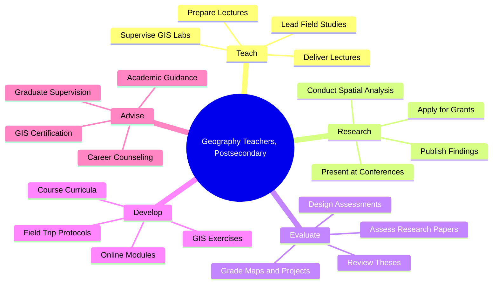
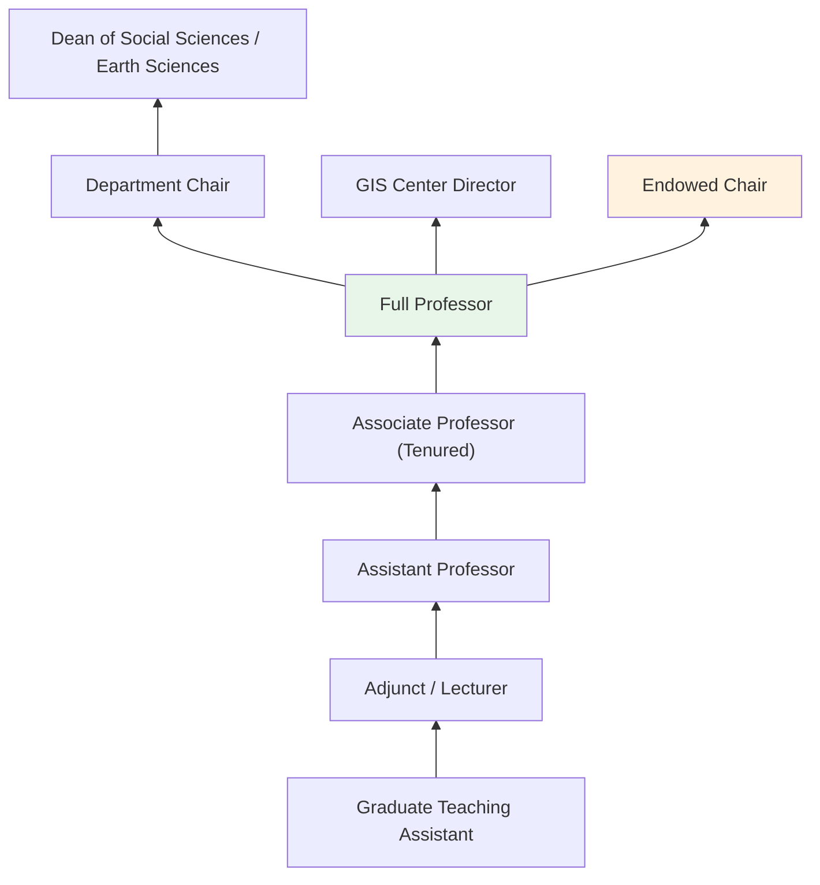
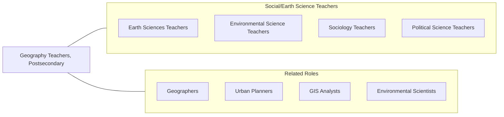

# Geography Teachers, Postsecondary

> Teach courses in geography. Includes both teachers primarily engaged in teaching and those who do a combination of teaching and research.

## Overview

Geography Teachers in postsecondary education instruct students in the study of Earth's physical features, human populations, cultures, and the spatial relationships between human activity and the natural environment. They teach courses in physical geography, human geography, geographic information systems (GIS), cartography, climatology, urban geography, environmental geography, and regional studies. These educators train students to analyze spatial patterns, use geospatial technologies, and understand the complex interactions between societies and their environments.

Many geography professors conduct research on topics such as climate change impacts, urbanization, migration patterns, land use transformation, natural hazards, and environmental justice. They employ advanced geospatial technologies including GIS, remote sensing, and spatial statistics to investigate these phenomena. Their work is increasingly interdisciplinary, connecting with environmental science, urban planning, public health, and international development.

Geography faculty play a distinctive role in higher education by bridging the natural and social sciences. They prepare students for careers in urban planning, environmental management, GIS analysis, international development, government agencies, and technology companies, while also training the next generation of geographic researchers.

## Classification Hierarchy

## Key Statistics

| Metric | Value |
|--------|-------|
| SOC Code | 25-1064.00 |
| Job Zone | 5 (Extensive Preparation) |
| Category | [Educational Instruction and Library](/occupations/Education/index) |
| Median Salary | $75,000 - $95,000 |
| Employment | ~6,500 |
| Projected Growth | 4-6% (Average) |
| Source | O*NET |

## Core Tasks

### teach.GeographyCourses

Geography Teachers deliver instruction across geographic disciplines.

**Actions:**
- `deliver.Lectures.on.PhysicalGeography` - Teach landforms, climate systems, and biogeography
- `deliver.Lectures.on.HumanGeography` - Instruct on population, culture, urbanization, and political geography
- `supervise.GISLabs.for.SpatialAnalysis` - Guide students in geographic information systems and mapping

### conduct.GeographicResearch

Geography Teachers pursue original spatial research.

**Actions:**
- `conduct.Research.using.GIS` - Analyze spatial data patterns using geospatial technology
- `conduct.Research.on.EnvironmentalChange` - Study land use, climate impacts, and resource management
- `publish.Findings.in.GeographyJournals` - Contribute to peer-reviewed geographic literature

## Skills & Competencies

### Technical Skills
- **Geographic Information Systems** - Expert (ArcGIS, QGIS, spatial databases)
- **Remote Sensing** - Advanced (satellite imagery, LiDAR, drone mapping)
- **Cartography** - Advanced (map design, spatial visualization)
- **Statistical Analysis** - Advanced (spatial statistics, R, GeoDa)
- **Research Methods** - Advanced (fieldwork, survey, mixed methods)
- **Curriculum Design** - Advanced (geography pedagogy)

### Soft Skills
- **Communication** - Critical (visual and written spatial communication)
- **Critical Thinking** - Essential (spatial reasoning and analysis)
- **Collaboration** - Essential (interdisciplinary research teams)
- **Mentorship** - Essential (student research guidance)
- **Fieldwork Skills** - Important (outdoor research and field instruction)
- **Adaptability** - Important (evolving geospatial technologies)

## Education & Certifications

| Requirement | Details |
|-------------|---------|
| Typical Education | Ph.D. in Geography or closely related field |
| Alternative Entry | Master's degree for community college or GIS instructor positions |
| Work Experience | Research and teaching experience required |
| On-the-Job Training | Faculty development; GIS software training |
| Common Certifications | GISP (GIS Professional); AAG membership; Esri Technical Certification |

## Career Progression

## Setting Variations

### Research Universities
Emphasis on original geospatial research, funded by NSF, NASA, and USGS. Doctoral student supervision and interdisciplinary collaboration.

### Liberal Arts Colleges
Broad geography education with emphasis on spatial thinking and field-based learning. Undergraduate research mentorship.

### Community Colleges
Introduction to Geography and GIS courses. Workforce preparation for GIS technician roles.

### Online Programs
Distance GIS education with cloud-based geospatial tools. Growing demand for GIS certificate programs.

### Government and Applied Research
Faculty affiliated with government agencies or research centers focusing on environmental monitoring, urban planning, or national security.

## Technology & Tools

| Category | Tools |
|----------|-------|
| GIS Software | ArcGIS Pro, QGIS, Google Earth Engine, Mapbox |
| Remote Sensing | ENVI, ERDAS IMAGINE, Sentinel Hub |
| Statistical Analysis | R, GeoDa, Python (geopandas, shapely) |
| Cartography | Adobe Illustrator, Mapbox Studio, CARTO |
| Learning Management Systems | Canvas, Blackboard, Moodle |
| Fieldwork | GPS units, drones (DJI), field survey equipment |

## Related Occupations

## Industries

- [Educational Services - Colleges and Universities](/industries/Education/index) - Primary Employment
- [Government](/industries/Government) - USGS, Census, EPA, Military
- [Professional Services](/industries/ProfessionalServices) - GIS Consulting and Environmental Planning
- [Information Technology](/industries/InformationTechnology) - Geospatial Technology Companies

## Departments

This occupation typically works in:
- [Department of Geography](/departments/Geography)
- [Department of Earth and Environmental Sciences](/departments/EarthSciences)
- [GIS and Spatial Analysis Center](/departments/GIS)
- [School of Environment and Sustainability](/departments/Environment)

---

*Source: O*NET 25-1064.00 - ONETOccupation*
