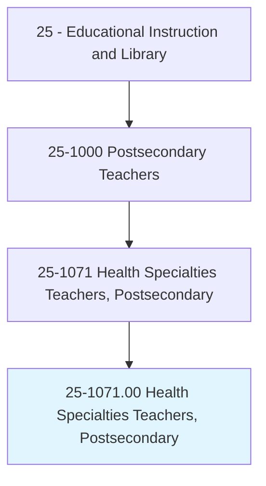
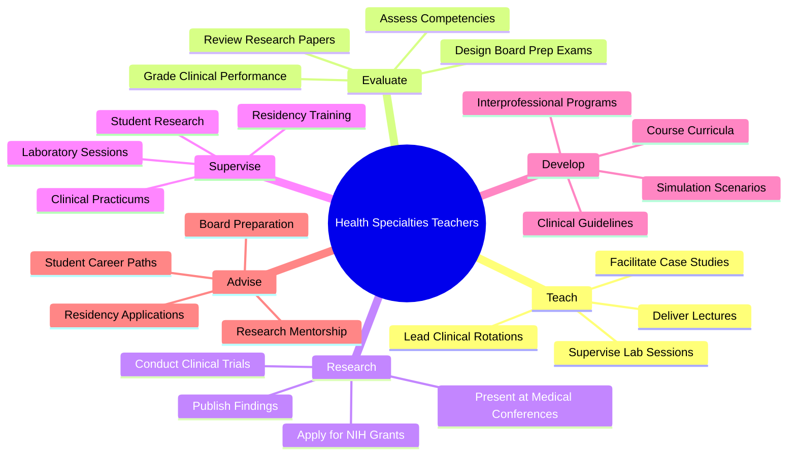
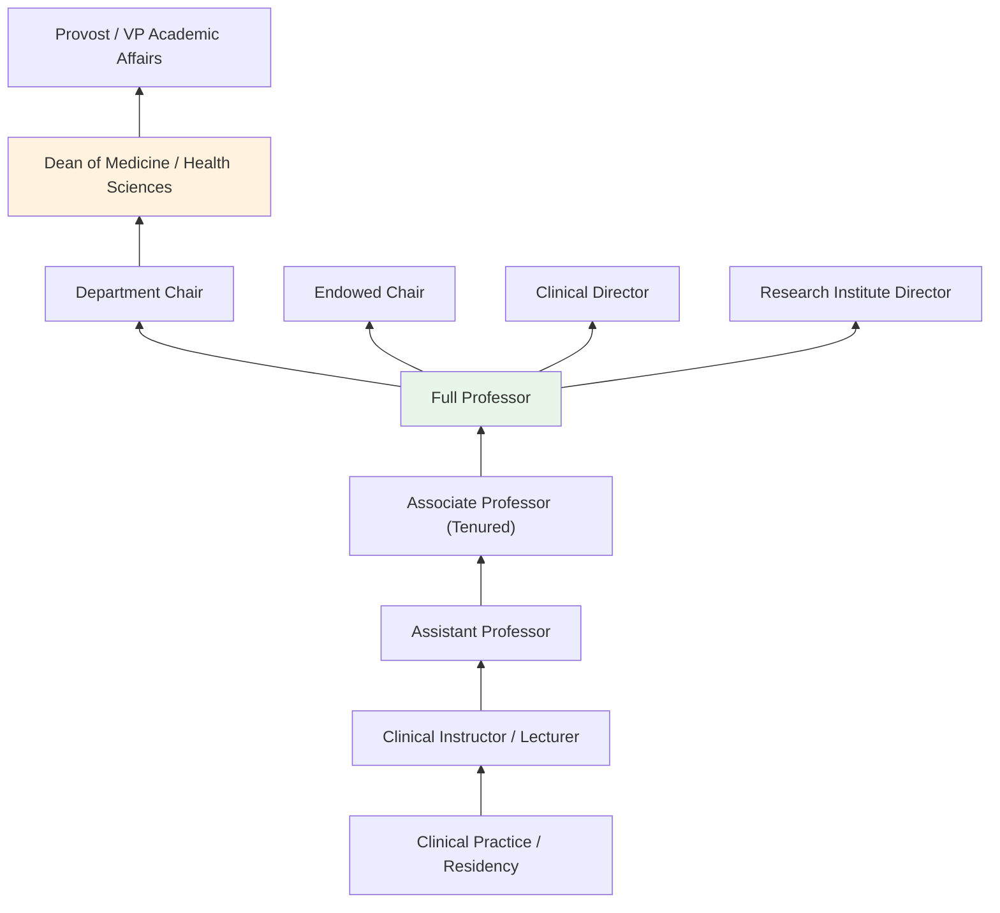
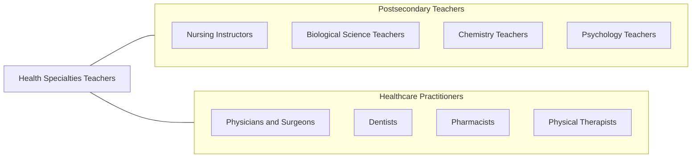

# Health Specialties Teachers, Postsecondary

> Teach courses in health specialties, in fields such as dentistry, laboratory technology, medicine, pharmacy, public health, therapy, and veterinary medicine.

## Overview

Health Specialties Teachers in postsecondary education are faculty members who instruct students in the wide range of health-related disciplines at colleges, universities, and professional schools. They cover fields including medicine, dentistry, pharmacy, public health, physical and occupational therapy, laboratory technology, veterinary medicine, and allied health professions. These educators combine deep clinical expertise with pedagogical skill, preparing the next generation of healthcare providers through both classroom instruction and supervised clinical experiences.

Many health specialties teachers maintain active clinical practices alongside their teaching roles, ensuring that their instruction reflects current medical knowledge, evidence-based practices, and real-world patient care scenarios. They design curricula that integrate foundational biomedical sciences with clinical skills training, simulation-based learning, and interprofessional education. Research is a significant component of many positions, with faculty conducting clinical trials, outcomes research, and health services studies.

The role demands exceptional ability to bridge theory and practice, mentoring students through rigorous academic programs and preparing them for licensure examinations and clinical residencies. These educators shape the competency and professionalism of healthcare workers who will ultimately serve diverse patient populations.

## Classification Hierarchy

## Key Statistics

| Metric | Value |
|--------|-------|
| SOC Code | 25-1071.00 |
| Job Zone | 5 (Extensive Preparation) |
| Category | [Educational Instruction and Library](/occupations/Education/index) |
| Median Salary | $99,000 - $130,000 |
| Employment | ~260,000 |
| Projected Growth | 12-18% (Much faster than average) |
| Source | O*NET |

## Core Tasks

### supervise.LaboratorySessions

Health Specialties Teachers oversee hands-on learning in laboratory and clinical settings.

**Actions:**
- `supervise.LaboratorySessions` - Monitor student performance in anatomy, physiology, and clinical skills labs
- `supervise.ClinicalPracticums.in.HealthcareFacilities` - Oversee student rotations in hospitals and clinics
- `evaluate.ClinicalCompetencies.of.Students` - Assess students on patient care skills and professionalism

### deliver.Lectures

Health Specialties Teachers present didactic content in health science disciplines.

**Actions:**
- `deliver.Lectures.on.BiomedicalSciences` - Teach foundational science courses (anatomy, pharmacology, pathology)
- `deliver.Lectures.on.ClinicalMedicine` - Instruct on diagnosis, treatment, and patient management
- `facilitate.CaseStudies.for.ClinicalReasoning` - Lead case-based learning sessions

### direct.Research

Health Specialties Teachers conduct and supervise scholarly research.

**Actions:**
- `direct.Research.in.ClinicalTrials` - Lead investigations into new treatments and therapies
- `direct.Research.of.GraduateStudents` - Supervise doctoral and postdoctoral research
- `publish.Findings.in.PeerReviewedJournals` - Contribute to the medical and health sciences literature

## Skills & Competencies

### Technical Skills
- **Clinical Expertise** - Expert (patient care, diagnostic skills, procedures)
- **Pedagogy** - Advanced (medical education, simulation-based learning)
- **Research Methods** - Advanced (clinical trials, epidemiology, biostatistics)
- **Curriculum Design** - Advanced (competency-based health education)
- **Assessment Design** - Advanced (OSCE, board-style exams, clinical evaluations)
- **Simulation Technology** - Advanced (standardized patients, high-fidelity simulators)

### Soft Skills
- **Communication** - Critical (explaining medical concepts, patient communication modeling)
- **Mentorship** - Critical (guiding clinical trainees)
- **Ethical Judgment** - Essential (medical ethics, research integrity)
- **Patience** - Essential (clinical teaching with novice learners)
- **Leadership** - Essential (interdisciplinary team management)
- **Cultural Competency** - Important (diverse patient populations)

## Education & Certifications

| Requirement | Details |
|-------------|---------|
| Typical Education | M.D., D.O., D.D.S., Pharm.D., D.V.M., Ph.D., or other terminal health science degree |
| Clinical Training | Residency and/or fellowship completion for clinical disciplines |
| Work Experience | Clinical practice experience strongly preferred or required |
| On-the-Job Training | Faculty development in medical education pedagogy |
| Common Certifications | Board certification in clinical specialty; medical education fellowship; BLS/ACLS certification |

## Career Progression

## Setting Variations

### Academic Medical Centers
Integrated teaching, research, and patient care. Faculty balance clinical practice with classroom instruction and scholarly activity. Strong emphasis on research funding.

### Professional Schools
Medical, dental, pharmacy, and veterinary schools with intensive clinical training programs. Heavy focus on licensure preparation and clinical competency.

### Community Colleges
Allied health programs (medical assisting, radiography, dental hygiene). Focus on workforce-ready clinical skills and certification preparation.

### Online Health Education
Distance learning for public health, health administration, and health informatics. Emphasis on asynchronous content with periodic in-person clinical intensives.

### Simulation Centers
Dedicated facilities for high-fidelity clinical simulation. Instruction focuses on procedural skills, team-based scenarios, and clinical decision-making.

## Technology & Tools

| Category | Tools |
|----------|-------|
| Learning Management Systems | Canvas, Blackboard, D2L Brightspace |
| Clinical Simulation | SimMan, CAE Healthcare, Laerdal SimPad |
| Assessment Platforms | ExamSoft, NBME Customized Assessments, Kaplan |
| Electronic Health Records | Epic (training environment), Cerner, practice EMRs |
| Research Tools | PubMed, REDCap, SPSS, SAS, Stata |
| Video & Communication | Zoom, Panopto, Microsoft Teams |

## Related Occupations

## Industries

- [Educational Services - Medical Schools and Universities](/industries/Education/index) - Primary Employment
- [Healthcare - Hospitals and Medical Centers](/industries/Healthcare) - Academic Medical Centers
- [Government](/industries/PublicAdministration) - Public Health Agencies, VA Medical Centers
- [Professional, Scientific, and Technical Services](/industries/Scientific) - Health Research Organizations

## Departments

This occupation typically works in:
- School of Medicine
- School of Dentistry
- College of Pharmacy
- School of Public Health
- College of Health Sciences

---

*Source: O*NET 25-1071.00 - ONETOccupation*
