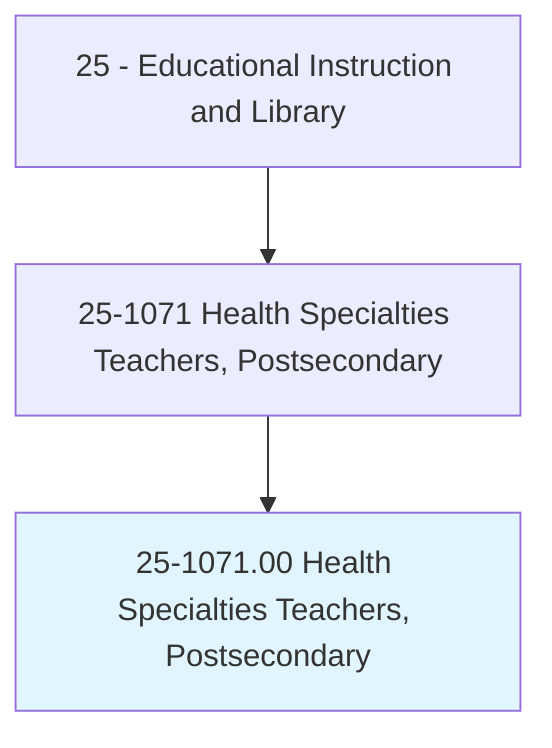
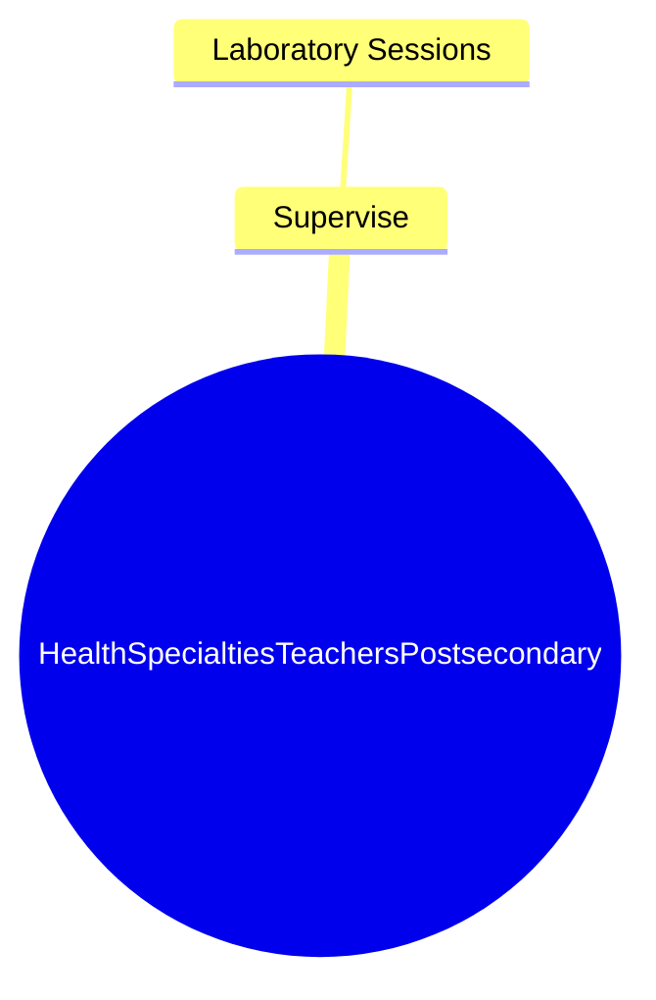

# Health Specialties Teachers, Postsecondary

> Teach courses in health specialties, in fields such as dentistry, laboratory technology, medicine, pharmacy, public health, therapy, and veterinary medicine.

## Overview

Health Specialties Teachers, Postsecondary is classified under Educational Instruction and Library (SOC 25). Teach courses in health specialties, in fields such as dentistry, laboratory technology, medicine, pharmacy, public health, therapy, and veterinary medicine.

## Classification Hierarchy

## Key Statistics

| Metric | Value |
|--------|-------|
| SOC Code | 25-1071.00 |
| Category | [Educational Instruction and Library](/occupations/Education) |
| Task Count | 7 |
| Source | O*NET |

## Core Tasks

### supervise.LaboratorySessions

Health Specialties Teachers, Postsecondary supervise laboratory sessions as part of their core responsibilities.

**Actions:**
- `supervise.LaboratorySessions`

## Skills & Competencies

### Technical Skills
- **Curriculum Development** - Advanced
- **Instructional Design** - Advanced
- **Assessment** - Advanced

### Soft Skills
- **Communication** - Essential
- **Problem Solving** - Essential
- **Critical Thinking** - Important
- **Teamwork** - Important
- **Adaptability** - Important

## Related Occupations

## Industries

This occupation is found across multiple industries. See [Industries](/industries) for sector-specific employment data.

## Career Progression

---

*Source: O*NET 25-1071.00 - ONETOccupation*
