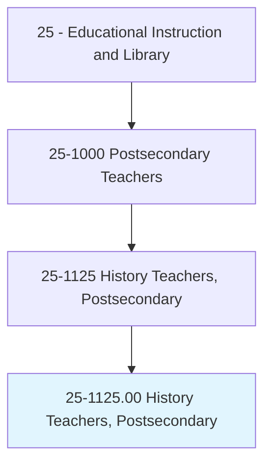
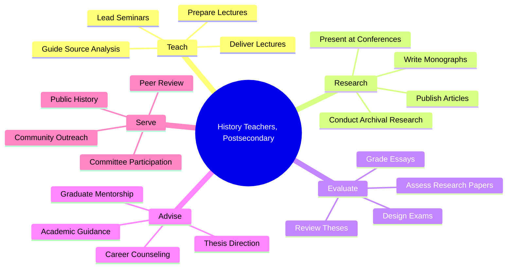
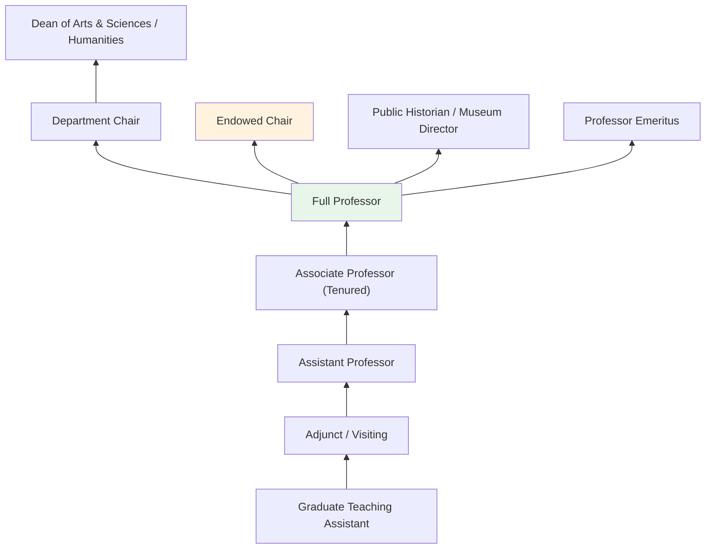
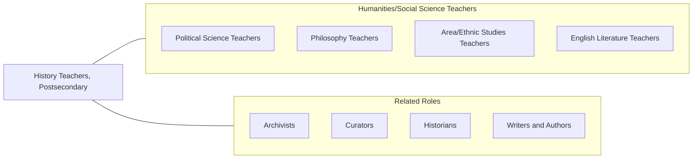

# History Teachers, Postsecondary

> Teach courses in human history and historiography. Includes both teachers primarily engaged in teaching and those who do a combination of teaching and research.

## Overview

History Teachers in postsecondary education instruct students in the study of human history, historiography, and the methods historians use to interpret the past. They teach courses spanning ancient civilizations, medieval Europe, American history, world history, military history, diplomatic history, social and cultural history, and the history of science and technology. These educators help students develop the analytical skills to evaluate primary sources, construct historical arguments, and understand how the past shapes contemporary societies.

Many history professors are active scholars who produce original research through archival work, oral history, digital humanities, and interdisciplinary methodologies. They publish monographs, peer-reviewed articles, and edited volumes, contributing to ongoing historiographical debates. Their research may focus on specific geographic regions, time periods, thematic topics, or methodological approaches, and they often participate in professional organizations such as the American Historical Association.

History faculty serve an essential role in liberal arts education, fostering critical thinking, analytical writing, and the ability to evaluate evidence from multiple perspectives. They prepare students for careers in education, law, government, journalism, museum work, archival science, and public history, while training graduate students for academic careers.

## Classification Hierarchy

## Key Statistics

| Metric | Value |
|--------|-------|
| SOC Code | 25-1125.00 |
| Job Zone | 5 (Extensive Preparation) |
| Category | [Educational Instruction and Library](/occupations/Education/index) |
| Median Salary | $72,000 - $90,000 |
| Employment | ~22,000 |
| Projected Growth | 3-5% (Slower than average) |
| Source | O*NET |

## Core Tasks

### prepare.Lectures

History Teachers develop instructional content across historical periods and regions.

**Actions:**
- `prepare.Lectures.to.AncientHistory` - Create content on ancient civilizations, classical antiquity, and early societies
- `prepare.Lectures.to.PostwarCivilizations` - Develop materials on 20th century history and Cold War era
- `prepare.Lectures.to.HistoryOfThirdWorldCountries` - Design content on postcolonial history and developing nations

### deliver.Lectures

History Teachers present course material through lectures, seminars, and discussions.

**Actions:**
- `deliver.Lectures.to.AncientHistory` - Teach ancient and classical historical periods
- `deliver.Lectures.to.PostwarCivilizations` - Instruct on modern and contemporary world history
- `deliver.Lectures.to.HistoryOfThirdWorldCountries` - Present global south and postcolonial historical narratives

### conduct.ArchivalResearch

History Teachers pursue original scholarly research using primary sources.

**Actions:**
- `conduct.ArchivalResearch.in.HistoricalCollections` - Analyze manuscripts, documents, and artifacts in archives
- `write.Monographs.on.HistoricalTopics` - Produce book-length original historical scholarship
- `publish.Articles.in.HistoricalJournals` - Contribute to peer-reviewed historiographical discourse

## Skills & Competencies

### Technical Skills
- **Historiography** - Expert (historical theory, methodology, interpretation)
- **Archival Research** - Expert (primary source analysis, paleography)
- **Academic Writing** - Expert (monographs, articles, book reviews)
- **Curriculum Design** - Advanced (survey and specialized history courses)
- **Digital Humanities** - Intermediate to Advanced (GIS, text mining, digital archives)
- **Foreign Languages** - Advanced (reading competency in relevant languages)

### Soft Skills
- **Critical Thinking** - Critical (evaluating evidence and constructing arguments)
- **Communication** - Critical (narrative clarity, engaging lectures)
- **Writing** - Critical (scholarly and accessible historical prose)
- **Mentorship** - Essential (guiding student researchers)
- **Intellectual Curiosity** - Essential (sustained engagement with complex topics)
- **Patience** - Important (teaching historical thinking skills)

## Education & Certifications

| Requirement | Details |
|-------------|---------|
| Typical Education | Ph.D. in History or closely related field |
| Alternative Entry | M.A. in History for community college or adjunct positions |
| Work Experience | Archival research and teaching experience required |
| On-the-Job Training | Faculty development; pedagogical workshops |
| Common Certifications | AHA membership; digital humanities certifications; foreign language proficiencies |

## Career Progression

## Setting Variations

### Research Universities
Heavy emphasis on archival research and monograph publication. Doctoral student supervision and seminar-based graduate teaching. Tenure expectations center on book publication.

### Liberal Arts Colleges
Focus on undergraduate teaching excellence with broad survey courses and specialized seminars. Close mentorship of student thesis research.

### Community Colleges
U.S. and World History survey courses for general education and transfer credit. Diverse student populations with emphasis on accessible instruction.

### Online Programs
Asynchronous history courses with emphasis on document analysis, discussion forums, and research papers. Growing enrollment in public history programs.

### Museums and Public History
Faculty affiliated with museum studies, historic preservation, or public history programs. Emphasis on applied historical practice.

## Technology & Tools

| Category | Tools |
|----------|-------|
| Digital Archives | JSTOR, Archive.org, Hathi Trust, Europeana |
| Learning Management Systems | Canvas, Blackboard, Moodle |
| Digital Humanities | ArcGIS, Omeka, Voyant Tools, Zotero |
| Research Databases | America: History and Life, Historical Abstracts, ProQuest |
| Presentation | PowerPoint, Google Slides, Prezi |
| Reference Management | Zotero, EndNote, Turabian style |

## Related Occupations

## Industries

- [Educational Services - Colleges and Universities](/industries/Education/index) - Primary Employment
- [Government](/industries/PublicAdministration) - Public Universities, National Archives
- Arts, Entertainment, and Recreation - Museums, Historical Sites
- [Professional Services](/industries/Scientific) - Historical Consulting

## Departments

This occupation typically works in:
- Department of History
- School of Humanities
- American Studies Program
- Public History Program

---

*Source: O*NET 25-1125.00 - ONETOccupation*
