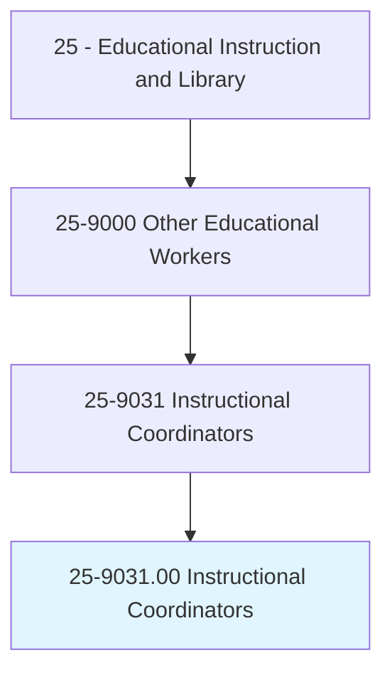
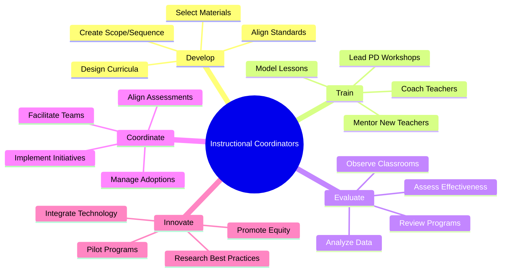
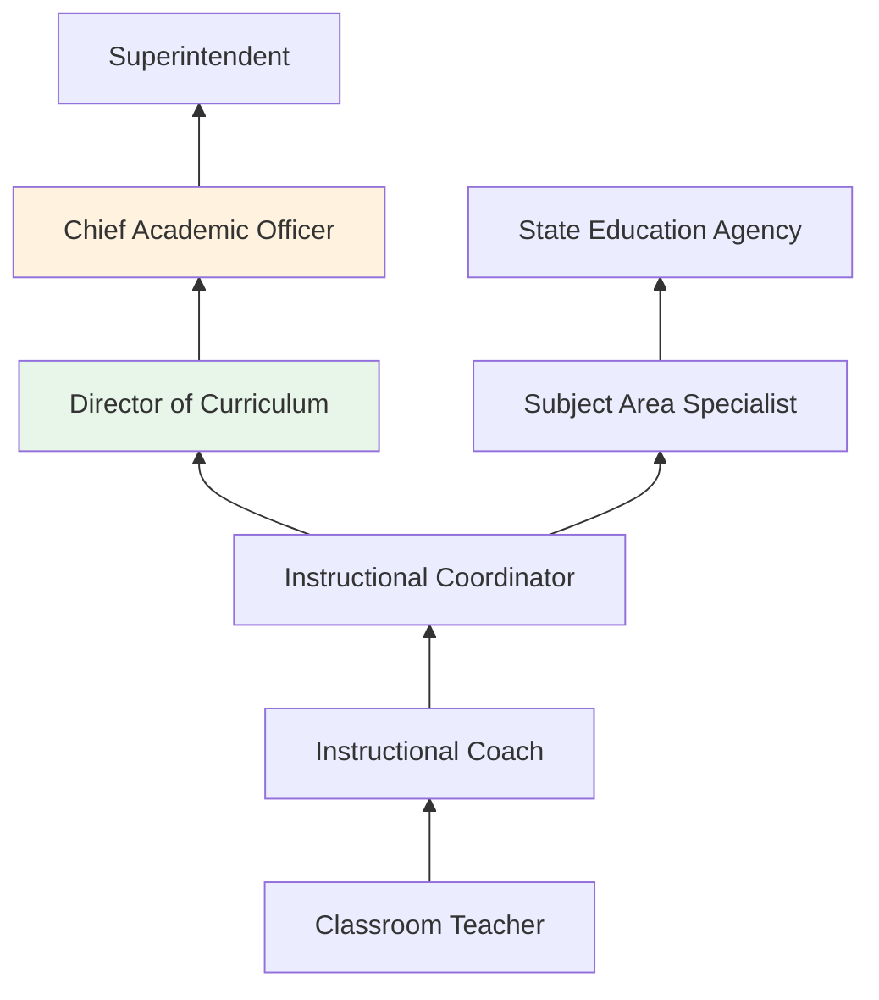
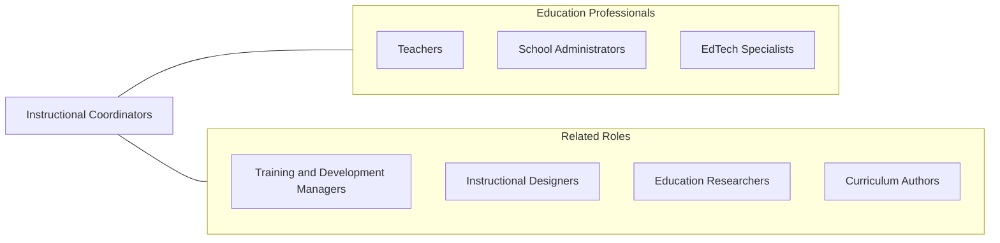

# Instructional Coordinators

> Develop instructional material, coordinate educational content, or incorporate current technology into curricula. Examine and institute methods and ways of teaching and presenting material.

## Overview

Instructional Coordinators develop curricula, select textbooks and instructional materials, train teachers in new content and pedagogical strategies, and assess the effectiveness of educational programs. They work at the school district, state, or organizational level to ensure curriculum alignment with academic standards, analyze student achievement data to identify areas needing improvement, and implement research-based instructional practices across schools and classrooms.

These professionals serve as the bridge between educational policy and classroom practice. They interpret state and federal standards, translate them into coherent scope-and-sequence documents, and support teachers through professional development workshops, coaching cycles, and model lessons. Instructional coordinators analyze standardized test data, benchmark assessments, and classroom observations to make evidence-based decisions about curriculum adoption and instructional improvement.

The role has expanded significantly with the adoption of educational technology, requiring coordinators to evaluate digital tools, learning management systems, adaptive software, and blended learning models. They also lead initiatives around culturally responsive teaching, differentiated instruction, social-emotional learning integration, and equity-focused curriculum design.

## Classification Hierarchy

## Key Statistics

| Metric | Value |
|--------|-------|
| SOC Code | 25-9031.00 |
| Job Zone | 5 (Extensive Preparation) |
| Category | [Educational Instruction and Library](/occupations/Education/index) |
| Median Salary | $66,000 - $78,000 |
| Employment | ~210,000 |
| Projected Growth | 7-10% (Faster than average) |
| Source | O*NET |

## Core Tasks

### develop.CurriculumAndInstruction

Instructional Coordinators design and align educational programs.

**Actions:**
- `develop.Curricula.aligned.to.AcademicStandards` - Create scope and sequence documents matching state and federal standards
- `select.InstructionalMaterials.for.DistrictAdoption` - Evaluate and recommend textbooks, digital resources, and supplementary materials
- `analyze.StudentData.to.InformInstruction` - Use assessment data to identify gaps and guide curriculum decisions

### train.EducatorsInBestPractices

Instructional Coordinators support teacher professional growth.

**Actions:**
- `lead.ProfessionalDevelopment.for.Teachers` - Design and deliver training on instructional strategies and content
- `coach.Teachers.through.ClassroomObservation` - Provide feedback and model effective teaching practices
- `implement.Initiatives.for.InstructionalImprovement` - Roll out district-wide programs and reform efforts

## Skills & Competencies

### Technical Skills
- **Curriculum Design** - Expert (standards alignment, backward design, scope and sequence)
- **Data Analysis** - Advanced (assessment data, achievement gaps, program evaluation)
- **Instructional Strategies** - Expert (research-based pedagogy, differentiation, UDL)
- **Professional Development** - Advanced (adult learning theory, coaching models, facilitation)
- **Educational Technology** - Advanced (LMS, adaptive software, blended learning)
- **Assessment** - Advanced (formative, summative, benchmark, standardized testing)

### Soft Skills
- **Leadership** - Critical (influencing without direct authority)
- **Communication** - Critical (presenting to diverse audiences, writing reports)
- **Collaboration** - Essential (working with teachers, administrators, community)
- **Analytical Thinking** - Essential (data-driven decision making)
- **Diplomacy** - Important (navigating change resistance)
- **Organization** - Essential (managing multiple initiatives and timelines)

## Education & Certifications

| Requirement | Details |
|-------------|---------|
| Typical Education | Master's degree in Curriculum and Instruction, Educational Leadership, or related field |
| Teaching Experience | 3-5+ years of classroom teaching typically required |
| State Requirements | Administrative or curriculum specialist certification in some states |
| Continuing Education | Professional development for certification maintenance |
| Common Certifications | State curriculum specialist license; NBPTS certification; EdD or Ph.D. for advancement |

## Career Progression

## Setting Variations

### School Districts
District-level curriculum development, material adoption, and teacher training. Standards alignment and assessment coordination.

### State Education Agencies
Statewide standards development, program evaluation, and technical assistance to districts.

### Educational Publishers
Curriculum authoring, alignment auditing, and professional development for published programs.

### Nonprofit / Research Organizations
Educational research, program design, and consulting for schools and districts.

### Higher Education
Faculty development, curriculum review, and accreditation support at colleges and universities.

## Technology & Tools

| Category | Tools |
|----------|-------|
| Data Analysis | Tableau, Power BI, Excel, state assessment portals |
| Learning Management | Canvas, Google Classroom, Schoology |
| Curriculum Mapping | Atlas, Rubicon Atlas, Curriculum Trak |
| Assessment | MAP Growth, iReady, STAR, state benchmarks |
| Professional Development | Zoom, Nearpod, Swivl, coaching platforms |
| Productivity | Google Workspace, Microsoft Office, Asana |

## Related Occupations

## Industries

- [Educational Services - K-12](/industries/Education/index) - Primary Employment
- [Government](/industries/PublicAdministration) - State Education Agencies
- [Professional Services](/industries/Scientific) - Educational Consulting
- [Information Services](/industries/Information) - Educational Publishing

## Departments

This occupation typically works in:
- Curriculum and Instruction
- Professional Development
- Academic Affairs

---

*Source: O*NET 25-9031.00 - ONETOccupation*
