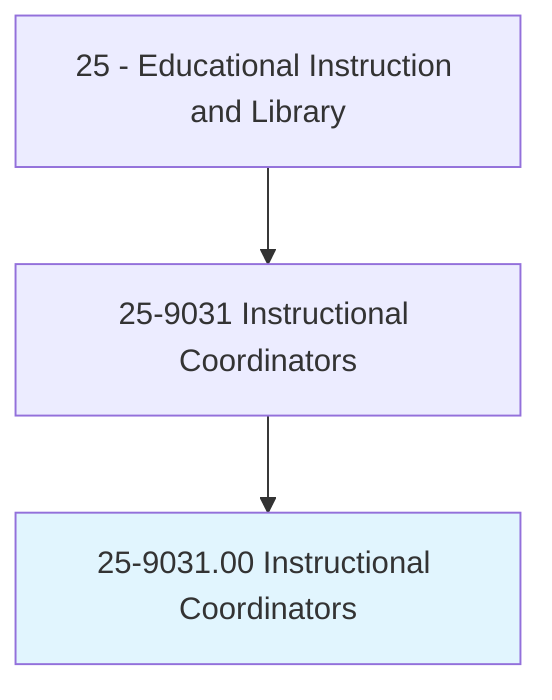
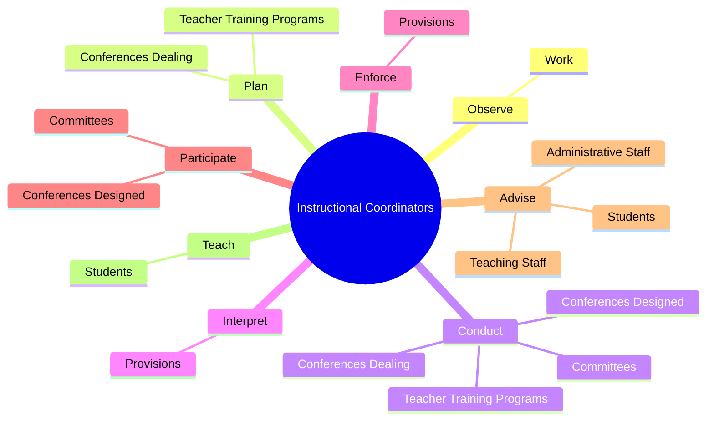

# Instructional Coordinators

> Develop instructional material, coordinate educational content, and incorporate current technology into instruction in order to provide guidelines to educators and instructors for developing curricula and conducting courses. May train and coach teachers. Includes educational consultants and specialists, and instructional material directors.

## Overview

Instructional Coordinators is an occupation within the Educational Instruction and Library category. Develop instructional material, coordinate educational content, and incorporate current technology into instruction in order to provide guidelines to educators and instructors for developing curricula and conducting courses. May train and coach teachers.

## Classification Hierarchy

## Key Statistics

| Metric | Value |
|--------|-------|
| SOC Code | 25-9031.00 |
| Category | [Educational Instruction and Library](/occupations/Education) |
| Task Count | 152 |
| Source | O*NET |

## Core Tasks

### observe.Work

Instructional Coordinators observe work as part of their core responsibilities.

**Actions:**
- `observe.Work.of.TeachingStaff.to.evaluate.PerformanceRecommendChangesCouldStrengthenTeachingSkills`
- `observe.Work.of.recommend.ChangesCouldStrengthenTeachingSkills`

### plan.TeacherTrainingPrograms

Instructional Coordinators plan teacher training programs as part of their core responsibilities.

**Actions:**
- `plan.TeacherTrainingPrograms.with.NewClassroomProcedures`
- `plan.TeacherTrainingPrograms.with.InstructionalMaterials`
- `plan.TeacherTrainingPrograms.with.Equipment`
- `plan.TeacherTrainingPrograms.with.TeachingAids`

### conduct.TeacherTrainingPrograms

Instructional Coordinators conduct teacher training programs as part of their core responsibilities.

**Actions:**
- `conduct.TeacherTrainingPrograms.with.NewClassroomProcedures`
- `conduct.TeacherTrainingPrograms.with.InstructionalMaterials`
- `conduct.TeacherTrainingPrograms.with.Equipment`
- `conduct.TeacherTrainingPrograms.with.TeachingAids`

## Skills & Competencies

### Technical Skills
- **Curriculum Development** - Advanced
- **Instructional Design** - Advanced
- **Assessment** - Advanced

### Soft Skills
- **Communication** - Essential
- **Problem Solving** - Essential
- **Critical Thinking** - Important
- **Teamwork** - Important
- **Adaptability** - Important

## Related Occupations

## Industries

This occupation is found across multiple industries. See [Industries](/industries) for sector-specific employment data.

## Career Progression

---

*Source: O*NET 25-9031.00 - ONETOccupation*
