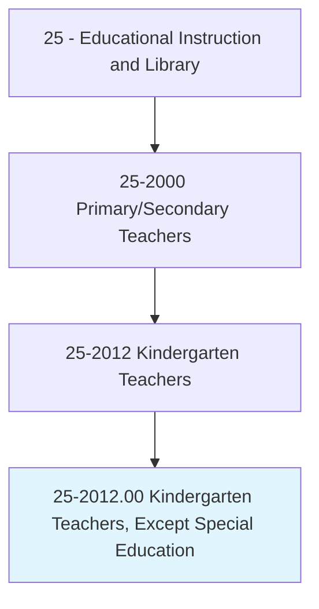
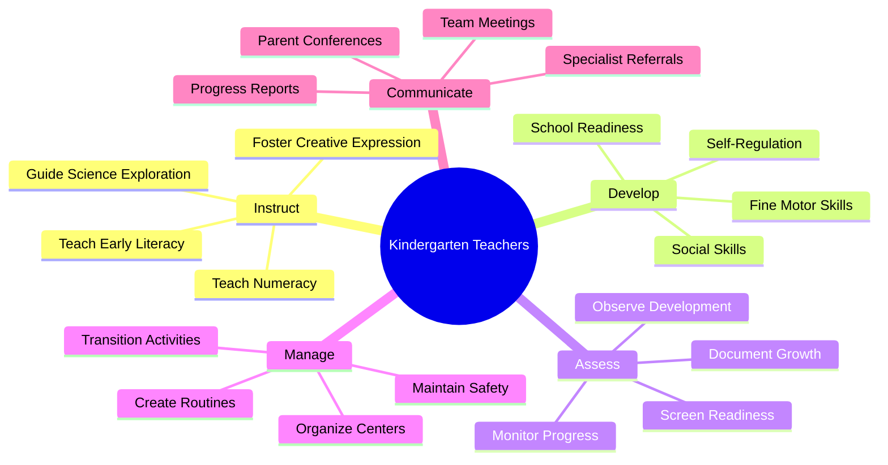
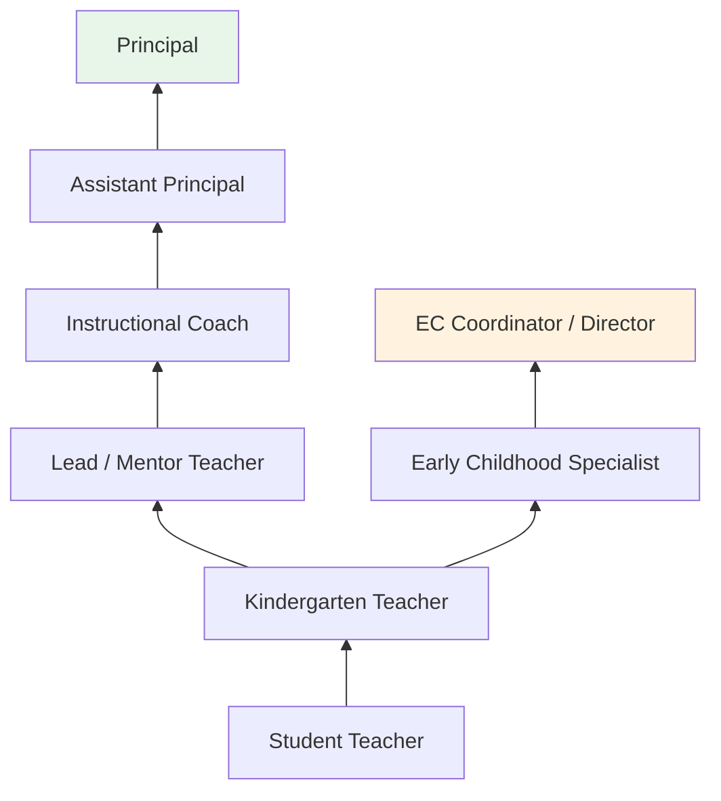
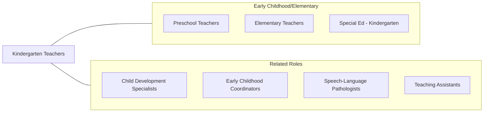

# Kindergarten Teachers, Except Special Education

> Teach academic and social skills to kindergarten students.

## Overview

Kindergarten Teachers instruct children aged 4-6 in the foundational academic, social, and behavioral skills that prepare them for elementary school. They teach early literacy (letter recognition, phonemic awareness, beginning reading), numeracy (counting, number recognition, basic operations), science exploration, social studies concepts, and creative expression through art, music, and movement. These educators create structured yet playful learning environments that honor the developmental needs of young children while building school readiness skills.

Kindergarten teaching requires exceptional skill in managing young children who are often experiencing their first formal school setting. Teachers establish classroom routines, teach social skills such as sharing, turn-taking, and conflict resolution, and develop students' ability to follow multi-step directions and work independently. They use a balance of direct instruction, guided practice, centers-based learning, and play-based activities to address the wide developmental range typical of kindergarten classrooms.

The kindergarten year represents a pivotal transition from home or preschool to formal schooling. Teachers collaborate closely with families, school counselors, and specialists to identify developmental delays, implement early interventions, and build the parent-school partnership essential for long-term student success. Full-day kindergarten programs have become the norm, increasing the scope and depth of instruction at this level.

## Classification Hierarchy

## Key Statistics

| Metric | Value |
|--------|-------|
| SOC Code | 25-2012.00 |
| Job Zone | 4 (Considerable Preparation) |
| Category | [Educational Instruction and Library](/occupations/Education/index) |
| Median Salary | $60,000 - $68,000 |
| Employment | ~160,000 |
| Projected Growth | 2-4% (Average) |
| Source | O*NET |

## Core Tasks

### instruct.KindergartenStudents

Kindergarten Teachers deliver developmentally appropriate instruction.

**Actions:**
- `instruct.Students.in.EarlyLiteracy` - Teach letter recognition, phonics, and beginning reading
- `instruct.Students.in.EarlyNumeracy` - Develop counting, number sense, and basic mathematical concepts
- `facilitate.PlayBasedLearning.for.Development` - Use structured play to build cognitive and social skills

### develop.SchoolReadiness

Kindergarten Teachers build foundational behaviors for academic success.

**Actions:**
- `develop.SocialSkills.for.ClassroomSuccess` - Teach sharing, cooperation, and respectful communication
- `develop.SelfRegulation.for.LearningReadiness` - Build attention, impulse control, and emotional management
- `develop.FineMotorSkills.for.WritingReadiness` - Strengthen hand coordination through cutting, drawing, and writing practice

## Skills & Competencies

### Technical Skills
- **Early Childhood Pedagogy** - Expert (play-based learning, centers, developmental approaches)
- **Early Literacy** - Expert (phonemic awareness, emergent reading, shared reading)
- **Early Mathematics** - Advanced (manipulatives, number talks, spatial reasoning)
- **Assessment** - Advanced (developmental screening, observational assessment, portfolios)
- **Classroom Design** - Advanced (learning centers, sensory areas, organized materials)
- **Educational Technology** - Intermediate (interactive whiteboards, tablets, apps)

### Soft Skills
- **Patience** - Critical (young children learning school expectations)
- **Nurturing** - Critical (emotional support for children in their first school year)
- **Communication** - Essential (parent partnerships, clear instruction for young children)
- **Creativity** - Essential (engaging activities for short attention spans)
- **Energy** - Essential (active, physical teaching style)
- **Observation** - Important (identifying developmental concerns early)

## Education & Certifications

| Requirement | Details |
|-------------|---------|
| Typical Education | Bachelor's degree in Early Childhood or Elementary Education |
| State Licensure | Required; early childhood or elementary endorsement (varies by state) |
| Student Teaching | Clinical experience in kindergarten/primary grades |
| Continuing Education | Professional development hours for renewal |
| Common Certifications | State teaching license (ECE or elementary); NBPTS Early Childhood; Praxis; CPR/First Aid |

## Career Progression

## Setting Variations

### Public Elementary Schools
Full-day kindergarten programs with state standards alignment. Large class sizes with paraprofessional support.

### Private and Independent Schools
Varied philosophies (Montessori, Reggio Emilia, Waldorf). Smaller class sizes.

### Charter Schools
Innovative models with unique pedagogical approaches. Accountability for academic outcomes.

### Head Start / Pre-K to K Programs
Transition programs serving economically disadvantaged students. Comprehensive family services.

## Technology & Tools

| Category | Tools |
|----------|-------|
| Interactive Learning | Seesaw, ABCmouse, Starfall, PBS Kids |
| Classroom Management | ClassDojo, visual schedules, timers |
| Assessment | mCLASS, ESGI, Teaching Strategies GOLD |
| Communication | Seesaw Family, Remind, ParentSquare |
| Interactive Displays | Interactive whiteboards, document cameras |
| Manipulatives | Pattern blocks, Unifix cubes, magnetic letters, sand tables |

## Related Occupations

## Industries

- [Educational Services - Elementary Schools](/industries/Education/index) - Primary Employment
- [Government](/industries/PublicAdministration) - Public School Districts
- Social Assistance - Head Start Programs
- [Religious Organizations](/industries/ReligiousOrganizations) - Private Schools

## Departments

This occupation typically works in:
- [Kindergarten Team / Early Childhood Wing](/departments/Operations)
- Curriculum and Instruction
- Student Support Services

---

*Source: O*NET 25-2012.00 - ONETOccupation*
