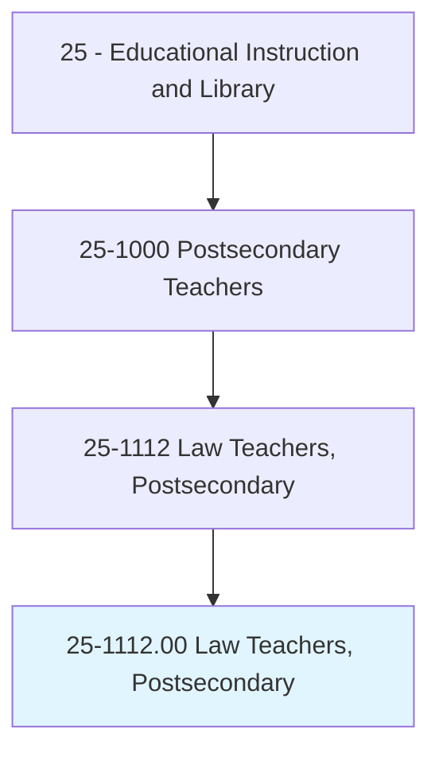
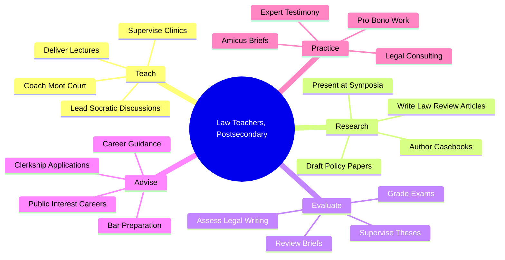
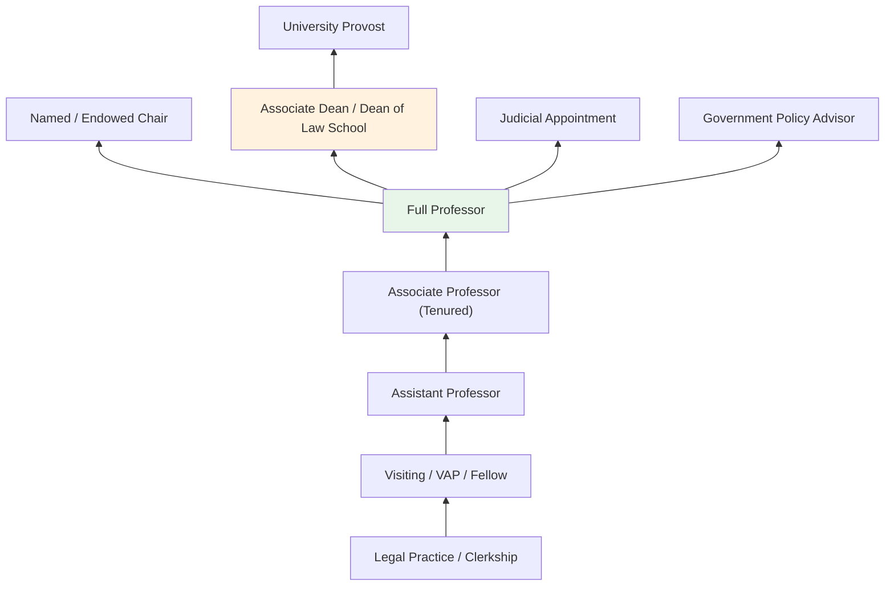
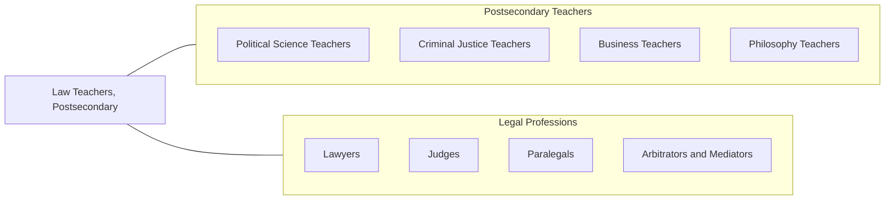

# Law Teachers, Postsecondary

> Teach courses in law. Includes both teachers primarily engaged in teaching and those who do a combination of teaching and research.

## Overview

Law Teachers in postsecondary education instruct students in legal theory, doctrine, and practice at law schools, universities, and paralegal programs. They teach courses covering constitutional law, contracts, torts, criminal law, civil procedure, property law, corporate law, international law, and specialized areas such as environmental law, intellectual property, and healthcare law. These educators employ the Socratic method, case analysis, legal writing workshops, and clinical experiences to develop students' legal reasoning and advocacy skills.

Law professors are frequently active legal scholars who publish law review articles, treatises, and casebooks that shape legal doctrine and policy. Many maintain connections to legal practice through consulting, expert witness testimony, amicus briefs, or pro bono work. Their scholarship addresses evolving legal questions surrounding technology, civil rights, regulatory policy, and international governance, contributing to both academic discourse and practical legal development.

The role of law teacher requires the ability to model rigorous analytical thinking while fostering practical competencies in legal research, writing, oral argument, and client counseling. Law faculty prepare students for bar examinations, judicial clerkships, and careers across private practice, government service, public interest law, and corporate compliance.

## Classification Hierarchy

## Key Statistics

| Metric | Value |
|--------|-------|
| SOC Code | 25-1112.00 |
| Job Zone | 5 (Extensive Preparation) |
| Category | [Educational Instruction and Library](/occupations/Education/index) |
| Median Salary | $120,000 - $180,000 |
| Employment | ~17,000 |
| Projected Growth | 3-5% (Slower than average) |
| Source | O*NET |

## Core Tasks

### teach.LegalCourses

Law Teachers deliver instruction in legal subjects using case-based and Socratic methods.

**Actions:**
- `deliver.Lectures.on.ConstitutionalLaw` - Teach foundational constitutional principles and case law
- `lead.SocraticDiscussions.on.CaseLaw` - Guide students through analytical reasoning about judicial opinions
- `supervise.LegalClinics.for.ExperientialLearning` - Oversee student representation of real clients

### research.LegalScholarship

Law Teachers produce original legal scholarship and policy analysis.

**Actions:**
- `write.LawReviewArticles.on.LegalDoctrine` - Publish scholarly analysis in peer-reviewed legal journals
- `author.Casebooks.for.LegalInstruction` - Create instructional materials compiling cases and commentary
- `draft.PolicyPapers.for.LegalReform` - Produce analysis informing legislative and regulatory change

### evaluate.StudentPerformance

Law Teachers assess legal reasoning and professional competency.

**Actions:**
- `grade.Examinations.using.IssueSpotting` - Evaluate students' ability to identify and analyze legal issues
- `assess.LegalWriting.for.ArgumentClarity` - Review briefs, memoranda, and research papers
- `evaluate.ClinicalPerformance.for.ProfessionalCompetency` - Assess client interaction and advocacy skills

## Skills & Competencies

### Technical Skills
- **Legal Analysis** - Expert (case law, statutory interpretation, legal reasoning)
- **Legal Research** - Expert (Westlaw, LexisNexis, legislative history)
- **Legal Writing** - Expert (scholarly articles, briefs, opinions)
- **Curriculum Design** - Advanced (law school pedagogy)
- **Clinical Supervision** - Advanced (client representation, ethics)
- **Assessment Design** - Advanced (issue-spotting exams, performance evaluations)

### Soft Skills
- **Analytical Thinking** - Critical (legal reasoning and argumentation)
- **Communication** - Critical (Socratic dialogue, oral argument coaching)
- **Mentorship** - Essential (career guidance, professional development)
- **Writing** - Critical (scholarly and practical legal writing)
- **Ethical Judgment** - Essential (professional responsibility)
- **Public Speaking** - Important (lectures, conferences, courtroom advocacy)

## Education & Certifications

| Requirement | Details |
|-------------|---------|
| Typical Education | J.D. from accredited law school; many also hold Ph.D., LL.M., or S.J.D. |
| Bar Admission | Active bar membership in at least one jurisdiction typically expected |
| Work Experience | Legal practice experience (often 3-10 years); judicial clerkship valued |
| On-the-Job Training | Faculty development; clinical teaching training |
| Common Certifications | Bar admission; AALS membership; subject-specific specialization certificates |

## Career Progression

## Setting Variations

### ABA-Accredited Law Schools
Full J.D. programs with emphasis on bar passage and practice readiness. Tenure-track positions with scholarship expectations.

### Paralegal and Legal Studies Programs
Undergraduate and associate-level legal education. Focus on practical legal skills for paralegal careers.

### Online Law Programs
Distance J.D. and LL.M. programs with asynchronous and live components. Growing but limited bar eligibility in some jurisdictions.

### Continuing Legal Education
Teaching practicing attorneys through CLE seminars and workshops on emerging legal topics.

### International Programs
Comparative law and LL.M. programs for international students. Focus on U.S. legal system orientation and specialized legal topics.

## Technology & Tools

| Category | Tools |
|----------|-------|
| Legal Research | Westlaw, LexisNexis, Bloomberg Law, HeinOnline |
| Learning Management Systems | Canvas, TWEN (Westlaw), Blackboard |
| Assessment | ExamSoft, exam4 |
| Case Management | Clio, MyCase (clinical programs) |
| Presentation | PowerPoint, document cameras |
| Collaboration | Microsoft Teams, Zoom, Google Workspace |

## Related Occupations

## Industries

- [Educational Services - Law Schools](/industries/Education/index) - Primary Employment
- [Government](/industries/Government) - Public Universities, Judicial Education
- [Professional, Scientific, and Technical Services](/industries/ProfessionalServices) - Legal Consulting
- [Public Administration](/industries/PublicAdministration) - Policy and Regulatory Advisory

## Departments

This occupation typically works in:
- [School of Law](/departments/Law)
- [Legal Studies Program](/departments/LegalStudies)
- [Criminal Justice Department](/departments/CriminalJustice)
- [Policy Studies](/departments/PolicyStudies)

---

*Source: O*NET 25-1112.00 - ONETOccupation*
