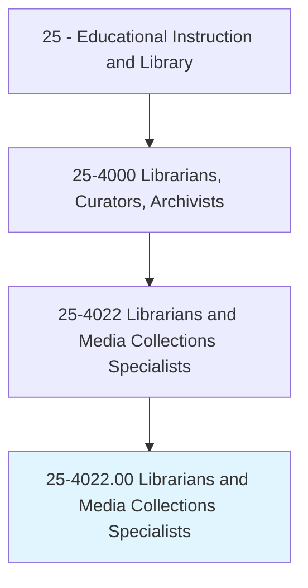
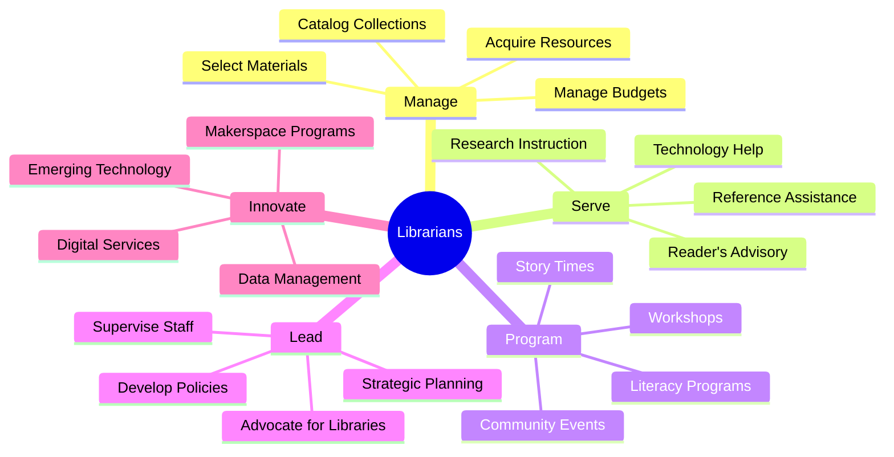
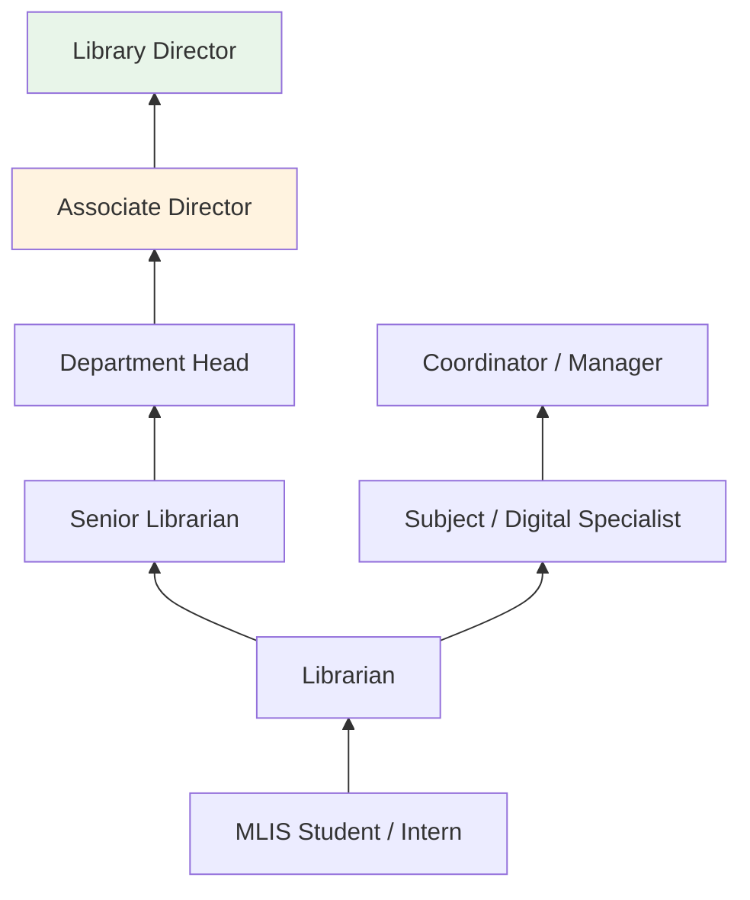
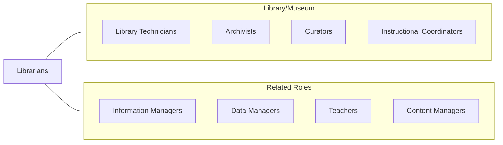

# Librarians and Media Collections Specialists

> Administer and maintain libraries or collections of information, for public access or for other organizations. Work in a variety of settings, including public libraries, educational institutions, museums, corporations, government agencies, healthcare facilities, and the military. Tasks may include selecting, acquiring, cataloguing, classifying, circulating, and maintaining library materials, and furnishing reference, bibliographical, and reader's advisory services.

## Overview

Librarians and Media Collections Specialists manage information resources and provide access to knowledge for diverse communities. They select and acquire books, periodicals, databases, media, and digital resources; organize collections using classification systems and metadata standards; deliver reference and research services; develop educational programming; and advocate for intellectual freedom and equitable access to information. They work in public, academic, school, and special libraries as well as corporate information centers.

Modern librarians serve as information navigators in an era of data abundance, helping patrons evaluate sources, develop digital literacy skills, and access authoritative information. They design and lead community programs including literacy initiatives, technology training, early childhood story times, teen programming, and adult continuing education. Academic librarians provide research instruction, manage institutional repositories, and support scholarly communication.

The profession has evolved significantly with digital transformation, requiring expertise in electronic resource management, data services, digital preservation, makerspaces, and emerging technologies. Librarians champion open access, privacy rights, and the democratic role of libraries as community anchors providing free access to information, technology, and cultural enrichment.

## Classification Hierarchy

## Key Statistics

| Metric | Value |
|--------|-------|
| SOC Code | 25-4022.00 |
| Job Zone | 5 (Extensive Preparation) |
| Category | [Educational Instruction and Library](/occupations/Education/index) |
| Median Salary | $61,000 - $72,000 |
| Employment | ~143,000 |
| Projected Growth | 4-6% (Average) |
| Source | O*NET |

## Core Tasks

### manage.InformationResources

Librarians develop and organize collections to serve their communities.

**Actions:**
- `select.Materials.for.CollectionDevelopment` - Evaluate and acquire resources aligned with community needs
- `catalog.Resources.using.MetadataStandards` - Organize materials with MARC, RDA, and classification systems
- `manage.ElectronicResources.for.DigitalAccess` - Negotiate licenses and provide access to databases and e-resources

### serve.InformationNeeds

Librarians help patrons find and use information effectively.

**Actions:**
- `provide.ReferenceServices.to.Patrons` - Answer research questions and guide information discovery
- `instruct.Users.in.InformationLiteracy` - Teach evaluation, search strategies, and citation skills
- `develop.Programs.for.CommunityEngagement` - Create programming serving diverse population needs

## Skills & Competencies

### Technical Skills
- **Information Organization** - Expert (cataloging, classification, metadata, taxonomy)
- **Reference Services** - Expert (research strategies, database searching, reader's advisory)
- **Collection Development** - Advanced (selection, evaluation, weeding, budget management)
- **Digital Services** - Advanced (e-resources, ILS administration, digital repositories)
- **Instruction** - Advanced (information literacy, technology training)
- **Programming** - Advanced (community events, story times, workshops)

### Soft Skills
- **Communication** - Critical (serving diverse populations, instruction)
- **Customer Service** - Critical (welcoming and responsive to all patrons)
- **Intellectual Curiosity** - Essential (broad knowledge across subjects)
- **Adaptability** - Essential (evolving technology and community needs)
- **Leadership** - Important (managing staff and advocating for libraries)
- **Cultural Competence** - Essential (serving diverse communities equitably)

## Education & Certifications

| Requirement | Details |
|-------------|---------|
| Typical Education | Master's degree in Library and Information Science (MLIS) from ALA-accredited program |
| State Requirements | Public librarian certification required in many states |
| Work Experience | Practicum or internship required in MLIS programs |
| Continuing Education | Professional development for certification renewal |
| Common Certifications | State public librarian certification; school library media certification; specialized endorsements (archives, youth services) |

## Career Progression

## Setting Variations

### Public Libraries
Community-serving institutions offering broad collections, programs, and technology access. Youth, adult, and reference services.

### Academic Libraries
Research support, instruction, scholarly communication, and institutional repositories. Subject liaison roles.

### School Libraries
Media center management, curriculum support, reading promotion, and information literacy instruction for K-12 students.

### Special Libraries
Corporate, law, medical, government, and nonprofit information centers. Specialized collections and services.

### Digital Libraries
Born-digital collections, digital preservation, metadata services, and virtual reference.

## Technology & Tools

| Category | Tools |
|----------|-------|
| Integrated Library Systems | Alma/Primo, Sierra, Koha, Polaris, Symphony |
| Discovery | EBSCO Discovery, Summon, WorldCat |
| Digital Repositories | DSpace, Digital Commons, Islandora |
| E-Resources | OverDrive, Libby, Hoopla, Kanopy, databases |
| Cataloging | OCLC Connexion, MarcEdit, RDA Toolkit |
| Communication | LibGuides, LibAnswers, social media |

## Related Occupations

## Industries

- [Educational Services](/industries/Education/index) - Academic and School Libraries
- [Government](/industries/Government) - Public Libraries, Federal Libraries
- [Information Services](/industries/Information) - Special Libraries
- [Healthcare](/industries/Healthcare) - Medical Libraries

## Departments

This occupation typically works in:
- [Reference Services](/departments/ReferenceServices)
- [Collection Development](/departments/CollectionDevelopment)
- [Technical Services](/departments/TechnicalServices)
- [Youth Services / Children's Services](/departments/YouthServices)

---

*Source: O*NET 25-4022.00 - ONETOccupation*
