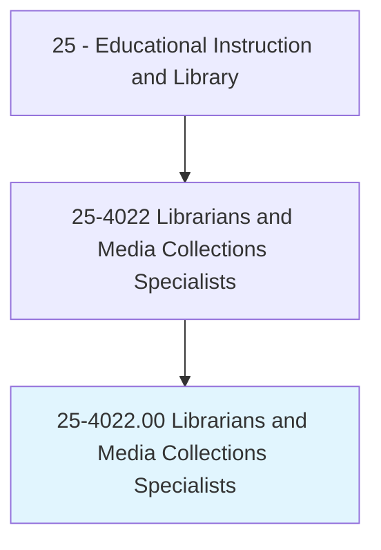
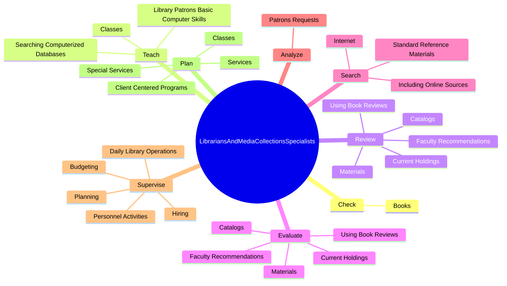
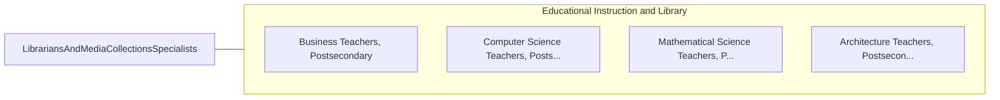

# Librarians and Media Collections Specialists

> Administer and maintain libraries or collections of information, for public or private access through reference or borrowing. Work in a variety of settings, such as educational institutions, museums, and corporations, and with various types of informational materials, such as books, periodicals, recordings, films, and databases. Tasks may include acquiring, cataloging, and circulating library materials, and user services such as locating and organizing information, providing instruction on how to access information, and setting up and operating a library's media equipment.

## Overview

Librarians and Media Collections Specialists is an occupation within the Educational Instruction and Library category. Administer and maintain libraries or collections of information, for public or private access through reference or borrowing. Work in a variety of settings, such as educational institutions, museums, and corporations, and with various types of informational materials, such as books, periodicals, recordings, films, and databases.

## Classification Hierarchy

## Key Statistics

| Metric | Value |
|--------|-------|
| SOC Code | 25-4022.00 |
| Category | [Educational Instruction and Library](/occupations/Education) |
| Task Count | 238 |
| Source | O*NET |

## Core Tasks

### check.Books

Librarians and Media Collections Specialists check books as part of their core responsibilities.

**Actions:**
- `check.Books.in.Out.of.Library`

### teach.LibraryPatronsBasicComputerSkills

Librarians and Media Collections Specialists teach library patrons basic computer skills as part of their core responsibilities.

**Actions:**
- `teach.LibraryPatronsBasicComputerSkills`
- `teach.SearchingComputerizedDatabases`
- `teach.Classes.on.Topics`
- `teach.Classes.on.InformationLiteracy`

### review.Materials

Librarians and Media Collections Specialists review materials as part of their core responsibilities.

**Actions:**
- `review.Materials.to.select.Print`
- `review.Materials.to.order.Print`
- `review.Materials.to.AudioVisual`
- `review.Materials.to.ElectronicResources`

## Skills & Competencies

### Technical Skills
- **Curriculum Development** - Advanced
- **Instructional Design** - Advanced
- **Assessment** - Advanced

### Soft Skills
- **Communication** - Essential
- **Problem Solving** - Essential
- **Critical Thinking** - Important
- **Teamwork** - Important
- **Adaptability** - Important

## Related Occupations

## Industries

This occupation is found across multiple industries. See [Industries](/industries) for sector-specific employment data.

## Career Progression

---

*Source: O*NET 25-4022.00 - ONETOccupation*
