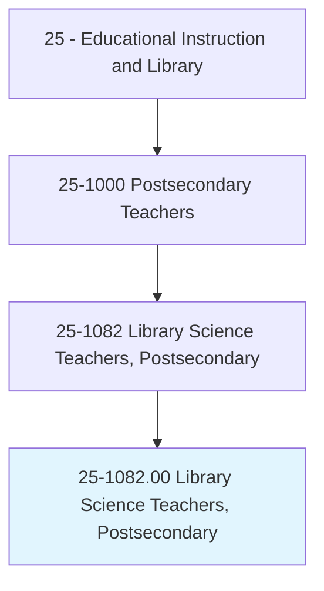
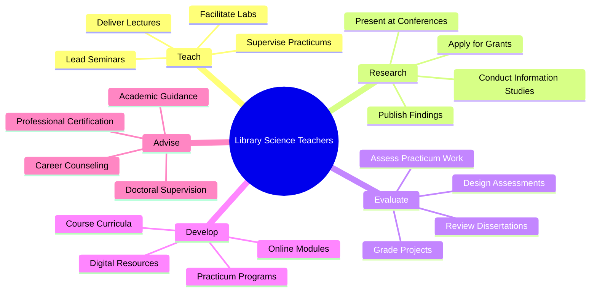
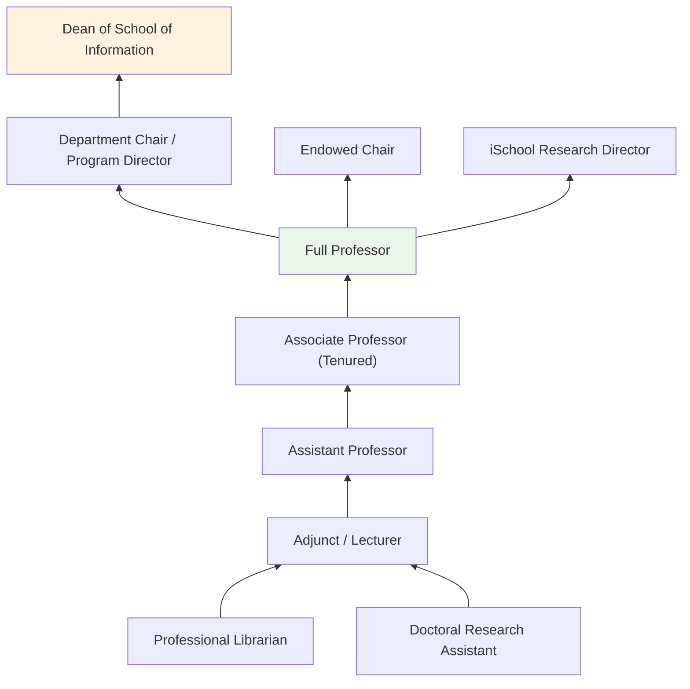
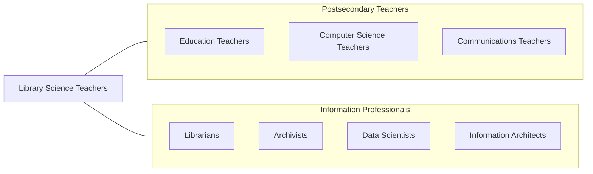

# Library Science Teachers, Postsecondary

> Teach courses in library science. Includes both teachers primarily engaged in teaching and those who do a combination of teaching and research.

## Overview

Library Science Teachers in postsecondary education instruct students in the theory and practice of information organization, retrieval, and dissemination. They teach courses covering cataloging and classification, reference services, information technology, digital libraries, collection development, archives management, youth services, academic librarianship, and information policy. These educators prepare students for professional careers as librarians, archivists, information specialists, and knowledge managers across public, academic, school, and special library settings.

Many library science professors conduct research on information behavior, metadata standards, digital preservation, information literacy, intellectual freedom, and the social impacts of information technology. They publish in journals such as the Journal of the American Society for Information Science and Technology, Library Quarterly, and College & Research Libraries. Their scholarship shapes the evolving practices of information management in an increasingly digital world.

The field has expanded beyond traditional librarianship to encompass data science, user experience design, information architecture, and knowledge management, reflecting the growing importance of information organization in the digital economy. Faculty prepare graduates for a widening range of careers while maintaining the profession's core values of intellectual freedom, equitable access, and service.

## Classification Hierarchy

## Key Statistics

| Metric | Value |
|--------|-------|
| SOC Code | 25-1082.00 |
| Job Zone | 5 (Extensive Preparation) |
| Category | [Educational Instruction and Library](/occupations/Education/index) |
| Median Salary | $75,000 - $95,000 |
| Employment | ~3,800 |
| Projected Growth | 3-5% (Average) |
| Source | O*NET |

## Core Tasks

### teach.LibraryAndInformationScience

Faculty deliver instruction across library and information science disciplines.

**Actions:**
- `deliver.Lectures.on.InformationOrganization` - Teach cataloging, classification, and metadata standards
- `deliver.Lectures.on.ReferenceServices` - Instruct on information retrieval, research assistance, and databases
- `supervise.Practicums.in.LibrarySettings` - Oversee student fieldwork in libraries and information centers

### conduct.InformationResearch

Faculty pursue original research in library and information science.

**Actions:**
- `conduct.Research.on.InformationBehavior` - Study how people seek, use, and evaluate information
- `conduct.Research.on.DigitalPreservation` - Investigate methods for long-term digital content management
- `publish.Findings.in.LISJournals` - Contribute to peer-reviewed information science literature

## Skills & Competencies

### Technical Skills
- **Information Organization** - Expert (cataloging, metadata, taxonomies, ontologies)
- **Information Technology** - Advanced (databases, digital libraries, information systems)
- **Research Methods** - Advanced (user studies, bibliometrics, content analysis)
- **Digital Preservation** - Advanced (digital curation, format migration)
- **Curriculum Design** - Advanced (ALA-accredited program standards)
- **Data Management** - Intermediate to Advanced (data curation, repositories)

### Soft Skills
- **Communication** - Critical (teaching information literacy, academic writing)
- **Intellectual Curiosity** - Essential (evolving information landscape)
- **Collaboration** - Essential (interdisciplinary research, professional service)
- **Mentorship** - Essential (guiding future library professionals)
- **Service Orientation** - Important (core library professional value)
- **Adaptability** - Important (rapid technological change)

## Education & Certifications

| Requirement | Details |
|-------------|---------|
| Typical Education | Ph.D. in Library and Information Science or Information Science |
| Professional Degree | MLIS or MLS from ALA-accredited program typically required |
| Work Experience | Professional library experience valued |
| On-the-Job Training | Faculty development; technology workshops |
| Common Certifications | ALA membership; ASIS&T membership; specialized certifications (digital archives, data management) |

## Career Progression

## Setting Variations

### iSchools (Information Schools)
Broad information science programs covering data science, UX, and information management alongside traditional library science.

### Traditional Library Schools
ALA-accredited MLIS programs focused on library practice. Strong practicum components and professional preparation.

### Online Programs
Distance MLIS programs with virtual instruction and distributed practicum placements. Growing enrollment.

### Continuing Education
Professional development for practicing librarians through workshops, webinars, and certificate programs.

### Interdisciplinary Programs
Library science taught within schools of education, communication, or computing.

## Technology & Tools

| Category | Tools |
|----------|-------|
| Library Systems | Alma, Koha, Sierra, Evergreen |
| Metadata Tools | Dublin Core, MARC, RDA, Schema.org |
| Learning Management Systems | Canvas, Blackboard, Moodle |
| Digital Repositories | DSpace, Fedora, Omeka, ContentDM |
| Research Tools | Scopus, Web of Science, Google Scholar |
| Data Management | OpenRefine, Jupyter, Dataverse |

## Related Occupations

## Industries

- [Educational Services - iSchools and Universities](/industries/Education/index) - Primary Employment
- [Government](/industries/Government) - Library of Congress, National Archives
- [Professional Services](/industries/ProfessionalServices) - Information Consulting
- [Information Technology](/industries/InformationTechnology) - Knowledge Management

## Departments

This occupation typically works in:
- [School of Information](/departments/Information)
- [School of Library and Information Science](/departments/LibraryScience)
- [Department of Information Studies](/departments/InformationStudies)
- [College of Communication and Information](/departments/Communication)

---

*Source: O*NET 25-1082.00 - ONETOccupation*
