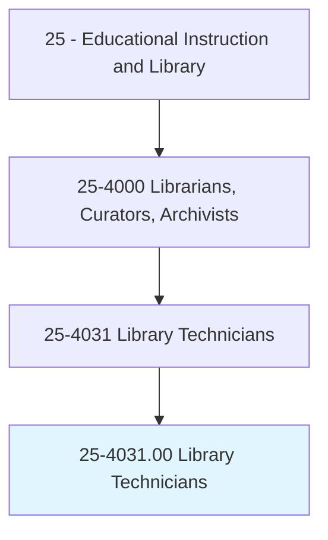
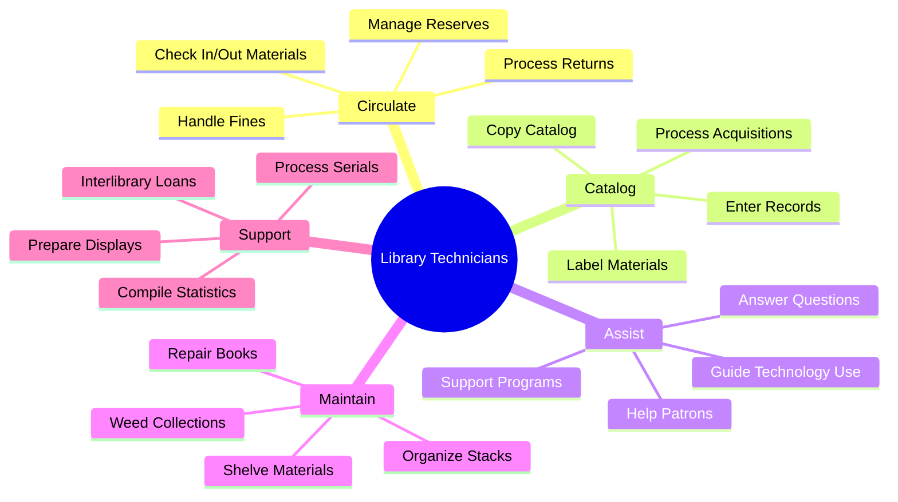
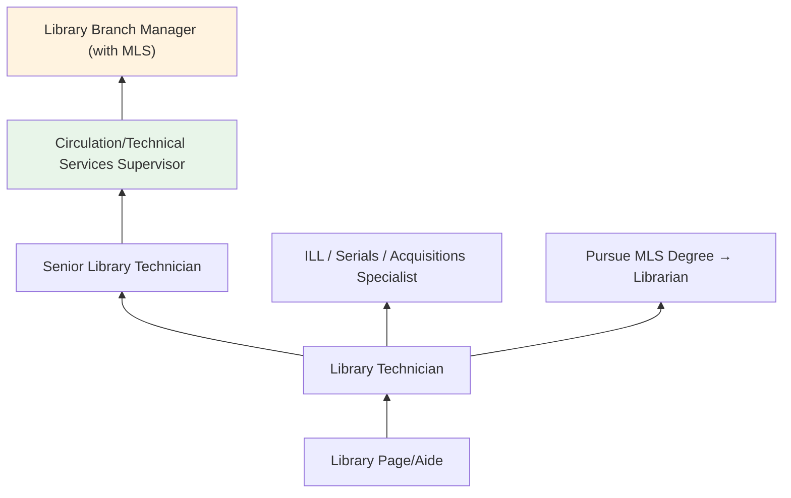
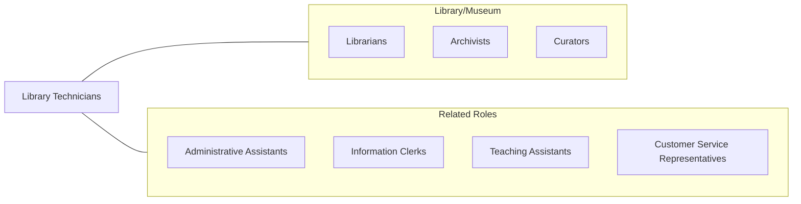

# Library Technicians

> Assist librarians by helping readers in the use of library catalogs, databases, and indexes to locate books and other materials; and by answering questions that require only brief consultation of standard reference. Compile records; sort and shelve books; remove or repair damaged books; register patrons; check materials in and out of the circulation process.

## Overview

Library Technicians perform the operational and technical tasks that keep libraries running smoothly. They assist patrons in finding materials, check items in and out, process new acquisitions, catalog materials, maintain the collection, and help users navigate databases and technology resources. They work in public libraries, academic libraries, school media centers, and special libraries in corporations, law firms, hospitals, and government agencies.

These paraprofessionals handle much of the day-to-day library operations including shelving, interlibrary loan processing, serial check-in, reserve management, and circulation desk services. They increasingly assist patrons with technology such as public computers, printers, digital resources, and e-book platforms. In smaller libraries, technicians may take on responsibilities typically handled by librarians.

Library technicians serve as the front-line staff most patrons interact with, making their customer service skills essential to the library experience. They help maintain an organized, welcoming environment and ensure equitable access to information resources for all community members.

## Classification Hierarchy

## Key Statistics

| Metric | Value |
|--------|-------|
| SOC Code | 25-4031.00 |
| Job Zone | 3 (Medium Preparation) |
| Category | [Educational Instruction and Library](/occupations/Education/index) |
| Median Salary | $36,000 - $42,000 |
| Employment | ~88,000 |
| Projected Growth | 1-3% (Slower than average) |
| Source | O*NET |

## Core Tasks

### assist.LibraryPatrons

Library Technicians help users find and access materials.

**Actions:**
- `assist.Patrons.in.LocatingMaterials` - Help users find books, articles, and digital resources
- `circulate.Materials.through.CheckoutProcess` - Process checkouts, returns, and holds
- `support.Patrons.with.TechnologyUse` - Assist with computers, printers, databases, and e-resources

### maintain.LibraryCollections

Library Technicians keep collections organized and accessible.

**Actions:**
- `catalog.Materials.using.LibrarySystems` - Process and enter new acquisitions into ILS
- `shelve.Materials.in.ProperOrder` - Maintain organized stacks using classification systems
- `repair.DamagedMaterials.for.ContinuedUse` - Mend books and prepare materials for rebinding

## Skills & Competencies

### Technical Skills
- **Library Systems** - Advanced (ILS, OPAC, circulation modules)
- **Cataloging** - Intermediate (copy cataloging, MARC records, classification)
- **Database Navigation** - Intermediate (research databases, digital resources)
- **Technology Support** - Intermediate (public computers, printers, e-readers)
- **Collection Maintenance** - Advanced (shelving, weeding, repairs)
- **Office Software** - Intermediate (spreadsheets, word processing, email)

### Soft Skills
- **Customer Service** - Critical (front-line patron interaction)
- **Organization** - Critical (maintaining orderly collections and processes)
- **Communication** - Essential (answering questions, explaining services)
- **Patience** - Essential (assisting diverse patrons)
- **Attention to Detail** - Important (accurate cataloging and shelving)
- **Teamwork** - Important (supporting librarians and colleagues)

## Education & Certifications

| Requirement | Details |
|-------------|---------|
| Typical Education | Associate's degree in Library Technology or related field |
| Alternative Entry | High school diploma with on-the-job training |
| Work Experience | Entry-level; library volunteer experience helpful |
| On-the-Job Training | Moderate; ILS training and procedures |
| Common Certifications | Library Support Staff Certification (ALA-APA); state-specific paraprofessional certificates |

## Career Progression

## Setting Variations

### Public Libraries
Circulation, reference assistance, and program support. Community-facing role with diverse patron interactions.

### Academic Libraries
Support for students and faculty. Specialized in course reserves, ILL, and database assistance.

### School Libraries
Media center support. Helping students and teachers access resources and technology.

### Special Libraries
Corporate, law, medical, or government libraries. Specialized collections and clientele.

## Technology & Tools

| Category | Tools |
|----------|-------|
| Integrated Library Systems | Koha, Sierra, Polaris, Symphony, Alma |
| Cataloging | OCLC Connexion, MarcEdit, LC Classification |
| Digital Resources | OverDrive, Libby, Hoopla, Kanopy |
| Office | Microsoft Office, Google Workspace |
| Communication | LibAnswers, email, phone systems |
| Equipment | Barcode scanners, receipt printers, self-checkout kiosks |

## Related Occupations

## Industries

- [Educational Services](/industries/Education/index) - Academic and School Libraries
- [Government](/industries/Government) - Public Libraries
- [Information Services](/industries/Information) - Special Libraries
- [Professional Services](/industries/ProfessionalServices) - Law and Corporate Libraries

## Departments

This occupation typically works in:
- [Circulation Services](/departments/Circulation)
- [Technical Services](/departments/TechnicalServices)
- [Public Services](/departments/PublicServices)

---

*Source: O*NET 25-4031.00 - ONETOccupation*
