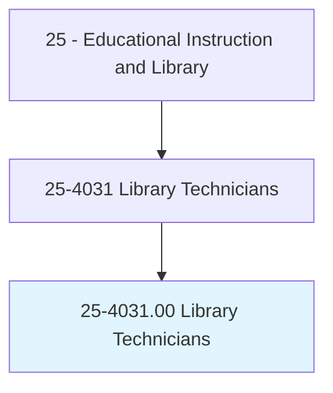
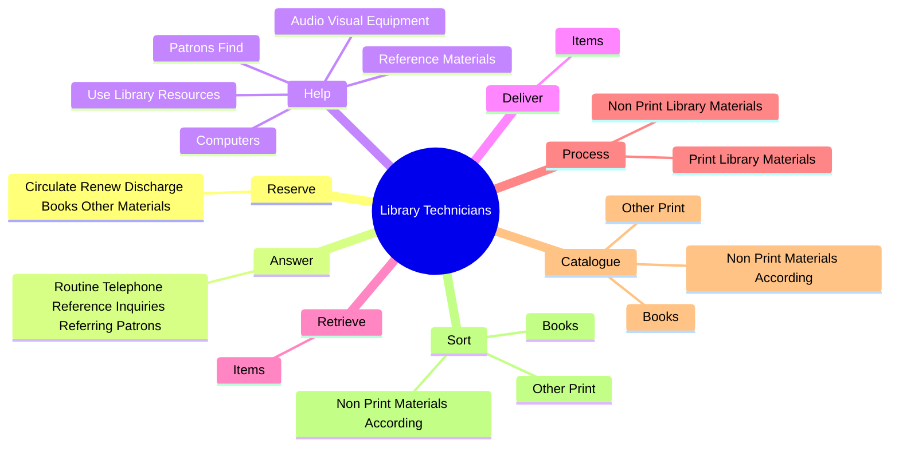

# Library Technicians

> Assist librarians by helping readers in the use of library catalogs, databases, and indexes to locate books and other materials; and by answering questions that require only brief consultation of standard reference. Compile records; sort and shelve books or other media; remove or repair damaged books or other media; register patrons; and check materials in and out of the circulation process. Replace materials in shelving area (stacks) or files. Includes bookmobile drivers who assist with providing services in mobile libraries.

## Overview

Library Technicians is an occupation within the Educational Instruction and Library category. Assist librarians by helping readers in the use of library catalogs, databases, and indexes to locate books and other materials; and by answering questions that require only brief consultation of standard reference. Compile records; sort and shelve books or other media; remove or repair damaged books or other media; register patrons; and check materials in and out of the circulation process.

## Classification Hierarchy

## Key Statistics

| Metric | Value |
|--------|-------|
| SOC Code | 25-4031.00 |
| Category | [Educational Instruction and Library](/occupations/Education/index) |
| Task Count | 129 |
| Source | O*NET |

## Core Tasks

### reserve.CirculateRenewDischargeBooksOtherMaterials

Library Technicians reserve circulate renew discharge books other materials as part of their core responsibilities.

**Actions:**
- `reserve.CirculateRenewDischargeBooksOtherMaterials`

### answer.RoutineTelephoneReferenceInquiriesReferringPatrons

Library Technicians answer routine telephone reference inquiries referring patrons as part of their core responsibilities.

**Actions:**
- `answer.RoutineTelephoneReferenceInquiriesReferringPatrons.to.LibrariansForFurtherAssistance`
- `answer.RoutineTelephoneReferenceInquiriesReferringPatrons.to.WhenNecessary`

### help.PatronsFind

Library Technicians help patrons find as part of their core responsibilities.

**Actions:**
- `help.PatronsFind`
- `help.UseLibraryResources`
- `help.ReferenceMaterials`
- `help.AudioVisualEquipment`

## Skills & Competencies

### Technical Skills
- **Curriculum Development** - Advanced
- **Instructional Design** - Advanced
- **Assessment** - Advanced

### Soft Skills
- **Communication** - Essential
- **Problem Solving** - Essential
- **Critical Thinking** - Important
- **Teamwork** - Important
- **Adaptability** - Important

## Related Occupations

## Industries

This occupation is found across multiple industries. See [Industries](/industries) for sector-specific employment data.

## Career Progression

---

*Source: O*NET 25-4031.00 - ONETOccupation*
