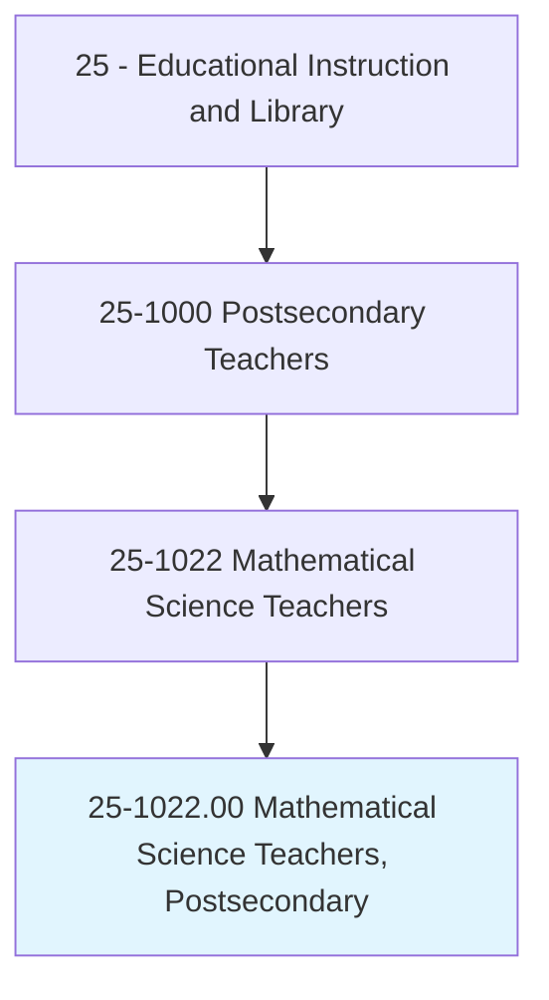
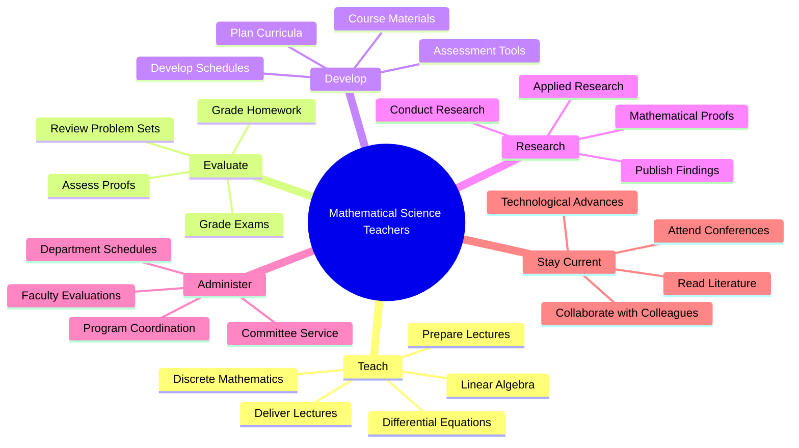
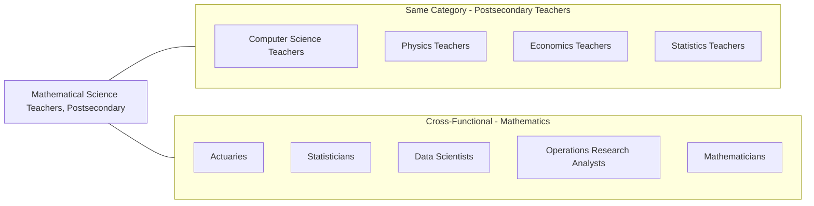

# Mathematical Science Teachers, Postsecondary

> Teach courses pertaining to mathematical concepts, statistics, and actuarial science and to the application of original and standardized mathematical techniques in solving specific problems and situations. Includes both teachers primarily engaged in teaching and those who do a combination of teaching and research.

## Overview

Mathematical Science Teachers in postsecondary education instruct students in pure and applied mathematics, statistics, and actuarial science. They teach foundational courses like calculus and linear algebra as well as advanced topics such as abstract algebra, real analysis, differential equations, and probability theory. These educators serve students across multiple disciplines, as mathematics provides the quantitative foundation for sciences, engineering, economics, and data-driven fields. Many engage in mathematical research, contributing to theoretical advances or developing applications in areas like cryptography, financial modeling, and scientific computing.

## Classification Hierarchy



## Key Statistics

| Metric | Value |
|--------|-------|
| SOC Code | 25-1022.00 |
| Job Zone | 5 (Extensive Preparation) |
| Category | [Educational Instruction and Library](/occupations/Education/index) |
| Core Tasks | 15+ |
| Source | O*NET |

## Core Tasks



### prepare.Lectures

Mathematical Science Teachers develop instructional content covering mathematical concepts from foundational to advanced levels.

**Actions:**
- `prepare.Lectures.to.LinearAlgebra` - Create lectures on vector spaces, matrices, eigenvalues, and transformations
- `prepare.Lectures.to.DifferentialEquations` - Develop content on ordinary and partial differential equations
- `prepare.Lectures.to.DiscreteMathematics` - Prepare lectures on combinatorics, graph theory, and logic

### deliver.Lectures

Mathematical Science Teachers present mathematical concepts through rigorous instruction, examples, and proof demonstrations.

**Actions:**
- `deliver.Lectures.to.LinearAlgebra` - Teach matrix operations, vector spaces, and linear transformations
- `deliver.Lectures.to.DifferentialEquations` - Instruct students on solving and analyzing differential equations
- `deliver.Lectures.to.DiscreteMathematics` - Present discrete structures and mathematical reasoning

### keep.Abreast

Mathematical Science Teachers stay current with developments in mathematics and mathematical pedagogy.

**Actions:**
- `keep.Abreast.of.DevelopmentsAdvances.in.MathematicalFieldByReadingCurrentLiterature` - Read mathematical journals and publications
- `keep.Abreast.of.TechnologicalAdvances.in.MathematicalFieldByReadingCurrentLiterature` - Stay updated on computational mathematics tools and software

### conduct.Research

Mathematical Science Teachers pursue original research in pure or applied mathematics and publish their findings.

**Actions:**
- `conduct.Research.in.PublishFindings.in.Books` - Author mathematical textbooks and monographs
- `conduct.Research.in.ProfessionalJournals` - Submit research papers to peer-reviewed mathematics journals
- `conduct.FacultyPerformanceEvaluations` - Assess colleague teaching and research performance

### develop.Schedules

Mathematical Science Teachers contribute to departmental administration by developing course schedules and program structures.

**Actions:**
- `develop.DepartmentSchedules` - Coordinate teaching assignments and course offerings
- `develop.CourseSchedules` - Plan semester-by-semester course progressions for students

## Skills & Competencies

### Technical Skills
- **Pure Mathematics** - Expert (analysis, algebra, topology, etc.)
- **Applied Mathematics** - Advanced (modeling, numerical methods)
- **Statistics** - Advanced
- **Mathematical Software** - Advanced (MATLAB, Mathematica, R, Python)
- **Proof Writing** - Expert
- **Research Methods** - Advanced

### Soft Skills
- **Communication** - Critical (explaining abstract concepts)
- **Analytical Thinking** - Critical
- **Patience** - Essential (working through difficult problems with students)
- **Precision** - Essential (mathematical rigor)
- **Adaptability** - Essential (multiple student skill levels)

## Related Occupations



## Industry Variations

### Research Universities
Emphasis on original mathematical research; publication in top journals (Annals of Mathematics, Journal of the AMS); Ph.D. student supervision; NSF/NIH grant funding; lighter teaching loads.

### Teaching-Focused Institutions
Primary focus on undergraduate mathematics education; service courses for other departments; higher course loads; curriculum development; pedagogical innovation.

### Liberal Arts Colleges
Small class sizes; close student mentorship; undergraduate research opportunities; interdisciplinary connections; teaching excellence prioritized.

### Community Colleges
Developmental mathematics; college algebra and precalculus; transfer preparation; diverse student populations; accessibility focus.

### Applied Mathematics Programs
Emphasis on mathematical modeling; computational mathematics; industry applications; interdisciplinary research; collaboration with science and engineering.

## Industries

- [Educational Services - Colleges and Universities](/industries/Education/index) - Primary Employment
- [Professional, Scientific, and Technical Services](/industries/Scientific) - Consulting
- [Finance and Insurance](/industries/Finance) - Actuarial Science, Quantitative Finance
- [Government](/industries/PublicAdministration) - Public Universities, Research Labs
- Information Technology - Data Science, Cryptography

## Career Progression

```mermaid
graph BT
    Entry["Graduate Teaching Assistant / Adjunct"] --> PostDoc["Postdoctoral Researcher"]
    PostDoc --> Mid["Assistant Professor"]
    Mid --> Senior["Associate Professor (Tenured)"]
    Senior --> Full["Full Professor"]
    Full --> Admin["Department Chair / Dean"]

    Industry["Actuary / Quant / Data Scientist"] --> Lecturer["Lecturer / Instructor"]
    Lecturer --> Mid

    Full --> Named["Distinguished Professor / Endowed Chair"]
    Full --> Research["Research Mathematician"]
    Full --> Emeritus["Professor Emeritus"]

    style Full fill:#e8f5e9
    style Named fill:#fff3e0
```



## Education & Training

| Requirement | Details |
|-------------|---------|
| Typical Education | Ph.D. in Mathematics, Applied Mathematics, Statistics, or closely related field |
| Work Experience | Research experience required; postdoctoral fellowship common; industry experience valued for applied positions |
| On-the-Job Training | Faculty development; teaching workshops; grant writing seminars |
| Common Certifications | Professional memberships (AMS, MAA, SIAM); ASA certification for statistics |

## Departments

This occupation typically works in:
- Department of Mathematics
- Department of Statistics
- Department of Applied Mathematics
- Actuarial Science Program
- Data Science Institute

## GraphDL Semantic Structure

The core semantic patterns for Mathematical Science Teachers follow this structure:

```graphdl
verb.Object.preposition.PrepObject

Primary Actions:
- prepare.Lectures.to.{MathTopic}
- deliver.Lectures.to.{MathTopic}
- keep.Abreast.of.{Developments}.in.{Field}
- conduct.Research.in.{Area}
- conduct.Research.in.PublishFindings.in.{Medium}
- develop.DepartmentSchedules
- develop.CourseSchedules
- conduct.FacultyPerformanceEvaluations
```

## Specialization Areas

### Pure Mathematics
- **Algebra** - Group theory, ring theory, field theory
- **Analysis** - Real analysis, complex analysis, functional analysis
- **Geometry/Topology** - Differential geometry, algebraic topology
- **Number Theory** - Analytic and algebraic number theory
- **Logic and Foundations** - Set theory, model theory

### Applied Mathematics
- **Numerical Analysis** - Computational algorithms, approximation theory
- **Differential Equations** - ODEs, PDEs, dynamical systems
- **Mathematical Modeling** - Physical, biological, social systems
- **Optimization** - Linear programming, convex optimization
- **Probability Theory** - Stochastic processes, random matrices

### Statistics and Data Science
- **Statistical Theory** - Estimation, hypothesis testing
- **Bayesian Statistics** - Prior distributions, MCMC methods
- **Machine Learning** - Statistical learning theory
- **Biostatistics** - Clinical trials, epidemiology

### Actuarial Science
- **Life Insurance Mathematics** - Mortality modeling, reserves
- **Pension Mathematics** - Funding, valuation
- **Risk Theory** - Loss distributions, ruin theory
- **Financial Mathematics** - Derivatives pricing, portfolio theory

---

*Source: O*NET 25-1022.00 - ONETOccupation*
