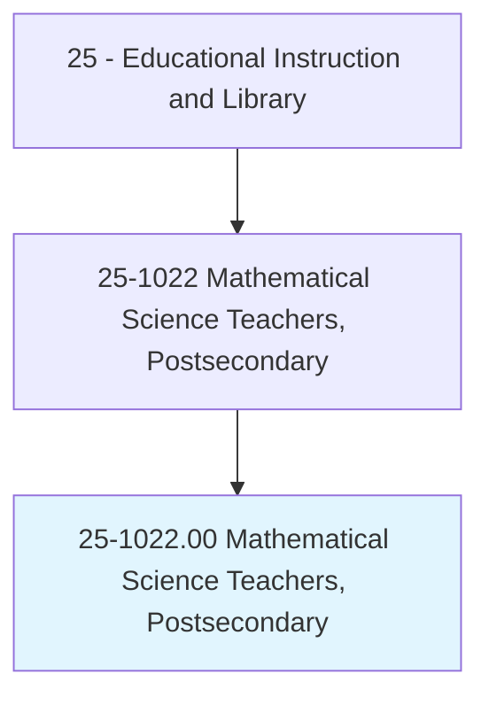
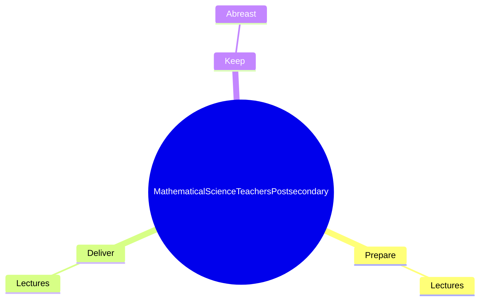
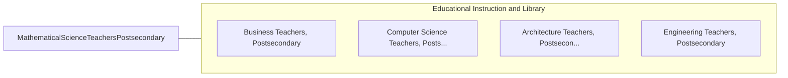

# Mathematical Science Teachers, Postsecondary

> Teach courses pertaining to mathematical concepts, statistics, and actuarial science and to the application of original and standardized mathematical techniques in solving specific problems and situations. Includes both teachers primarily engaged in teaching and those who do a combination of teaching and research.

## Overview

Mathematical Science Teachers, Postsecondary is an occupation within the Educational Instruction and Library category. Teach courses pertaining to mathematical concepts, statistics, and actuarial science and to the application of original and standardized mathematical techniques in solving specific problems and situations. 

## Classification Hierarchy

## Key Statistics

| Metric | Value |
|--------|-------|
| SOC Code | 25-1022.00 |
| Category | [Educational Instruction and Library](/occupations/Education/index) |
| Task Count | 13 |
| Source | O*NET |

## Core Tasks

### prepare.Lectures

Mathematical Science Teachers, Postsecondary prepare lectures as part of their core responsibilities.

**Actions:**
- `prepare.Lectures.to.LinearAlgebra`
- `prepare.Lectures.to.DifferentialEquations`
- `prepare.Lectures.to.DiscreteMathematics`

### deliver.Lectures

Mathematical Science Teachers, Postsecondary deliver lectures as part of their core responsibilities.

**Actions:**
- `deliver.Lectures.to.LinearAlgebra`
- `deliver.Lectures.to.DifferentialEquations`
- `deliver.Lectures.to.DiscreteMathematics`

### keep.Abreast

Mathematical Science Teachers, Postsecondary keep abreast as part of their core responsibilities.

**Actions:**
- `keep.Abreast.of.DevelopmentsAdvances.in.MathematicalFieldByReadingCurrentLiterature`
- `keep.Abreast.of.TechnologicalAdvances.in.MathematicalFieldByReadingCurrentLiterature`

## Skills & Competencies

### Technical Skills
- **Curriculum Development** - Advanced
- **Instructional Design** - Advanced
- **Assessment** - Advanced

### Soft Skills
- **Communication** - Essential
- **Problem Solving** - Essential
- **Critical Thinking** - Important
- **Teamwork** - Important
- **Adaptability** - Important

## Related Occupations

## Industries

This occupation is found across multiple industries. See [Industries](/industries) for sector-specific employment data.

## Career Progression

---

*Source: O*NET 25-1022.00 - ONETOccupation*
