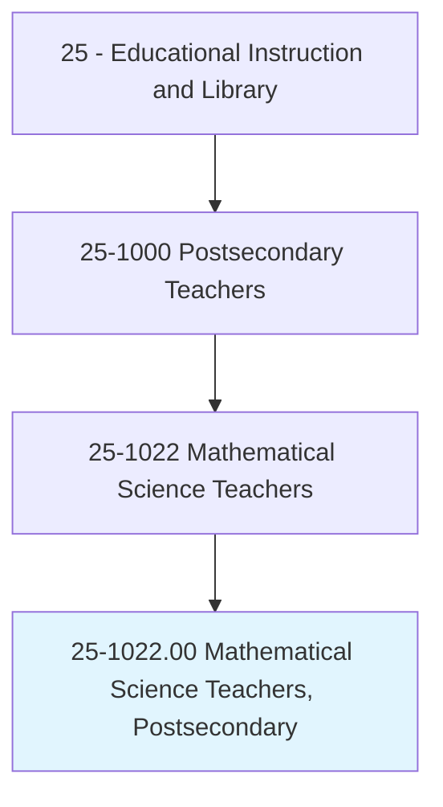
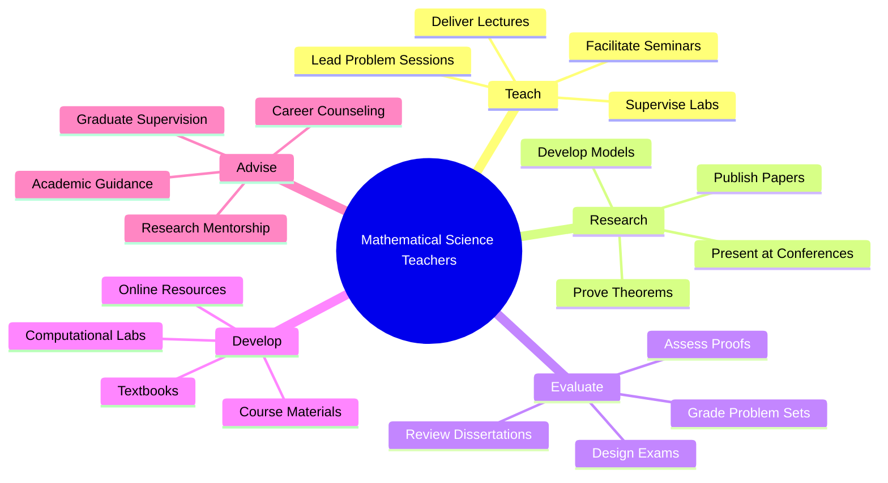
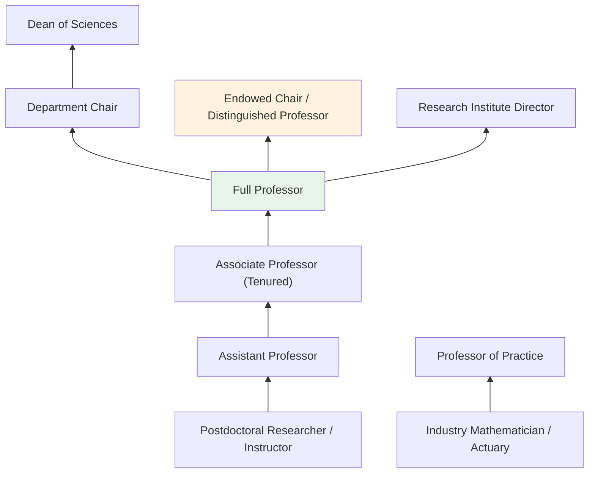
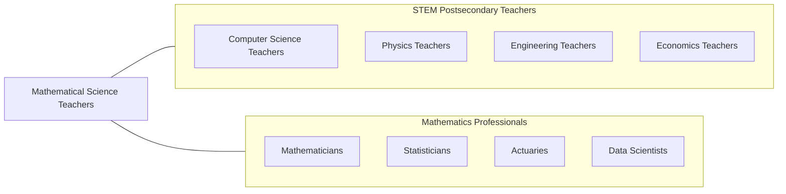

# Mathematical Science Teachers, Postsecondary

> Teach courses pertaining to mathematical concepts, statistics, and actuarial science and to the application of original and standardized mathematical techniques in solving specific problems and situations. Includes both teachers primarily engaged in teaching and those who do a combination of teaching and research.

## Overview

Mathematical Science Teachers in postsecondary education instruct students in pure and applied mathematics, statistics, and actuarial science. They teach courses spanning calculus, linear algebra, differential equations, abstract algebra, real analysis, probability, mathematical statistics, discrete mathematics, numerical methods, and mathematical modeling. These educators develop students' ability to think abstractly, construct rigorous proofs, apply quantitative methods to real-world problems, and communicate mathematical ideas clearly.

Many mathematics professors conduct research in areas such as number theory, topology, algebraic geometry, combinatorics, mathematical physics, data science, and applied statistics. They publish in journals including the Annals of Mathematics, Journal of the American Mathematical Society, and Annals of Statistics. Mathematics research is uniquely foundational, providing the theoretical underpinnings for advances in physics, engineering, computer science, economics, and biology.

Mathematics faculty serve a critical service role in higher education, teaching required courses for students across STEM, business, and social science programs. They face the challenge of making abstract concepts accessible to students with widely varying preparation levels while maintaining the rigor essential to mathematical training.

## Classification Hierarchy

## Key Statistics

| Metric | Value |
|--------|-------|
| SOC Code | 25-1022.00 |
| Job Zone | 5 (Extensive Preparation) |
| Category | [Educational Instruction and Library](/occupations/Education/index) |
| Median Salary | $78,000 - $105,000 |
| Employment | ~54,000 |
| Projected Growth | 5-8% (Average) |
| Source | O*NET |

## Core Tasks

### teach.Mathematics

Faculty deliver instruction across mathematical disciplines.

**Actions:**
- `deliver.Lectures.on.Calculus` - Teach differential and integral calculus, multivariable calculus, and analysis
- `deliver.Lectures.on.LinearAlgebra` - Instruct on vector spaces, matrices, eigenvalues, and linear transformations
- `deliver.Lectures.on.Statistics` - Teach probability theory, statistical inference, and data analysis

### conduct.MathematicalResearch

Faculty pursue original mathematical scholarship.

**Actions:**
- `prove.Theorems.in.PureMathematics` - Advance mathematical knowledge through rigorous proof
- `develop.MathematicalModels.for.Applications` - Create models addressing scientific and engineering problems
- `publish.Papers.in.MathematicsJournals` - Contribute to peer-reviewed mathematical literature

## Skills & Competencies

### Technical Skills
- **Mathematics** - Expert (pure and/or applied mathematics)
- **Statistics** - Advanced to Expert (probability, inference, computing)
- **Proof Writing** - Expert (rigorous mathematical argumentation)
- **Computational Methods** - Advanced (MATLAB, Python, R, Mathematica, SageMath)
- **Curriculum Design** - Advanced (MAA guidelines, developmental math reform)
- **Mathematical Software** - Advanced (LaTeX, computational algebra systems)

### Soft Skills
- **Communication** - Critical (making abstract concepts accessible)
- **Patience** - Critical (teaching students with varied preparation)
- **Analytical Thinking** - Critical (rigorous logical reasoning)
- **Mentorship** - Essential (guiding research students)
- **Collaboration** - Important (interdisciplinary research)
- **Creativity** - Important (novel approaches to proofs and problems)

## Education & Certifications

| Requirement | Details |
|-------------|---------|
| Typical Education | Ph.D. in Mathematics, Applied Mathematics, or Statistics |
| Alternative Entry | Master's degree for community college or adjunct positions |
| Postdoctoral Training | Common for research university positions |
| On-the-Job Training | Faculty development; pedagogical workshops |
| Common Certifications | MAA/AMS/ASA membership; actuarial certifications (for actuarial faculty) |

## Career Progression

## Setting Variations

### Research Universities
Emphasis on original mathematical research and doctoral student supervision. NSF-funded programs.

### Liberal Arts Colleges
Focus on undergraduate teaching with broad course coverage. Student research mentorship.

### Community Colleges
Developmental math through calculus. Large enrollment with diverse preparation levels. Active learning reforms.

### Online Programs
Asynchronous math courses with adaptive learning platforms. Growing use of interactive tools.

### Applied Mathematics Programs
Interdisciplinary programs connecting mathematics to engineering, data science, and finance.

## Technology & Tools

| Category | Tools |
|----------|-------|
| Computing | MATLAB, Python, R, Mathematica, SageMath |
| Typesetting | LaTeX, Overleaf |
| Learning Management Systems | Canvas, Blackboard, Moodle, WebAssign |
| Interactive Tools | Desmos, GeoGebra, WolframAlpha |
| Assessment | WebAssign, MyMathLab, WeBWorK |
| Research Databases | MathSciNet, arXiv, zbMATH |

## Related Occupations

## Industries

- [Educational Services - Colleges and Universities](/industries/Education/index) - Primary Employment
- [Government](/industries/PublicAdministration) - NSA, DOE, DOD, National Labs
- [Finance and Insurance](/industries/Finance) - Actuarial and Quantitative Finance
- [Professional Services](/industries/Scientific) - Data Science and Analytics

## Departments

This occupation typically works in:
- Department of Mathematics
- Department of Statistics
- Department of Applied Mathematics
- School of Mathematical Sciences

---

*Source: O*NET 25-1022.00 - ONETOccupation*
