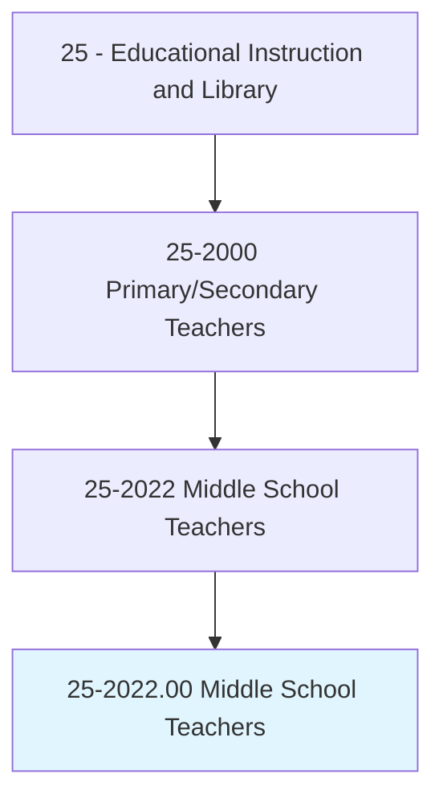
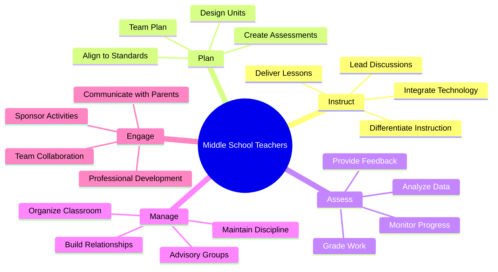
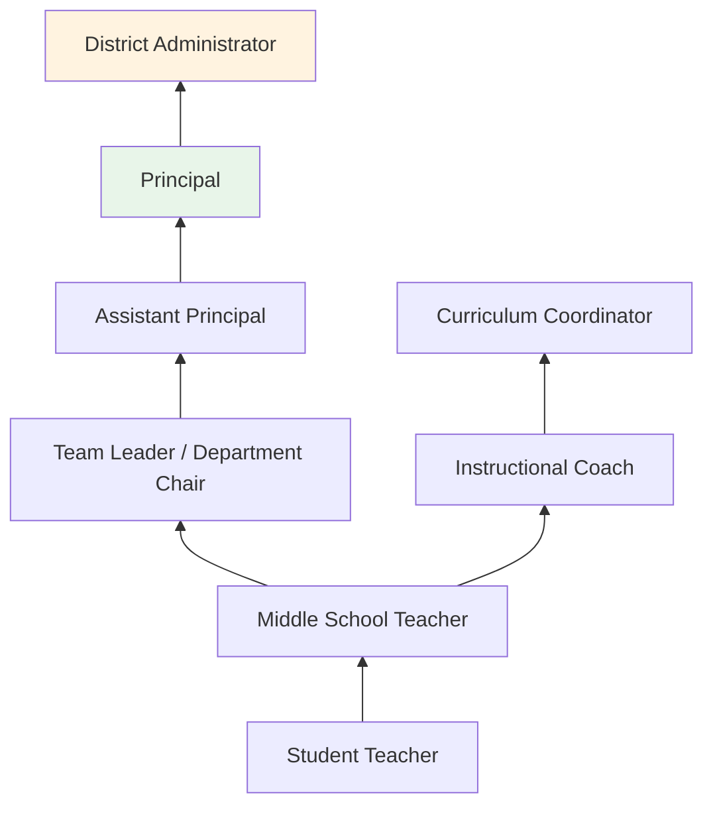
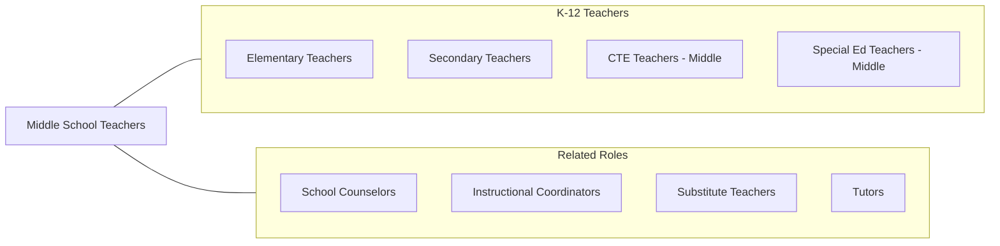

# Middle School Teachers, Except Special and Career/Technical Education

> Teach one or more subjects to students at the middle, intermediate, or junior high school level. May be designated according to subject matter specialty.

## Overview

Middle School Teachers instruct students in grades 5-8 in specific subject areas during a critical developmental period. They teach English language arts, mathematics, science, social studies, and other core subjects to early adolescents experiencing significant physical, cognitive, and social-emotional changes. These educators must balance rigorous academic instruction with developmentally responsive practices that acknowledge the unique needs of young adolescents.

Middle school teachers design curriculum that bridges the foundational skills of elementary education and the specialized content of high school. They employ active learning strategies, collaborative projects, and varied assessment methods to engage students whose attention spans and interests are rapidly evolving. They work within interdisciplinary teams, often sharing common planning time and groups of students, which facilitates integrated instruction and coordinated student support.

Beyond academic instruction, middle school teachers serve as mentors and role models during a formative period of identity development. They advise student organizations, lead advisory groups, implement anti-bullying programs, and communicate regularly with families about academic progress and social-emotional development.

## Classification Hierarchy

## Key Statistics

| Metric | Value |
|--------|-------|
| SOC Code | 25-2022.00 |
| Job Zone | 4 (Considerable Preparation) |
| Category | [Educational Instruction and Library](/occupations/Education/index) |
| Median Salary | $62,000 - $72,000 |
| Employment | ~600,000 |
| Projected Growth | 3-5% (Average) |
| Source | O*NET |

## Core Tasks

### instruct.MiddleSchoolStudents

Middle School Teachers deliver subject-specific instruction to early adolescents.

**Actions:**
- `instruct.Students.in.CoreSubjects` - Teach grade-level content in language arts, math, science, or social studies
- `differentiate.Instruction.for.AdolescentLearners` - Adapt methods for diverse developmental levels
- `engage.Students.through.ActiveLearning` - Use collaborative projects, technology, and hands-on activities

### manage.AdolescentClassroom

Middle School Teachers create supportive environments for young adolescents.

**Actions:**
- `build.Relationships.with.EarlyAdolescents` - Establish trust and rapport with students navigating identity development
- `lead.AdvisoryGroups.for.SocialEmotionalSupport` - Facilitate regular check-ins and character education
- `collaborate.WithTeamMembers.for.InterdisciplinaryPlanning` - Work with grade-level teams on shared students

## Skills & Competencies

### Technical Skills
- **Content Knowledge** - Advanced (subject-area mastery for middle grades)
- **Adolescent Development** - Advanced (understanding cognitive, social, and physical changes)
- **Pedagogy** - Advanced (active learning, cooperative structures, differentiation)
- **Curriculum Design** - Advanced (standards alignment, interdisciplinary planning)
- **Assessment** - Advanced (formative, summative, data-driven instruction)
- **Educational Technology** - Advanced (LMS, interactive tools, digital resources)

### Soft Skills
- **Patience** - Critical (managing early adolescent behavior)
- **Empathy** - Critical (understanding developmental challenges)
- **Communication** - Essential (clear instruction, parent engagement)
- **Flexibility** - Essential (adapting to unpredictable adolescent dynamics)
- **Humor** - Important (connecting with middle school students)
- **Collaboration** - Essential (team teaching, grade-level planning)

## Education & Certifications

| Requirement | Details |
|-------------|---------|
| Typical Education | Bachelor's degree with middle grades endorsement |
| State Licensure | Required; middle grades certification with subject endorsement |
| Student Teaching | Clinical experience at middle school level |
| Continuing Education | Professional development for license renewal |
| Common Certifications | State middle grades license; NBPTS Middle Childhood Generalist; subject-area Praxis |

## Career Progression

## Setting Variations

### Traditional Middle Schools (6-8)
Departmentalized instruction with interdisciplinary teams. Advisory programs and exploratory courses.

### K-8 Schools
Middle grades within a broader K-8 setting. Smaller school environments with cross-grade connections.

### Junior High Schools (7-9)
Traditional junior high model with more departmentalized, high school-like structure.

### Online/Virtual Schools
Asynchronous and synchronous middle grades instruction. Growing enrollment.

### Magnet and Charter Schools
Theme-based (STEM, arts, IB) middle grades programs with specialized curricula.

## Technology & Tools

| Category | Tools |
|----------|-------|
| Learning Management | Google Classroom, Canvas, Schoology |
| Assessment | Edulastic, Kahoot, Quizizz, IXL |
| Communication | Remind, ParentSquare, ClassDojo |
| Productivity | Google Workspace, Microsoft Office |
| Subject Tools | Desmos, BrainPOP, Newsela, CommonLit, PhET |
| Student Information | PowerSchool, Infinite Campus |

## Related Occupations

## Industries

- [Educational Services - Middle Schools](/industries/Education/index) - Primary Employment
- [Government](/industries/PublicAdministration) - Public School Districts
- [Religious Organizations](/industries/ReligiousOrganizations) - Private Schools
- [Other Services](/industries/OtherServices) - Charter Schools

## Departments

This occupation typically works in:
- Subject-Area Departments (ELA, Math, Science, Social Studies)
- Grade-Level Teams
- Student Activities

---

*Source: O*NET 25-2022.00 - ONETOccupation*
